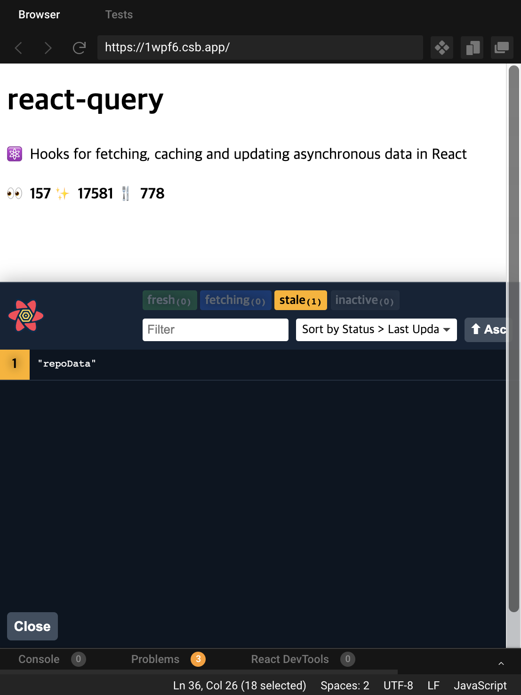

React-Query is a library that makes it easy to work with asynchronous logic in React apps.
It's interesting to see asynchronous logic from a different perspective than what I've been using most in React, which is to manage asynchronous logic with Redux and Saga.
I found it very interesting because it looks at asynchronous logic from a very different perspective and provides a lot of useful features.
However, there doesn't seem to be a lot of resources in Korean yet, so I hope this post will be useful for those who want to take a look at React-Query
React-Query, I hope this post will be helpful.


> The content of this post is all from the [React Query Docs](https://react-query.tanstack.com/) and my own opinions.  
> I've transcribed a very rough draft directly into a blog post, so the tone is a bit different from my previous blog posts, and there may be some things that are not clear or missing. Please point them out!

## Summary + Impressions.

- **A library that makes the React app itself, not the developer, responsible for data integrity in asynchronous requests**.
- Integrity of asynchronous requests: create a situation where when asynchronous request data is needed by the view, the asynchronous request works before the data can be referenced.
- Integrity of the result, not the process: the library does the caching and re-patching for you, breaking away from the practice of asynchronous requests where data is referenced or exceptioned immediately after the request, request completion, or both, and ensuring that the latest data is referenced when view needs it, even if the request is not immediately before the data is referenced.
- Context API: Manage asynchronous requests by providing a global layer to manage asynchronous, server state using context.
- Small boilerplate: like in SAGA, you can declare every single async-related success and failure action without having to
  no need for verbose organization. Queries created via `useQuery` are separated by a unique key.
  You can have multiple queries scattered throughout your components and still access the same query and data as long as the key is the same.

## Global State concept claimed by React-Query

- Don't use the term Global State: Global state can be categorized into Client and Server, and these two states should be handled differently to create an efficient app.
- Server-State: data fetched from the server is also a state
- Distinction between Server-State and Client-State
  - Client State: Data not persistent between sessions, synchronous, owned by the client, always updated with the latest data (reflected in rendering)
    - ex) React component's state, data from redux store stored synchronously
  - Server State : persistent data between sessions, asynchronous, not only owned by the client running the session, but also shared data exists and can be modified by multiple clients, since the client only uses a snapshot of the server data, the server data seen by the client cannot always be guaranteed to be up-to-date.
    - ex) In a React app, data stored in the backend DB that can be fetched in an asynchronous request

## created synchronous

- Since React itself doesn't provide an option to patch or update data, React developers originally had to organize the http communication logic in their own way.
- While global state management libraries like Redux work well for client state values, they don't work so well for server state. This is because server state is completely different from client state
  - Server data is not always guaranteed to be up to date. You must explicitly fetch it to ensure it is up-to-date.
  - Network communication should be minimized, as it can be wasteful to perform multiple fetches to get the latest data from multiple components.

## Initialization

- Setup

```shell
yarn add react-query
```

- Wrap the following components in App.js with a Context Provider and send down a queryClient ⇒ This context becomes the background layer that takes care of asynchronous requests in your app

```javascript
import { QueryClient, QueryClientProvider, useQuery } from 'react-query';

const queryClient = new QueryClient();

export default function App() {
  return <QueryClientProvider client={queryClient}>{...Components}</QueryClientProvider>;
}
```

## Concept

### 1. Important basics

- Queries have four states, and you can check which state is which by the properties of the object returned by useQuery.
  1. fresh : Newly added query instance → start of active state, default staleTime is 0, so if you don't set anything, it will change to stale state immediately after the call ends. If you increase the staleTime, it will remain fresh, in which case the query will not be patched when it is remounted and will return the existing fresh value.
  2. fetching: The query that is currently making the request
  3. stale: A query for which an instance exists but has already been patched. If you attempt to mount the same query while the query is stale, it will attempt to repatch it while returning cached data.
  4. inactive: A query that does not have any active instances. After becoming inactive, it will retain cached data for cacheTime. After cacheTime, it is GC'd.
- \*How does it become inactive? : In the example of [pagenation](https://codesandbox.io/s/github/tannerlinsley/react-query/tree/master/examples/pagination?file=/pages/index.js), each time the component is re-rendered, new queries are created and the queries that were called in the last render are inactive. Queries that are unmounted and not re-called between renders seem to become inactive.
- Repatching occurs in four cases
  1. a specific query instance that is stale at runtime is recreated.
  2. when the window is regained focus (optionally turned off and keyed)
  3. when the network is reconnected (can optionally be turned off and keyed)
  4. when there is a refetch interval: a failed query is requested 3 more times in the background by default, and the interval and number of times can be customized with the retry and retryDelay options.

### 2. Queries

```javascript
const { status, data, error, isFetching, isPreviousData } = useQuery(
  ['projects', page],
  () => fetchProjects(page),
  { keepPreviousData: true, staleTime: 5000 }
);

// Exception handling -> throw Error unconditionally instead of using reject
const { error } = useQuery(['todos', todoId], async () => {
  if (somethingGoesWrong) {
    throw new Error('Oh no!');
  }

  }); return data;
});
```

- The query is mapped to a unique key with a function that returns a promise requesting the server state.
- The query works fine as long as the request from the callback function returns a promise. However, if the request can change data on the server, it's better to use a mutation (more on why in the mutation section below).
- The useQuery hook takes two arguments - a unique key from the query, and a function that returns a promise (this function must return a resolve Promise or throw an error).
- unique key: Once fresh, it can be tracked continuously. A value that is referenced when re-patching, caching, sharing, etc. Usually an array is used, and the elements of the array contain a string representing the name of the query and a value that is used as an argument to the function that returns the promise.
- useQuery returns: an object, some properties that indicate the status of the request, and some properties that have a result or error value.
  - isLoading, isError, isSuccess, isIdle, isIdle, **status**, \*\*error
  - error, data, isFetching ⇒ The value exists if at least one unconditional request has been made between runtimes.
- There are four status values to express the status of the query request function. It can be evaluated as a string in the status property and as a boolean in the property with is in front of the status name.
  - idle: When there is no query data and it is empty. It starts in this state when the query is called with `{enabled : false}`.
  - loading: literally loading.
  - error: literally, when an error occurred.
  - success: literally, when the request succeeded.
- Key query options
  - enabled: Setting this to True will prevent the query's request function from being called automatically.
  - keepPreviousData: Avoid jumping between success and loading
  - placeholderData: You can also set mock data. This one doesn't cache though
  - initialData: set initial value
  - You can customize your data by setting different options in your query.

### 3. Query Keys

```javascript
useQuery(['todo', 5, { preview: true }], ...)
// queryKey === ['todo', 5, { preview: true }]
```

- String: You can give the key as a distinguished string. This is immediately converted to an array with one argument
- Array: If you give a number along with a string, you can write the same key with the same string and still distinguish it by ID.
- Argument to the callback function: The last element of the array, which is also used to distinguish queries ⇒ Even if the endpoint is the same, if the body or query parameters in the request are different, they are treated as different query instances.
- The order of the array elements is also important: if they are all the same, but in a different order, they are hashed differently.
- When a request function depends on a specific variable, you can include it as an object in the query key array so that the request function can receive the object as an argument and do something with it inside the function.

```javascript
function Todos({ todoId }) {
  const result = useQuery(['todos', todoId], () => fetchTodoById(todoId));
}

function Todos({ status, page }) {
  const result = useQuery(['todos', { status, page }], fetchTodoList);
}

// queryKey is accessible in the query request function
function fetchTodoList({ queryKey }) {
  const [_key, { status, page }] = queryKey;
  return new Promise();
}
```

### 4. Parallel

- In the general case where multiple queries are declared, except for a few situations, the query functions are simply requested and processed in parallel. ⇒ Maximize the concurrency of query processing.

```javascript
function App () {
  // In this case, everything is processed in parallel
  const usersQuery = useQuery('users', fetchUsers)
  const teamsQuery = useQuery('teams', fetchTeams)
  const projectsQuery = useQuery('projects', fetchProjects)
  ...
}
```

- If you need to execute multiple queries at the same time, and the queries need to be executed continuously between renders, the logic to execute the queries may violate the hooks rule. In such cases, useQueries

```javascript
function App({ users }) {
  const userQueries = useQueries(
    users.map((user) => {
      return {
        queryKey: ['user', user.id],
        queryFn: () => fetchUserById(user.id),
      };
    })
  );
}
```

### 5. Query Retries

```javascript
import { useQuery } from 'react-query';

// You can optionally customize the number of retries.
const result = useQuery(['todos', 1], fetchTodoListPage, {
  retry: 10, // Call 10 more times until displaying an error.
});
```

- If a request to useQuery fails, the request will be repeated up to the max number of consecutive retries. (Default is 3)
- The retry option determines how many times the query is retried.
- If the retryDelay option is set, the request will be retried after a set period of time if the request fails once.

### 6. Mutations

```javascript
function App() {
  const mutation = useMutation((newTodo) => axios.post('/todos', newTodo));

  return (
    <div>
      {mutation.isLoading ? (
        'Adding todo...'
      ) : (
        <> <
          {mutation.isError ? <div>An error occurred: {mutation.error.message}</div> : null}

          {mutation.isSuccess ? <div>Todo added!</div> : null}

          <button
            onClick={() => {
              mutation.mutate({ id: new Date(), title: 'Do Laundry' });
            }}
          >
            Create Todo
          </button>
        </>
      )}
    </div>
  );
}
```

- Unlike useQuery, it is used to create, update, delete, and cause side effects on the server state.
- You define a mutation object with useMutation and use the mutate method to call the request function to send a request. This seems to be the reason why query and muataion are separated. Calling useQuery conditionally ⇒ event handler function, or conditionally, is annoying because it violates the hook's rule that it must be called from the top.
- The status values provided as object properties returned by useMutation are the same as those of useQuery
- mutation.reset: can clear both the current error and data
- You can also write lifecycle intercept logic by passing a callback object as the second argument.

```javascript
useMutation(addTodo, {
  onMutate: (variables) => {
    // Start mutating
    // The object returned by onMutate can be referenced by the context parameter later in the lifecycle.
    return { id: 1 };
  },
  onError: (error, variables, context) => {
    // An error occurred
    console.log(`rolling back optimistic update with id ${context.id}`);
  },
  onSuccess: (data, variables, context) => {
    // Success
  },
  onSettled: (data, error, variables, context) => {
    // success or error, it's over anyway
  },
});
```

- As with useQuery, retrying on failure is not the default, but you can give it the retry option.

### 7. invalidation

- Discarding stale queries (invalidation)
- If the data in a query has changed on the server since the request, the data that remains in the background can become stale and useless to the app.
- The invalidateQueries method allows developers to explicitly pinpoint the point at which a query becomes stale. When this method is called, the query is immediately stale, and the patch is applied.
- If a query has certain keys in common, it can be invalidated by catching it.

```javascript
// Invalidate all queries in the cache.
queryClient.invalidateQueries();

// Invalidate all queries starting with 'todos'.
queryClient.invalidateQueries('todos');

queryClient.invalidateQueries({
  predicate: (query) => query.queryKey[0] === 'todos' && query.queryKey[1]?.version >= 10,
});
```

- Of course, if the mutation is successful, we need to patch the data again with a high probability ⇒ we need to invalidate the related query when the mutation occurs.
- In this case, it's natural to invalidate inside the mutation lifecycle callback like below

```javascript
import { useMutation, useQueryClient } from 'react-query';

const queryClient = useQueryClient();

// If the mutation succeeds, invalidate the data in the query so that the related query is repatched.
const mutation = useMutation(addTodo, {
  onSuccess: () => {
    queryClient.invalidateQueries('todos');
    queryClient.invalidateQueries('reminders');
  },
});
```

- There are also cases where the response value you receive from the server after making a request with a mutation is new, updated data. In this case, you can use the setQueryData method of the queryClient instance to explicitly replace the query data when the mutation succeeds.

```javascript
const queryClient = useQueryClient();

const mutation = useMutation(editTodo, {
  onSuccess: (data) => queryClient.setQueryData(['todo', { id: 5 }], data),
});

mutation.mutate({
  id: 5,
  name: 'Do the laundry',
});

// We can use the updated data as the response value of the mutation.
const { status, data, error } = useQuery(['todo', { id: 5 }], fetchTodoByID);
```

### 8. Caching Process

1. mount the first, new instance of useQuery ⇒ if the query is called fresh for the first time between runtimes, cache it, and replace it with stale (staleTime:0) after patching.
2. mount a second instance of useQuery somewhere in the app ⇒ since the query is already stale, we return the cache that was created on the last request and re-patch it. Update the cache at the same time.
3. when the query is unmounted or no longer in use ⇒ automatically delete it after 5 minutes (default value of cacheTime) when the last instance is unmounted and inactive.

## What looks good.

- Really reduces a lot of async typing
- Reduces the size of a global stateful store like Redux by leaving only synchronously updated data and actions in the store, and replaces Saga altogether.
- It supports caching and refactoring without requiring developers to implement them.
- It's highly customizable with a wealth of options.

### Questions

Things you might not know until you try it

- Since it doesn't force you to manage asynchronous data in a centralized way like Redux+Saga does, it seems like asynchronous requests may become more dependent on individual components if you just use it without conventions.\*\* If you use query-related logic directly in components, it may be harder to find asynchronous requests that may be hidden in individual components as your app grows. I think we should definitely talk about how teams should use React Query to separate business logic from UI logic, such as categorizing and bundling multiple query calls with custom hooks.
- It may seem obvious, but the more queries you have, the harder it is to manage. It would be nice if the team had a clear identifier for the queries and only used the ones that are defined.
- Can I really get the latest version of the server data I want in every situation? Could there be situations where other logic prevents me from doing invalidation? I wonder.

## Expected difference when using React Query instead of Redux Saga

\*\*Less typing: No need to write tons of actions, action creators, reducer functions...

\*\*Easier to debug: One of the reasons why the cost-performance ratio wasn't terrible even with all those actions in Saga was the ease of debugging. With Redux Devtool, the execution, success, and failure of asynchronous requests are all captured in actions, and the diff of the store is very easy to see. However, since React Query also provides its own devtool (not as a Chrome extension, but directly in the component) and you can check the status of the query call directly in the browser, there's no need to write so many actions to make debugging useful.



**Makes Redux itself more purposeful** : I tend to agree with React Query's argument that server state and client state have different characteristics and should be managed differently. While writing Redux Saga, I often wondered whether I should store all the data received from all asynchronous requests while managing asynchronous logic, or what to do if multiple components need data at the same time. After looking into React Query, it definitely seems like it could be one of the ways to manage data on these servers more efficiently.

Redux manages the global state, and React Query manages the data received from the server, splitting the roles.

The docs say that when you expose all the logic related to asynchronous state values in Redux, you'll be left with a very small number of common client state values that are updated synchronously. They argue that if those state values are small enough that you don't need to keep Redux, you can consider removing Redux from your app, and they're right.

> The React-Query Docs are very friendly. If you'd like to see more examples, I'd recommend checking out the [Example](https://react-query.tanstack.com/examples/simple) section of the docs.
