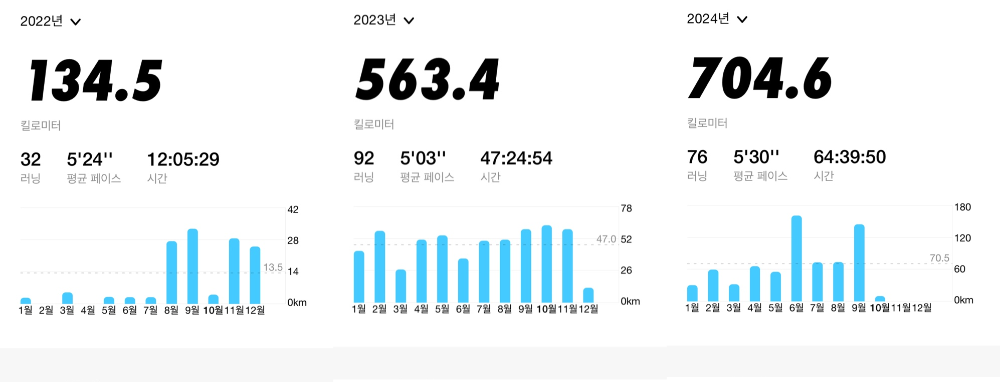
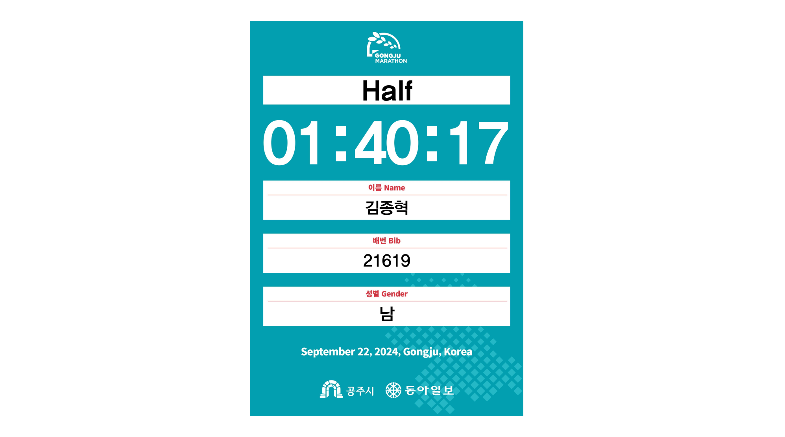
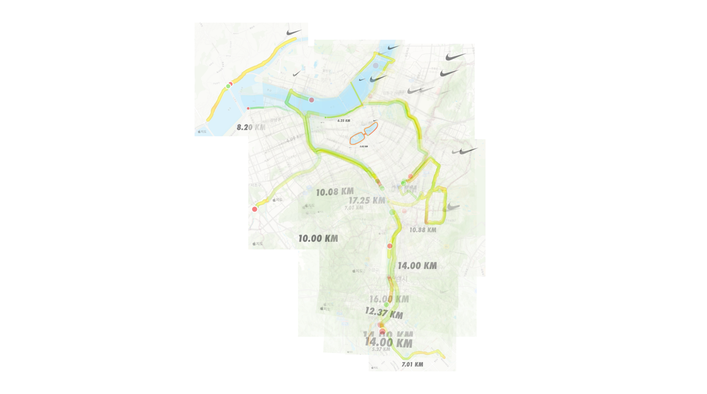
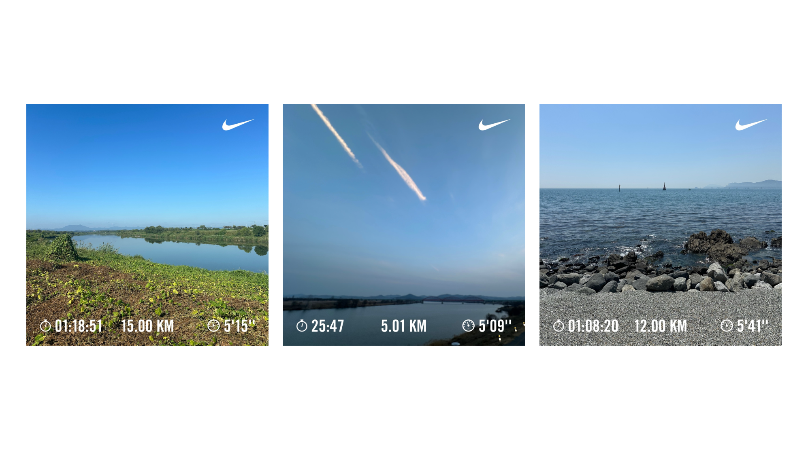
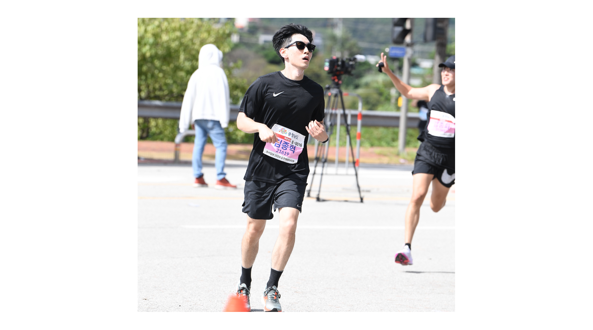

It's been about two years since I started considering running as a serious hobby, and I want to reflect on it.

I ran 1,325.61 kilometers over the past two years (October 2022 to October 2024).

In 2023, I focused on training to break my 10km record and achieved a time of 46 minutes and 2 seconds. I trained too fast without any strength training or recovery, which led to a stress fracture in February, requiring a 4-week break.

In 2024, I reduced the intensity and increased the distance to improve my aerobic capacity. This year, I tried interval and LSD training for the first time after only doing fast-tempo runs. I challenged myself in a half marathon and recorded a time of 1 hour, 40 minutes, and 17 seconds. Next week, I will participate in the Seoul Race half course.

Songpa-gu offers a variety of courses centered around the Tancheon stream. Discovering new running courses and expanding what I consider 'my neighborhood' is a joy. I am delighted with finding a route from my home to Hangang Park by crossing only one crosswalk.

If you overlay the routes you will get an image like this.

I ran as far west as Yangjae, north to Ttukseom, and south to Jeongja. If I ever have to move, it will be to a place as good for running as this one.

I've run around Songpa-gu, commuted from my company in Bundang to home by running, ran to Jeongja Café Street to buy my favorite bread, and even ran to Seongsu to visit a bathhouse and café for reading. I once carried books to return to the local library in a trail running vest.

These experiences are fun. It's amusing when people around me ask if I use a bicycle or a car.

Running in places other than Seoul and exploring travel destinations on foot was also enjoyable. I ran along the Geumgang River in Buyeo, the Yeongsan River in Gwangju (my hometown), and Gwangalli, Busan. I loved gaining new sensations in beautiful, unfamiliar places.

Running in 2023 immensely helped my mental health. When facing difficulties at work or in my personal life, exhausting my body quickly to the point of having no thoughts allowed me to take mental breaks.

Running in 2024 brought even more changes to my body and mind.

My stamina improved. When I first ran 10km at a 4:30 pace, my heart rate soared to 180, but now it has dropped to 160. I feel tired much less frequently during daily life.

My productivity and concentration have significantly improved. Higher work productivity and focus have greatly reduced over time. For the first time, I felt like my body was controlling my mind. This is a truly amazing sensation. When my physical condition is excellent, I rarely get annoyed or angry. It's hard to explain, but it feels like developing compassion, as mentioned in Buddhism.

I used to enjoy things that ruin the body. Still, since I have to exercise the next morning, I've naturally reduced my alcohol consumption. To maintain my vascular and cardiopulmonary condition for better records, I quit smoking. I no longer regret thinking, "If only I hadn't smoked, I would be running 1km ahead by now."

However, this year, I've also experienced a lot of leg stiffness and muscle pain. Hence, I must learn and explore more to consistently run about 100km a month without injuries.

I briefly joined a running crew this year but had to leave due to injury, and I mostly ran alone. There is a sense of peace and freedom in running alone, but it feels disrupted when running with others.

I occasionally run with others. I've run along Tancheon with colleagues from work, and I've made running appointments with friends or acquaintances. It's healthier than suggesting meals or drinks, so I like being able to propose running together.

I plan to run about 900km in the remaining months of 2024 and over 1,000km in 2025. In 2025, I aim to achieve a half-marathon time of 1 hour and 35 minutes and a 10km time of 44 minutes.

(End)
