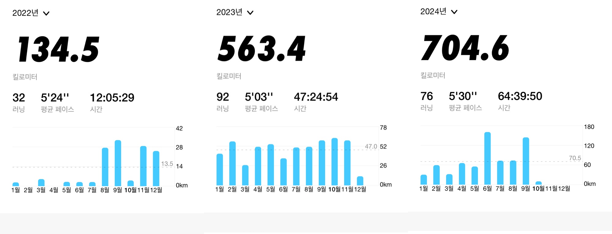
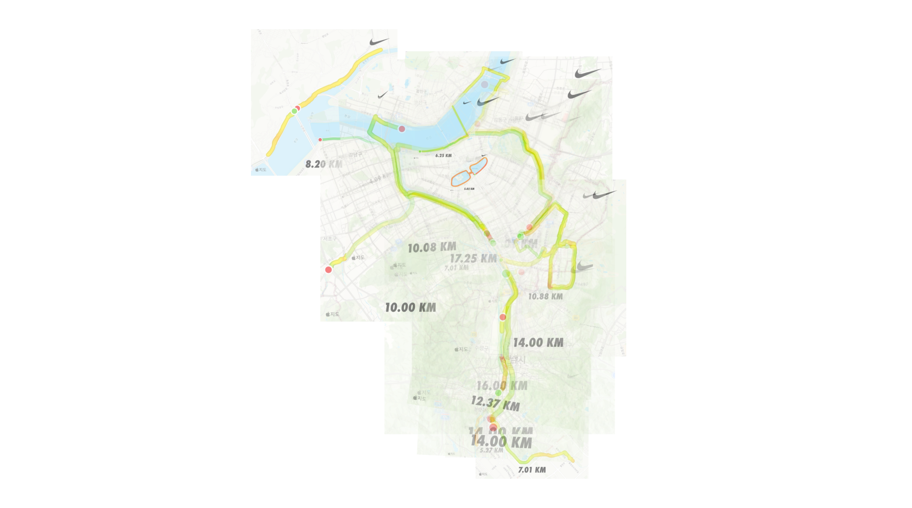

달리기를 취미로 생각한지 2년 정도가 되었다(2022.10 ~ 2024.10). 총 1325.61km를 뛰었다.

2023년에는 10km 기록을 갱신하는 훈련 위주로 10km 46분 2초까지 찍었다. 보강운동이나 리커버리 없이 너무 빠르게만 뛰다 보니 올해 2월에 피로골절이 와서 4주 정도 쉬기도 했다.

2024년에는 강도를 줄이고 거리를 늘렸다. 빠른 지속주만 하다가 인터벌이나 LSD 훈련도 올해 처음 해봤다. 하프마라톤 나가서 1시간 40분 17초 찍었다. 다음 주에 서울레이스 하프코스에 참가한다.

송파구는 탄천을 중심으로 정말 다양한 코스가 나온다. 새로운 러닝 코스를 개척하며 스스로가 생각하는 '내 동네', 생활 반경을 주도적으로 넓히는 재미가 있다. 횡단보도를 딱 한 번만 건너서 집부터 한강공원까지 한번에 갈 수 있는 길을 찾아내는 기쁨 같은 것이 그렇다.

그동안 주로 뛰었던 경로들을 겹쳐 보았다.

서쪽으로는 양재, 북쪽으로는 뚝섬, 남쪽으로는 정자까지 갔었다. 이사를 가야 한다면 지금처럼 러닝 입지가 좋은 곳이었으면 싶다.

송파구를 한 바퀴 돌거나, 분당에 있는 회사에서 집까지 뛰어서 퇴근하거나, 집에서 정자 카페거리까지 뛰어가서 빵을 사오기도 하고, 성수까지 뛰어가서 목욕탕 갔다가 카페에 가서 책을 읽었던 적도, 트레일러닝 조끼를 사서 반납할 책을 가방에 싣고 동네 도서관에 뛰어간 적도 있다.

이런 경험이 생긴게 재미있다. 주위 사람들이 혹시 자전거나 자동차냐고 놀라는 것도 재미있다.

서울이 아닌 곳, 여행지를 뛰며 돌아보는 것도 즐거웠다. 부여에서 금강, 광주(본가)에서 영산강, 부산에서는 광안리에서 뛰었다. 아름다운 풍경을 눈에 담으며 잘 알지 못하는 곳에서 새로운 감각을 얻는 것이 좋았다.

2023년의 달리기는 정신 건강에 도움을 많이 줬다. 일이나 개인사에 어려움이 있을 때 몸을 빠르게 지치게 만들어 아무 생각 없는 상태로 만들면 정신적인 휴식을 취할 수 있었다.

2024년의 달리기는 신체와 정신에 더 많은 변화를 주었다.

체력이 좋아졌다. 10km를 4분 30초 페이스로 처음 뛰었을때 180까지 치솟던 심박수가 160 아래로 떨어졌다. 일상 중 피곤을 느끼는 빈도가 많이 줄었다.

생산성과 집중력이 좋아졌다. 야근 횟수가 크게 감소했다. 이게 진짜 신기한 감각인데 몸이 정신을 지배하는 듯 하다. 신체적인 컨디션이 매우 좋으니 짜증이나 화도 잘 안나게 된다. 설명이 좀 힘든데, 불교에서 말하는 자비심 같은 것이 길러지는 싶기도 하다.

다음날 아침에 운동해야 하니 술은 자연스럽게 줄고, 더 좋은 기록을 내기 위해 혈관과 심폐 컨디션을 유지할 수 있도록 담배는 끊었다. 내가 담배만 안 피웠어도 지금쯤 한 1km 앞을 달리고 있을 텐데... 하는 아쉬움에서도 벗어났다.

올해는 다리의 뻐근함이나 근육통증 등도 많이 경험하고 있는데, 앞으로 한 달 100km 정도의 거리를 소화하면서도 부상 없이 꾸준히 운동할 수 있도록 더 많이 배우고 알아봐야 할 것 같다.

올해 잠깐 러닝 크루에 들어간 적도 있었지만 부상 때문에 나오게 되었고, 대부분 혼자 뛰었다. 혼자 뛰는데서 오는 평화로움과 자유로움이 다른 사람과 함께 뛰면 방해받는 감각이 있다.

다른 사람과는 종종 함께한다. 회사에서 직장 동료들과 탄천을 뛰었다. 친구 혹은 지인과 뛰는 약속을 잡았다. 밥이나 술 제안보다 훨씬 건강해서 친구들에게 같이 한번 뛰자고 제안할 수 있는게 좋다.

얼마 안 남은 2024년은 900km 정도를, 2025년은 1000km 이상을 소화할 수 있었으면 좋겠다. 2025년에는 하프마라톤 1시간 35분, 10km 44분 기록을 달성할 수 있었으면 좋겠다.

(끝)
