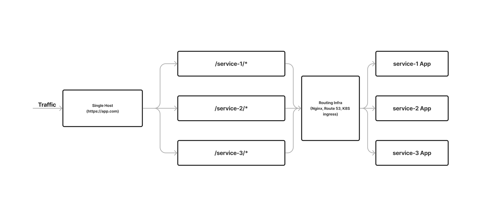
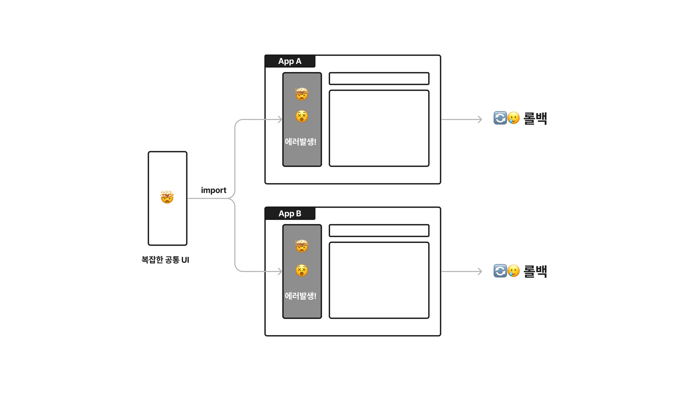
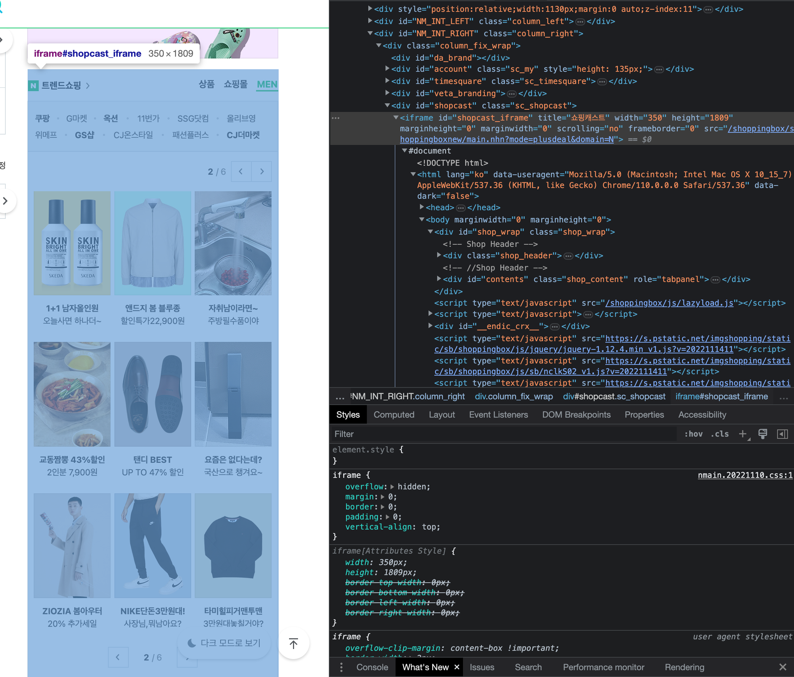
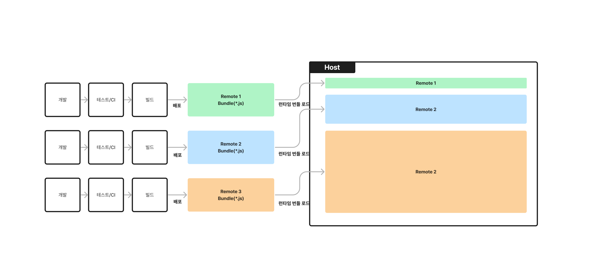

Micro Frontends has been coming up a lot at domestic conferences lately. I wouldn't say it's completely trendy or has gained a lot of attention, but it seems to be in the process of gaining some references in Korea after being a very unfamiliar concept.

Like MSA on the backend, the reason why there is a lot of talk about system slicing on the web frontend is because there are web apps being built somewhere in the world that are very complex and very large. If you think about a web app that has more than 200 page URLs, tens of gigabytes of code, and extreme requirements, such as that all the functions must look like one app.

Obviously, keeping it monolithic makes no sense, and you've been doing everything you can to break up the unit of deployment into fragmented web apps and pages, but there comes a point where you hit a wall. Front-end engineers suffer from overlapping and tangled workspaces, build/deployment and dev server spin-ups become insanely slow... pissing parties are thrown and the team slows to a crawl.

I've been exploring the world of Micro Frontends lately, and this post is my attempt to summarize some of the things I've noticed. It's a rough answer to the following questions.

- What does the Micro Frontends architecture mean and what problems does it solve for which apps?
- What are the different ways to implement a Micro Frontends architecture, and which one provides the most value to my team and product?
- What are the most important pitfalls to watch out for when adopting a runtime-integrated Micro Frontends architecture?
- Ultimately, what is the value of Micro Frontends?

## What are Micro Frontends?

What is a Micro Frontend depends a lot on your point of view.

In a broad sense, if you take the approach of breaking up the deployment of a single webapp into smaller units, you could say you're following the Micro Frontends architecture.

However, I believe that in order to maximize the benefits of the Micro Frontends architecture, **you should be able to break down your deployment units to page-level or smaller, and per UI component**.

Splitting deployment units into web apps is perfectly possible with existing web app frameworks and infrastructure. You can deploy by burning a single URL host with different basePaths or subdomains for each of your fragmented web apps.

Since a bundle of pages can be thought of as a unit of a webapp, breaking up a deployment into webapp units is a convenient way to start breaking up a monolithic app for the first time. As long as the pages in each breakup unit don't need to know about each other and the user navigation experience is not adversely affected, it's considered good engineering.

## Problems that per-webapp deployment doesn't solve.

However, if you have the following situations

First, each page has a common UI (navigation bar, app header, etc.), which becomes a pain in the ass when it gets complex. If there's a problem with a common UI that is integrated at build time across each of your fragmented web apps, you'll have to roll back the entire deployment unit where that UI exists, stuck.

Next, users may have a poor navigation experience when navigating between different pages/apps.

From the user's perspective, they're just navigating to a different page within the app, but from the infrastructure side, the app they're accessing changes, causing the app to initialize and get the resources it needs again.

Sure, you can reuse the overlapping DOM between page navigations with the help of the browser, but if the initialization process involves a lot of bundle loading and API requests, the user is more likely to wait a bit longer between page transitions or see the loading circle again.

If your pages contain a lot of common UI, to the point where they are almost identical, it will be more awkward for the user to see the same UI reloaded.

## What problems are Micro Frontends a good solution for?

Micro Frontends are a good solution when it's not enough to break up your deployment into web app units. Obviously, this is not a case of "apply it to all web apps and you're good to go!".

While it's hard to generalize, the Micro Frontends architecture is best suited for

- Each page contains a common, complex UI that is repeated over and over again.
- the UI of each page is highly similar and highly related.
- Add to this the fact that each of the segmented apps is already large enough in size, complexity, and domain difficulty that there is a requirement to break down the deployment into smaller units.

web applications that are already large enough in size, complexity, and domain difficulty to require smaller deployment units.

In these situations, large web apps can solve the problems we described earlier when switching to a Micro Frontends architecture. In addition, you'll get the benefits of shorter build/deployment cycles by splitting up a large app, and the benefits of collaboration through better-divided deployment units.

## How to do it.

In this paragraph, I'm going to talk about five ways to implement a Micro Frontends architecture from [Martin Fowler's blog post](https://martinfowler.com/articles/micro-frontends.html), focusing on how each of them can address the drawbacks described in the previous paragraph.

1. Server-side template Composition
2. Build-time Integration
3. Run-time Integration via iframes
4. Run-time Integration via web-components
5. Run-time Integration via javascript

To conclude, I think that run-time integration is the way to go for web apps to fully realize the benefits of Micro Frontends, and I think that run-time integration via javascript is the way to go.

Depending on the situation, I also think it can be used as follows.

- To isolate a small number of UI components that don't interact with other UI components into separate deployment units: via iframes, via web-components
- Separating a large number of UI components into separate deployments that actively interact with other UI components: via javascript

### Server-side template Composition

In this post, we'll describe a structure where we have a server that serves HTML for different apps behind it, and an nginx server in front of it that routes the right HTML based on the requested URL, and sends the right HTML as a response.

To make this more in line with current web development trends, you can deploy multiple Nextjs app servers, each with a specific page-level app, and use an infrastructure like Route53 or Cloud Front to build a web app that responds to requests with a basePath that corresponds to a specific app, sending the HTML and JS that the app responds with.

In other words, it's like what I described earlier, "breaking up your deployment beyond the web app."

A related solution to this approach is Nextjs' multi-zones. It's a way to bundle multiple web apps developed in Nextjs and make them easier to deploy. [vercel presents multi-zones as a way to implement micro frontends architecture](https://vercel.com/templates/next.js/microfrontends), but it doesn't solve the "problems that per-webapp deployment can't solve" mentioned above.

### Build-time Integration

This is a way to package and deploy separate UIs and integrate them at build time. You can package one part of a specific UI into an NPM package, specify the dependencies and version in the application's package.json, and then build and deploy it.

Packaging a specific piece of UI has benefits in terms of code separation: it makes it easier to segment ownership for each organization.

But ultimately, it doesn't solve the "what can't be solved by per-webapp deployment" problem because the code is integrated at build time, although the benefits of bundling specific packages and having them transpiled and built in advance can speed up the build/deployment cycle somewhat.

And these practices can be applied regardless of whether your app is monolithic or broken into deployment units.

### Run-time Integration via iframes

The next set of practices are definitely ways to separate the units of deployment down to the page level and below, but also ways to integrate the separated UI components at runtime.

The first approach is to use iframes. Iframes are still a popular way to separate units of deployment into UI units, or to integrate parts of UI from other web apps into other web apps. Iframes allow you to easily integrate parts of your UI that you've deployed to a specific external URL into your existing app by wrapping them in HTML.

However, they can be cumbersome to use due to security issues such as iframe injection. If you need to share state with other components in a UI component that is isolated by an iframe, you need to devise and implement a way to share state, such as utilizing Web APIs such as `window.postMessage()` and `EventListener`.

### Run-time Integration via Web Components

Another approach to runtime integration is via web-components, a relatively new web specification. It makes it easy to integrate decoupled HTML into existing apps without the security concerns of an iframe.

The way web-components are developed is different from the way existing apps develop components for libraries like React, so they may need to be developed in a slightly different way than existing apps. Of course, not all apps need to be micro apps, and if you only want to deploy a small number of specialized apps as micro apps, I don't think the management issues are too big.

Sharing state can still be a challenge, as web-components have a form of customized HTML tags that can only share data via attribute values.

A solution for this approach is [luigi](https://docs.luigi-project.io/docs/getting-started), an open source Micro Frontends tool created by SAP. It's a way to develop a web app that is compartmentalized in HTML and integrate it by writing configuration values. It supports both iframes and web-components. There's also [an example using React](https://github.com/SAP/luigi/tree/main/core/examples/luigi-example-react/public) that you can take a look at.

I think iframes and web-components are a good way to integrate a small number of UI components that are already complete and don't need to interact with other components at runtime. For example, each of these tabs on the portal main page, separated by an iframe, looks good without knowing the state of the other UI components.

When many different, separate UI components are integrated at runtime as iframes or web-components, you become more reliant on bridge-like implementations to pass state shared by multiple UI components to independent deployment units. This is likely to become more difficult to manage as it becomes more complex, as you need to store state values at some distance from the existing UI components and tie them into the lifecycle of the existing UI components.

Is there any way to avoid worrying about these points? If you think about a web app being developed in React, why not separate the units of deployment but let the parent component manage the shared state values naturally? Couldn't we just separate the components we define into separate units of deployment and combine them at runtime?

### Run-time Integration via javascript

There is a way. You can break up your UI components into javascript bundles, load the bundles when needed, and integrate them at runtime.

Assuming you're using React, this method allows you to "just pull the components you've defined into separate units of deployment and combine them at runtime". You'd start with those components as independent bundles that you can create at runtime.

Managing shared state per deployment unit is naturally possible inside the app through the APIs provided by React. Resources like CSS imported by the preloaded app are also readily available.

The biggest advantage of this approach is the flexibility it gives you with your deployment units: the work to share state between them is not as much or as disparate as the previous two runtime integration methods, and it's all done inside the web app, making it relatively easy to combine or split existing deployment units.

The [Module Federation Plugin provided by webpack 5](https://webpack.kr/plugins/module-federation-plugin/) is a solution for this approach. The plugin defines a so-called host, where web apps from separate units of deployment come together, and remote apps, each a separate unit of deployment, and provides a build option that allows them to be merged at runtime.

> Micro frontends work like a monolithic

This is from Zack Jackson, the creator of the plugin, and it describes the concept very well.

With the Module Federation Plugin, you get the benefits of MSA by developing and building/deploying huge web apps separately, but at runtime you get the naturalness of integration and the benefits of state management by integrating like a monolith.

## Runtime Integration Micro Frontends

So far, I've focused on the advantages of runtime integrated Micro Frontends, but let's talk about the disadvantages and things to keep in mind while implementing them.

From here on out, I'll be referring to the Run-time Integration via javascript method, which I think is the best solution.

### The risks of runtime integration should be mitigated.

The concept of combining UI components separated into microapps at runtime to deliver a webapp is riskier than the concept of combining components at build time and deploying them. This is because you can run into errors that you can only see when you deploy.

Imagine two apps in a Host-Remote relationship, sharing certain state values from Host to Remote. In our React example, Host is the provider of the Context API, and Remote is the consumer.

If Host changes the field of the shared state value and deploys it, this poses a risk to the lower-level deployment unit, remote, because the reference might be dereferenced and the object property value might be `undefined`.

Therefore, we need to reduce the code that can cause such cases as much as possible. The way to ensure reliability is to distinguish which deployment unit should definitely deploy when the state that each deployment unit depends on changes, and to reduce the shared state as much as possible.

You'll also be actively using Dynamic Import of isolated bundles of deployment units, which increases your network dependency. Error handling needs to be robust - if a bundle fails to load, or if an error occurs in a loaded bundle, it shouldn't propagate to the rest of the app.

It's also important to provide a development environment that can catch runtime errors as much as possible, such as allowing multiple deployment units to be floated on different ports on localhost during development.

### A single Micro app can be heavier than a traditional UI component.

To mitigate the risks of this runtime integration, you may need to eliminate shared state values between deployment units.

You may need to have certain UI components have their own data, resources, and state values that they use that were being received and shared from higher up in the monolithic app. This increases the size of the state values and bundles that a single UI component has. It can also result in more duplicate API requests.

This isn't typical of how apps are traditionally developed, from an optimization perspective, or leaning towards DRY principles, but it's better than having your app break at runtime after deployment due to shared data.

By sharing only the data that is absolutely necessary, and pushing state values that don't need to be strictly one across the entire app back into smaller microapps, you'll be able to enforce a clear boundary between the separate deployment units, allowing for more independent deployments between each microapp.

### Control the complexity introduced by microapps

With javascript runtime integration, you could theoretically create an infinite number of deployment units by simply breaking up UI components into javascript modules.

However, more units would obviously be unwieldy and expensive to manage and deploy. Writing code that references the separate units could lead to dependencies, and the need to dynamically load many apps could lead to performance issues.

The webpack 5 Module Federation Plugin can [create omnidirectional deployment units](https://webpack.js.org/concepts/module-federation/#uncaught-error-shared-module-is-not-available-for-eager-consumption).

What this means is that a Host can have a Remote, which in turn can have another Remote as another Host, which in turn can have another Remote acting as an existing Host, which in turn can have another Host as a Remote, and so on... Yes, it's possible to do this, but I personally think it's a bad idea to run microapps this way. [or even have two microapps be both Host and Remote to each other](https://youtu.be/njXeMeAu4Sg?t=1064);;

So I think it would be nice to have some rules to enforce the settings of the Module Federation plugin so that the deployment unit can easily grow or dependencies can get complicated, and wrap certain parts once so that they can't be modified.

Also, if you're using a monorepo, make sure that the usage of certain internal packages is clear between each deployment unit. If the dependencies are so tangled that it's hard to keep track of which apps to deploy when certain packages change, and eventually all apps need to be deployed, it's hard to establish clear boundaries between the micro-apps you're trying to create with Micro Frontends.

## Value of runtime integration Micro Frontends

I've covered quite a bit of ground so far, so I thought I'd wrap up by talking about the value of runtime-integrated Micro Fronteds, mainly from a development organization perspective.

### More granular ownership of the app by teams, allowing them to focus on improving the product.

Breaking down the unit of deployment into UI components means that ownership of the app can be more granular.

When developing a large, complex web product, it's not uncommon to find that the features you're building are intertwined with code from other domains, and you have to go to the developers who own the code. Developers in this situation may find themselves stepping on each other's toes.

> the coupling and complexity in the existing monolith means that **everyone is stepping on each other's toes.** - [Micro Frontends - Cam Jacskon](https://martinfowler.com/articles/micro-frontends.html)

If your team is working as a squad, especially in a purpose organization, a SPOTIFY organization, you need to have clear ownership and boundaries between projects to make that service better in the end. That way, you're less likely to have to go to other developers, you're less likely to have tangled public code get in the way of improving features, and you're more likely to focus on improving your part of the product.

> "The mail front-end engineer should talk to the drive front-end engineer, not the mail planner or mail BE engineer." - Woongjae Lee, [[NHN FORWARD 22] Creating a micro frontend by splitting a huge service](https://www.youtube.com/watch?v=BWyCH_fv81g)

Micro Frontends break down deployment units into smaller units that can be fully managed by the target organization and go through the development, QA, and build/deployment cycles. Deployment and enhancement schedules can be agreed upon and deployed within your organization only, without impacting other organizations. You have the freedom to make technology decisions and try new things within your boundaries.

### Create a flexible web app structure that can adapt to changes in the product as well as changes in the team.

With javascript runtime integration, it's relatively easy to break your app into smaller units while maintaining the traditional development approach.

Typically, you can't change the deployment units as your team's organization changes. It's not uncommon to find that there is overlap in ownership of existing deployment units, and you end up developing a new Organization B alongside Organization A...!

But if you can easily slice and dice existing deployment units, or combine multiple deployment units into one, when you want to, you can take the right deployment unit with you when you change organizations. Or, if the app you're developing for a particular organization gets too big, you can easily break it up to reduce build time and deploy faster.

In startup development organizations, organizations change quite often, and traditionally, deployment units haven't typically kept up with that pace, so I think being able to set deployment units relatively freely is a huge leverage point for teams to get up to speed.

And that's about it. I've tried to explain it a little bit better by giving an engineering example, and I've drawn pictures, and I've gotten pretty long-winded, but I'm not sure if I've done a good job of making it resonate.

If you don't understand or have any questions, please let me know in the comments or by email. (End)

## References

Here are some references that I found helpful while exploring Micro Frontends.

- [Micro Frontends - Cam Jackson, MartinFolower.com](https://martinfowler.com/articles/micro-frontends.html)
- [Micro Frontend Architecture - Luca Mezzalira](https://www.youtube.com/watch?v=BuRB3djraeM&t=242s)
- [Server-side rendering micro-frontends - the architecture - James Beswick, AWS Compute blog](https://aws.amazon.com/ko/blogs/compute/server-side-rendering-micro-frontends-the-architecture/)
- [How Micro Frontend Has Changed Our Team Dynamic - Bimo Wijoyo](https://medium.com/paypal-tech/how-micro-frontend-has-changed-our-team-dynamic-ba2f01597f48)
- Webpack 5 Module Federation
  - [Webpack 5 Module Federation - Zack Jackson - CityJS Conf 2020](https://www.youtube.com/watch?v=-ei6RqZilYI&t=1956s)
  - [When should you leverage module federation, and how? - Zack Jackson](https://scriptedalchemy.medium.com/when-should-you-leverage-module-federation-and-how-2998b132c840)
  - [Getting Out of Version-Mismatch-Hell with Module Federation - Manfred Steyer](https://www.angulararchitects.io/en/aktuelles/getting-out-of-version-mismatch-hell-with-module-federation/)
- Local conference presentations: all dealing with runtime integration micro frontends.
  - [[NHN FORWARD 22] Creating Micro Frontends by Splitting Huge Services](https://www.youtube.com/watch?v=BWyCH_fv81g)
  - [MFA, Who are you: Introducing MFA in Common Platform Development / if(kakao)2022](https://www.youtube.com/watch?v=_SkngG2RR3Q)
  - [Microfrontend. Practically useful? / if(kakao)2022](https://www.youtube.com/watch?v=DOS0YPwdnhk)
  - [[A4] Operating Micro-Frontends with Webpack 5 Module Federation](https://www.youtube.com/watch?v=0Eq6evGKJ68&t=1770s)
  - [[Track 2-4] Jihyuk Won - Microservices Architecture on the Frontend](https://www.youtube.com/watch?v=FQoNY2W0s4E)
  - [TOSSiSLASH 21 - Micro-frontend React, a gradual introduction](https://www.youtube.com/watch?v=DHPeeEvDbdo)
