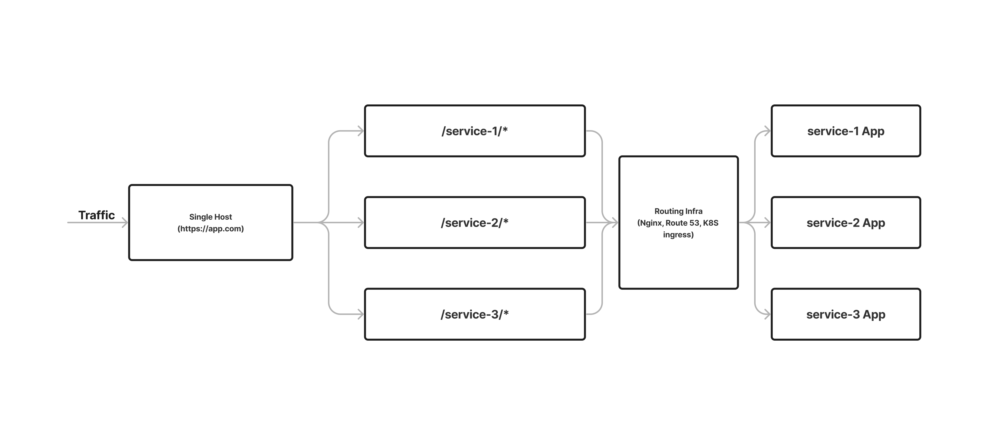
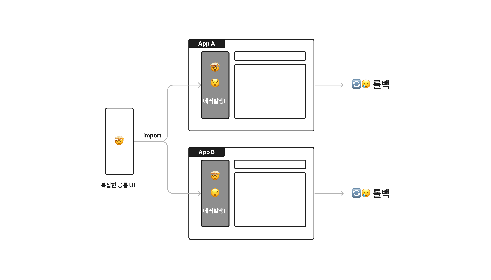
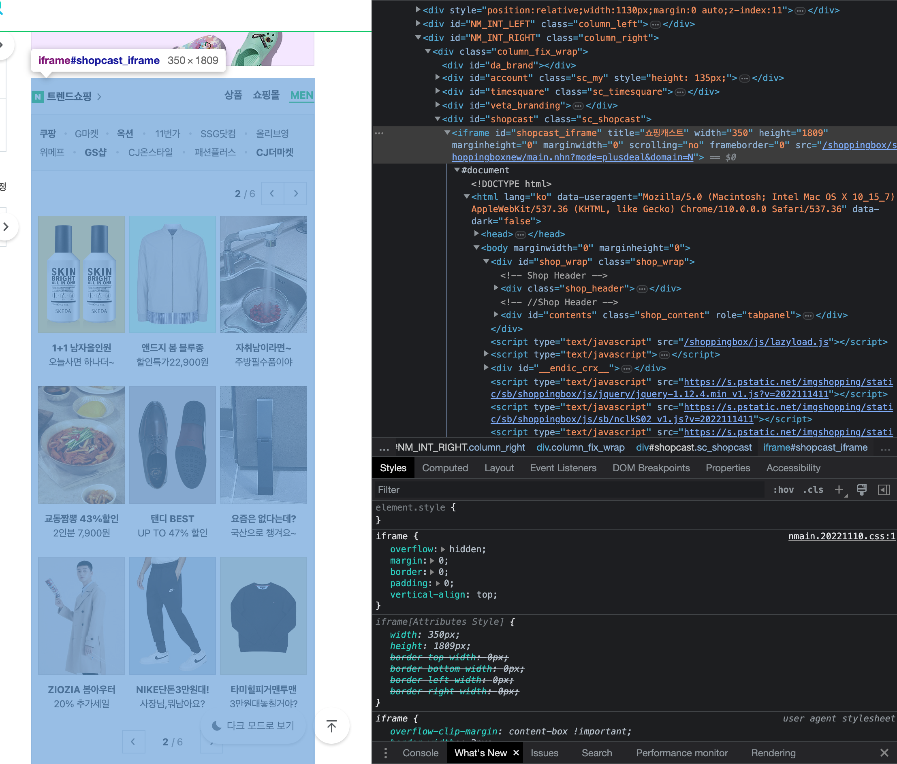
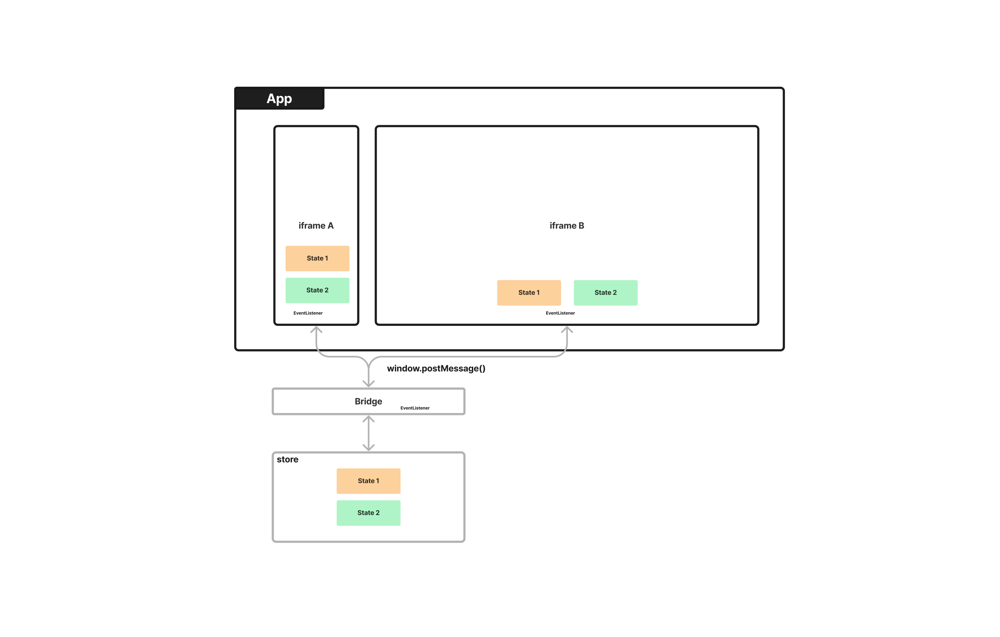
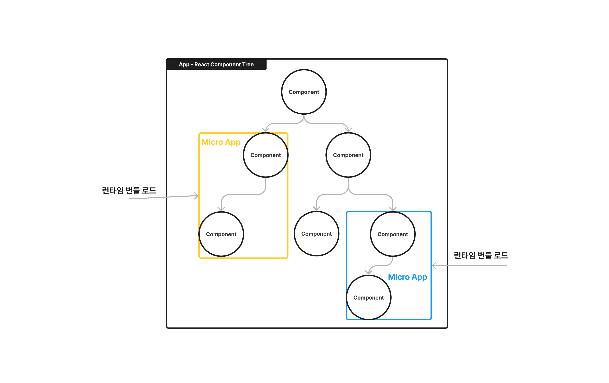
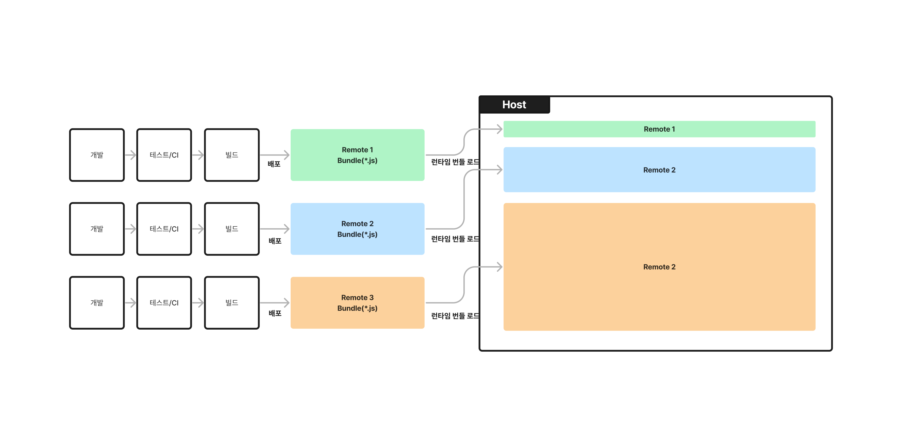
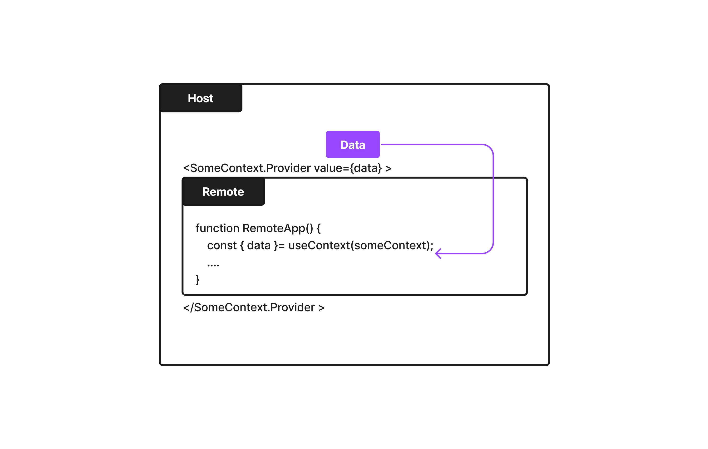
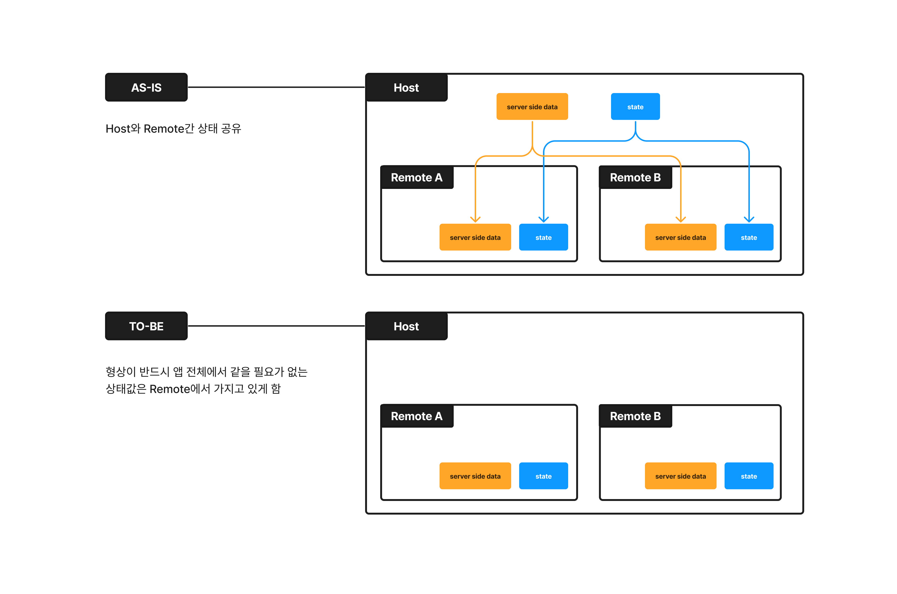

요새 Micro Frontends 이야기가 국내 컨퍼런스에서 종종 나오더라고요. 완전 트렌디하거나 주목도가 엄청 높아졌다고 하기에는 좀 뭐한데, 굉장히 생소한 개념이었던 시절을 지나 이제 국내에서도 어느정도 레퍼런스가 쌓이는 과정에 있는 것 같습니다.

웹 프론트엔드에서도 백엔드의 MSA처럼, 시스템을 잘게 쪼개는 것에 관한 이야기가 스멀스멀 나오게 된 까닭은 복잡성이 매우 높으면서 무지 크기까지 한 웹앱들이 이 세상 어딘가에서 만들어지고 있기 때문입니다. 페이지 URL개수가 200개가 넘고, 웹앱들에 들어가는 코드도 수십 기가바이트 수준인데, 만들어진 모든 기능이 한 앱처럼 보여야 한다는 등의 극한 요구사항을 가진 웹앱을 생각해보면 어떨까요?

당연히 모놀리식으로 유지하는건 말도 안되고, 여러 노하우로 배포 단위를 분절된 웹앱과 페이지 단위로 최대한 나눠서 어찌어찌 해왔지만 한계에 부닥치는 시점이 올 수 있습니다. 프론트엔드 엔지니어들은 애매하게 큰 배포단위 때문에 업무 영역이 겹치고 꼬여서 고통받고, 빌드/배포 그리고 개발서버 띄우는 속도까지 미친듯이 느려지고… 환장파티가 열리고 팀의 속도는 매우 느려집니다.

최근 Micro Frontends 세상을 탐구하면서 느꼈던 이것저것들을 정리해보려고 합니다. 이 포스트는 다음과 같은 질문에 대한 저만의 대답을 얼추 담고 있습니다.

- Micro Frontends 아키텍처는 무엇을 의미하며 어떤 앱의 어떤 문제를 해결하는가?
- Micro Frontends 아키텍처를 구현하는 여러 방법들 중 어떤 방법이 제일 팀과 제품에 주는 가치가 큰가?
- 런타임 통합 Micro Frontends 아키텍처를 도입하면서 가장 유의하고 경계해야할 지점은 무엇인가?
- 궁극적으로 Micro Frontends가 주는 가치는 무엇인가?

## 무엇이 Micro Frontends인가?

뭐가 Micro Frontends 인지부터 관점에 따라 너무 다른데요.

넓은 의미로, 하나의 웹앱의 배포 단위를 쪼개서 배포하는 방식을 가져간다면 Micro Frontends 아키텍처를 따른다고 이야기할 수도 있습니다.

하지만 저는 Micro Frontends 아키텍처의 이점을 최대로 누리기 위해서는 **배포 단위를 페이지 단위 이하로, UI 컴포넌트별로 쪼갤 수 있어야 한다고 생각합니다.**

웹앱으로 배포 단위를 쪼개는 것은 기존의 웹앱 프레임워크나 인프라를 통해 충분히 가능합니다. 하나의 URL 호스트에 각 다른 basePath나 서브 도메인에 각각 분절된 웹앱을 태워서 배포하면 됩니다.

페이지의 묶음은 웹앱의 단위라고 할 수 있으니, 웹앱 단위로 배포 단위를 쪼개는 것은 모놀리식 앱을 처음으로 쪼개기 시작할 때 편리한 방식입니다. 각 분절된 배포단위에 해당하는 페이지들이 서로를 몰라도 되고, 유저 네비게이션 경험에 악영향이 없다면 적정 수준의 엔지니어링이라고 생각합니다.

## 웹앱별 배포로 해결할 수 없는 문제

하지만 다음과 같은 상황이라면 문제가 있습니다.

먼저, 각 페이지에 공통적으로 들어가는 UI(네비게이션 바, 앱 헤더 등)가 존재하고, 이게 복잡해지면 운영에 고충이 생깁니다. 만약 각 분절된 웹앱에서 빌드 타임에 통합되는 공통 UI에 문제가 있을 경우, 해당 UI가 존재하는 배포단위 전체를 꼼짝없이 모두 롤백해야 합니다.

다음으로, 유저가 여러 페이지/앱을 넘나들 때 네비게이션 경험이 좋지 않을 수 있습니다.

유저 입장에서는 그저 앱 내부에서 다른 페이지로 이동하는 것이겠지만, 인프라단에서는 유저가 접속하는 앱이 바뀌기 때문에 앱 초기화, 앱에 필요한 자원을 다시 받는 동작이 일어납니다.

물론 브라우저의 도움으로 페이지 네비게이션간 겹치는 DOM을 다시 재사용할 수는 있겠습니다. 하지만 초기화 과정에서 많은 번들 로딩과 API 요청이 일어나야 한다면 유저는 페이지 전환간 좀 더 기다리거나, 로딩 서클을 재차 볼 가능성이 높아집니다.

만약 페이지간 UI가 거의 비슷할 정도로 공통 UI를 많이 포함하고 있다면 유저 입장에서는 거의 같은 UI가 다시 로딩되는 것이 더 어색할 것입니다.

## Micro Frontends는 어떤 문제에 적합한 솔루션인가?

Micro Frontends는 웹앱 단위로 배포단위를 쪼개는 것으로 충분하지 않을 때 좋은 솔루션이 됩니다. “모든 웹앱에 적용하면 다 좋다!” 이건 당연히 아닙니다.

일반화하기는 힘들지만 Micro Frontends 아키텍처는

- 페이지마다 복잡한 공통 UI가 반복되어 포함되고
- 그런 와중에도 각 페이지들의 UI 유사성이 높고 크게 연관되어 있으며
- 여기에 더불어 분절된 각 앱의 크기가 이미 충분히 크고, 복잡도와 도메인 난이도가 높아 배포 단위를 더 잘게 쪼개고 싶은 요구사항이 있는

웹 애플리케이션에 적합하다고 보여집니다.

이런 상황이라면 거대한 웹앱은 Micro Frontends 아키텍처로 전환했을 때 앞에서 설명했던 문제를 해결할 수 있습니다. 더불어 커다란 앱을 쪼갬으로 빌드/배포 사이클이 단축된다는 이점, 더 잘 나눠진 배포단위를 통해 협업에서의 이점까지 누릴 수 있게 됩니다.

## 어떻게 해야 하는가?

이 단락에서는 [Martin Fowler 블로그 포스트](https://martinfowler.com/articles/micro-frontends.html)에서, Micro Frontends 아키텍처를 구현하는 5가지 방법에 대해서 이야기해보고자 합니다. 각 방법들이 앞 단락에서 설명했던 단점들을 해결할 수 있는지 위주로 살펴봅니다.

1. Server-side template Composition
2. Build-time Integration
3. Run-time Integration via iframes
4. Run-time Integration via web-components
5. Run-time Integration via javascript

결론만 먼저 말하면요. 저는 Micro Frontends가 주는 이점을 확실히 웹 앱에 적용하기 위해서 저는 런타임 통합 (Run-time Integration)방식이 적절하다고 생각하고, 개중에서는 javascript를 통한 런타임 통합 방식(via javascript)이 가장 큰 이점을 준다고 생각합니다.

상황에 따라서는 다음과 같이 사용할 수도 있다고도 생각해요.

- 다른 UI 컴포넌트와 상호작용하지 않는 소수의 UI 컴포넌트를 별도 배포단위로 분리할 때: via iframes, via web-components
- 다른 UI 컴포넌트와 활발히 상호작용하고 다수의 UI 컴포넌트를 별도 배포단위로 분리할 때: via javascript

### Server-side template Composition

해당 포스트에서는, 각각 다른 앱에 맞는 HTML을 서빙하는 서버를 뒤에 두고, 요청한 URL에 따라 맞는 HTML들을 라우팅해주는 nginx 서버를 그 앞에다가 놓아서, 맞는 HTML을 응답으로 보내주는 구조를 설명합니다.

이걸 요즘 웹 개발 트랜드에 좀 더 맞게 말하면, 특정 페이지 단위의 앱을 가지고 있는 여러개의 Nextjs앱 서버를 배포해놓고, Route53이나 Cloud Front같은 인프라단에서 특정 앱에 해당되는 basePath로 요청이 들어왔을 때 해당 앱이 응답하는 HTML과 JS를 보내주어 웹앱을 그리는 방식입니다.

결국, 아까 설명했던 “웹앱 단위 이상으로 배포단위를 쪼개는 것” 과 같습니다.

이 방법과 관련있는 솔루션으로는 Nextjs의 multi-zones가 있습니다. Nextjs로 개발된 여러 웹앱을 묶어서 배포하기 용이하게 만드는 방법인데요. [vercel은 multi-zones를 micro frontends 아키텍처를 구현할 수 있는 방법](https://vercel.com/templates/next.js/microfrontends)으로 제시하고 있지만, 앞서 말한 “웹앱별 배포로 해결할 수 없는 문제”는 해결하지 못합니다.

### Build-time Integration

분리된 UI를 패키징해 배포하고 빌드타임에 통합시키는 방법입니다. 특정 UI의 한 부분을 NPM 패키지로 만들어 애플리케이션의 package.json에 의존성과 버전을 표기한 후 빌드해 배포하는 방법입니다.

특정 UI의 한 부분을 패키지화하면 코드 분리 면에서는 이점이 있습니다. 각 조직별로 오너십을 세분화하기 편해집니다.

하지만 결국 빌드타임에 코드가 통합된다는 한계 때문에 “웹앱별 배포로 해결할 수 없는 문제”는 해결되지 못합니다. 특정 패키지를 번들링해서 미리 트랜스파일하고 빌드해놓는 데서 발생하는 이점으로 어느정도 빌드/배포 사이클을 빠르게 할 수는 있지만요.

그리고 이러한 프랙티스는 앱이 모놀리식이든 배포단위가 나누어져 있든 상관없이 적용할 수 있는 방식입니다.

### Run-time Integration via iframes

여기서부터는 확실히 페이지 단위 이하로 배포 단위를 분리할 수 있는 방법들이면서, 분절된 UI 컴포넌트를 런타임에 통합하는 방식입니다.

먼저 iframe을 사용하는 방식이 있습니다. iframe은 현재도 배포단위를 UI단위로 분리하기 위해, 혹은 다른 웹앱의 UI 일부를 다른 웹앱 안으로 통합하기 위해서 왕왕 사용되는 방식입니다. iframe을 사용하면 특정 외부 URL로 배포해놓은 UI의 일부를 HTML째로 넣어 기존 앱에 쉽게 통합할 수 있습니다.

하지만 iframe Injection 같은 보안 문제 때문에 사용하기 부담스러울 수 있고요. 만약 iframe으로 분리되어있는 UI 컴포넌트에서 다른 컴포넌트와 상태값을 공유해야 한다면, `window.postMessage()` , `EventListener`와 같은 Web API를 활용하는 등 상태를 공유할 수 있는 방법을 고안하고 적용해야 합니다.

### Run-time Integration via Web Components

비교적 최신 web 스펙인 web-components를 이용한 런타임 통합 방식도 있습니다. iframe처럼 보안 문제가 없으면서 분리된 HTML을 기존 앱에 쉽게 통합할 수 있습니다.

web-components를 개발하는 방식이 기존 앱이 React와 같은 라이브러리의 컴포넌트를 개발하는 방식과 달라서, 기존 앱과는 살짝 다른 방식으로 개발되어야 할 수 있습니다. 물론 모든 앱이 Micro 앱이 될 필요가 없고, 소수의 특수한 앱만을 Micro App으로 따로 배포하고 싶은 것이라면 관리 이슈가 아주 크지는 않을 것 같네요.

상태 공유는 여전히 쉽지 않을 수 있습니다. web-components는 커스텀한 HTML 태그의 형태를 가지고 있어서 속성값을 통해서만 데이터를 공유받을 수 있기 때문입니다.

이 방법에 해당하는 솔루션으로는, SAP에서 만든 오픈소스 Micro Frontends 도구인 [luigi](https://docs.luigi-project.io/docs/getting-started)가 있습니다. HTML 을 단위로 분절된 웹앱을 개발하고, 이를 설정값을 작성하여 통합하는 방식인데요. iframe과 web-components의 형태 둘 다 지원하고 있습니다. [React를 사용하는 예제](https://github.com/SAP/luigi/tree/main/core/examples/luigi-example-react/public)도 있으니 한번 살펴보시면 좋을 것 같네요.

저는 iframe과 웹 컴포넌트의 경우, **이미 그것으로 완결되어 런타임에서 다른 컴포넌트와 상호작용할 필요가 없는 소수의 UI 컴포넌트들을 런타임에 통합하는데** 사용하기 좋은 방식이라고 생각합니다. 가령 포탈 메인 페이지에서 iframe으로 분리된 이런 각각의 탭들은 다른 UI 컴포넌트들의 상태를 알지 않아도 괜찮아 보이죠.

다수의 분리된 다른 UI 컴포넌트가 iframe이나 web-components로 런타임에 통합되는 경우, 여러 UI 컴포넌트가 공유하는 상태를 독립된 배포 단위로 넘기기 위한 브릿지 성격의 구현체에 더 의존하게 됩니다. 기존의 UI 컴포넌트와 약간 거리가 있는 곳에서 상태값들을 저장하고, 이를 기존 UI 컴포넌트들의 라이프사이클에 연동시켜야하기 때문에 복잡해질수록 관리가 어려워질 가능성이 높습니다.

이런 지점들을 신경쓰지 않을 방법은 없을까요? 웹앱이 React로 개발되고 있다고 생각해본다면, 배포 단위를 분리하되 공유하는 상태값들의 관리를 그냥 상위 컴포넌트에서 자연스럽게 해볼 수는 없을까요? 정의한 컴포넌트들을 그냥 툭 떼서 별도의 배포단위로 만들고 런타임에서 합치게 할수는 없을까요?

### Run-time Integration via javascript

방법이 있습니다. 바로 UI 컴포넌트를 자바스크립트 번들 단위로 배포 단위를 나누고, 필요할 때 번들을 로딩하여 런타임에 통합시키는 방식입니다.

React를 사용한다고 가정한다면 이 방법에서는 “정의한 컴포넌트들을 그냥 툭 떼서 별도의 배포단위로 만들고 런타임에서 합치는 것” 이 가능합니다. 해당 컴포넌트부터 런타임에 만들 수 있는 독립된 번들로 만드는 거죠.

당연히 배포 단위별 공유되는 상태의 관리는 React에서 제공하는 API들을 통해 앱 안에서 자연스럽게 가능합니다. 미리 로딩된 앱이 가져온 CSS와 같은 자원들도 바로 사용할 수 있습니다.

이 방법이 주는 가장 큰 장점은 배포 단위를 유연하게 가져갈 수 있게 한다는 것입니다. 배포단위간 상태 공유를 위한 작업이 앞선 두 런타임 통합 방법보다 많거나 이질적이지 않고, 모두 웹 앱 내부에서 가능하니 기존 배포 단위를 합치거나 나누는 것이 비교적 간편합니다.

[webpack 5가 제공하는 Module Federation Plugin](https://webpack.kr/plugins/module-federation-plugin/)이 이 방식에 해당하는 솔루션입니다. 해당 플러그인은 분리된 배포 단위의 웹앱이 모이는 일명 host, 각각 분리된 배포 단위인 remote 앱을 정의하고 런타임에 합칠 수 있는 빌드 옵션을 제공합니다.

> Micro frontends work like a monolithic

플러그인 창시자인 Zack Jackson의 표현인데요. 이 플러그인의 컨셉을 아주 잘 설명하고 있습니다.

Module Federation Plugin을 사용하면 거대한 웹 앱을 따로 개발해 빌드/배포하는 것으로 MSA의 장점을 가져가고, 런타임에서는 모놀리식처럼 통합되어 통합의 자연스러움과 상태 관리의 이점을 얻을 수 있습니다.

## 런타임 통합 Micro Frontends 도입 시 유의점

지금까진 런타임 통합 Micro Frontends의 장점 위주로 설명한 것 같은데요. 단점이나 구현하면서 유의할 점들도 말씀드려 볼게요.

여기서부터는 제가 제일 좋은 솔루션이라고 생각하는 Run-time Integration via javascript 방법을 기준으로 말씀드립니다.

### 런타임 통합의 위험성을 완화해야 한다.

런타임에 마이크로앱으로 분리된 UI 컴포넌트를 합쳐서 웹앱을 제공한다는 컨셉은 빌드 타임에 컴포넌트를 합쳐서 배포 나간다는 컨셉보다 더 위험합니다. 배포를 해봐야만 확인할 수 있는 에러를 맞닥뜨릴 수 있기 때문입니다.

Host-Remote 관계의 두 앱에서, Host에서 Remote로 특정 상태값을 공유하고 있다고 생각해보겠습니다. React의 예를 들어보면 Host에 Context API의 Provider가 존재하고, Remote에는 consumer가 존재하는 거죠.

Host에서 공유하는 상태값의 필드가 바뀌어 배포가 나갔을 때, 하위 배포 단위인 remote에는 리스크가 될 수 밖에 없습니다. 참조가 잘못되어 객체 속성값이 `undefined`로 나올 수도 있겠죠.

따라서 이런 경우를 유발할 수 있는 코드를 최대한 줄여야 하는데요. 각 배포단위간 의존하는 상태가 바뀌었을 때 확실하게 배포가 나가야될 배포 단위가 구분되어야 하고, 공유하는 상태를 최대한 줄이는 것이 안정성을 확보할 수 있는 방법이겠습니다.

또한 분리된 배포단위 번들의 동적 로드(Dynamic Import)를 적극적으로 사용하게 되니 네트워크 의존도도 높아집니다. 에러 처리가 확실하게 되어야 합니다. 번들을 불러오지 못했거나, 불러온 번들에서 에러가 났을때 앱 전체의 장애로 전파되지 않도록 해야합니다.

개발 과정에서 여러 배포단위들을 localhost의 여러 port에 띄울 수 있게 제공하는 등, 런타임 에러를 최대한 잡을 수 있는 개발 환경을 제공하는 것도 필요한 일입니다.

### 하나의 Micro 앱은 기존의 UI 컴포넌트보다 무거워질 수 있다.

이러한 런타임 통합의 위험성을 완화하기 위해 배포 단위간 공유하는 상태값을 없애야 할 수 있습니다.

모놀리식 앱에서 상위에서 받아 공유하고 있었던 특정 UI 컴포넌트가 사용하는 데이터, 자원, 상태값들을 개별적으로 가지게 해야 할 수 있습니다. 이러면 하나의 UI 컴포넌트가 가지는 상태값과 번들의 크기가 기존보다 커집니다. 중복된 API 요청이 더 발생할 수도 있습니다.

기존에 앱을 개발하는 방식이나, 최적화 관점, DRY 원칙에 기대 생각하면 이러한 조치는 일반적이지 않습니다. 하지만 공유하는 데이터 때문에 배포 이후 런타임에서 앱이 깨지는 것보단 낫습니다.

정말 꼭 필요한 데이터만 공유하고, 전체 앱에서 형상을 엄격히 하나로 유지할 필요가 없는 상태값들은 적당히 쪼개진 마이크로앱들로 도로 집어 넣어 분리된 배포단위 사이 경계를 뚜렷이 하면, 각 마이크로앱 사이에 더욱 독립적인 배포가 가능해질 것입니다.

### 마이크로앱이 가져오는 복잡성을 통제해야 한다

javascript 런타임 통합을 사용한다면 그냥 자바스크립트 모듈로 UI 컴포넌트를 배포 단위로 뜯기 때문에 이론적으로는 배포 단위를 무한으로 만들어낼 수도 있습니다.

그렇지만 배포 단위가 많아지면 당연히 관리가 힘들고 배포하는데도 품이 많이 들 거구요. 분리된 배포 단위를 참조하는 코드를 작성하는 과정에서 의존성이 꼬일수도 있고, 많은 앱을 동적으로 로드해야 하기 때문에 성능에도 문제가 생길 수 있습니다.

webpack 5 Module Federation Plugin은 [전방위적(Omnidirectional)인 배포 단위 생성](https://webpack.js.org/concepts/module-federation/#uncaught-error-shared-module-is-not-available-for-eager-consumption)이 가능합니다.

무슨 말이냐면 Host가 Remote를 가질 수 있고 Remote는 다시 또다른 Host로써 다른 Remote를 가질 수 있고 기존의 Host의 역할을 하는 Remote가 또 다른 Host를 Remote로 가질 수도 있고… 그렇습니다. 이런게 되긴 하는데, 이런 식으로 마이크로 앱을 운용하면 개인적으로는 큰일날거 같습니다. [심지어 두 마이크로앱이 서로의 Host와 Remote가 동시에 되는 것](https://youtu.be/njXeMeAu4Sg?t=1064)도 됩니다;;

따라서 배포 단위가 쉽게 늘거나 의존성이 복잡해지지 않도록 Module Federation plugin의 설정값을 어느정도 강제할 수 있게 규칙을 정하고, 특정 부분은 수정할 수 없게 한 번 래핑해서 쓸 수 있게 하면 좋을 것 같아요.

또한 모노레포를 사용하고 있다면, 특정 내부 패키지의 사용처가 각 배포 단위 사이에서 명확해야 합니다. 의존성이 너무 꼬여서 특정 패키지가 바뀔 때 배포할 앱들의 추적이 힘들고 결국 모든 앱이 배포되어야 한다면, Micro Frontends로 만드려고 했던 마이크로 앱간 확실한 경계 확립이 힘듭니다.

## 런타임 통합 Micro Frontends의 가치

여기까지 꽤 많은 것들을 말씀드렸네요. 제가 생각하는 런타임 통합 Micro Fronteds의 가치를 말씀드리고 글을 마무리지으려고 해요. 주로 개발 조직 관점의 이야기입니다.

### 팀별로 앱의 오너십을 더 섬세하게 규정하여 제품 개선에 집중할 수 있다.

UI 컴포넌트 단위로 배포 단위를 나누는 것은 앱의 오너십을 좀더 섬세하게 규정지을 수 있다는 것을 뜻합니다.

복잡하고 큰 웹 제품을 개발할 때, 내가 개발하는 기능에 다른 도메인의 코드가 엮이거나 엮일 수 밖에 없어 코드에 오너십을 가진 개발자를 찾아가야 하는 일이 왕왕 일어납니다. 이런 상황의 개발자들은 서로의 발을 자꾸 밟으면서 개발을 하고 있는지도 모릅니다.

> the coupling and complexity in the existing monolith means that **everyone is stepping on each other's toes.** - [Micro Frontends - Cam Jacskon](https://martinfowler.com/articles/micro-frontends.html)

팀이 특히 목적 조직, spotify 조직에서 말하는 스쿼드로 일하고 있다면 결국 그 서비스를 더 잘 개선하기 위해서는 프로젝트간 오너십과 경계가 확실해야 합니다. 그래야 다른 개발자를 찾아갈 일이 적어지고, 엮인 공용 코드 때문에 기능 개선에 장애물이 되는 일이 없어집니다. 결국 자신이 맡은 부분의 제품 개선에 집중할 수 있게 됩니다.

> "메일 프런트엔드 엔지니어가 대화를 많이 해야할 대상은 드라이브 프런트엔드 엔지니어가 아니라, 메일 기획자, 메일 BE 엔지니어 입니다." - 이웅재님, [[NHN FORWARD 22] 거대한 서비스 쪼개서 마이크로 프런트엔드 만들기](https://www.youtube.com/watch?v=BWyCH_fv81g)

Micro Frontends는 배포 단위를 더 잘게 나눠 목적 조직에서 온전히 관리할 수 있는 단위로 개발, QA, 빌드/배포 사이클까지 모두 거칠 수 있게 만듭니다. 배포와 개선 일정을 조직 안에서만 합의하고 배포해도, 다른 조직에는 영향을 미치지 않게 할 수 있습니다. 경계 안에서 자유로운 기술 결정과 새로운 시도도 가능합니다.

### 제품의 변화는 물론, 팀의 변화까지 대응할 수 있는 유연한 웹앱 구조를 만든다.

javascript 런타임 통합을 사용한다면 앱의 기존 개발 방식을 유지하면서도 비교적 쉽게 배포단위를 나눌 수 있습니다.

일반적으로 팀의 조직 변경에 따라 배포 단위가 바뀌지는 못합니다. 있는 배포 단위의 오너십은 바뀔 수 있어도요. 이미 존재하는 배포 단위에 오너십이 겹치는 부분이 있어 조직 A와 함께 새로운 조직 B도 개발하게 되었다…! 정도의 결정을 내리는 것도 흔합니다.

하지만 원할 때 존재하는 배포 단위를 더 잘게 나누거나, 여러 배포단위를 하나로 합치는 것을 쉽게 할 수 있다면 조직 변경에 맞는 배포 단위를 가져갈 수 있게 됩니다. 또한 특정 조직이 개발하는 앱이 너무 커졌을 때 이를 쪼개면서 손쉽게 빌드 시간을 줄이고 더 빨리 배포할 수도 있죠.

스타트업 개발 조직에서는 조직이 꽤 자주 바뀌고, 전통적으로 배포 단위는 일반적으로 이 속도를 따라가지 못했습니다. 그래서 저는 배포 단위를 비교적 자유롭게 설정할 수 있는 것이 팀의 속도를 높일 수 있는 큰 레버리지라고 생각합니다.

--

여기까지입니다. 엔지니어링 사례를 들면서 좀 더 적확히 설명해보려고 그림도 그리고, 꽤나 설명이 길어지기도 했지만 와닿을만한 글이 되었는지 잘 모르겠어서 불안합니다.

혹시 이해가 잘 안되시거나 질문이 있으시면 댓글이나 이메일로 말씀해주시면 감사하겠습니다. (끝)

## References

제가 Micro Frontends를 탐구하면서 도움이 되었던 레퍼런스들을 정리해 봤습니다.

- [Micro Frontends - Cam Jackson, MartinFolower.com](https://martinfowler.com/articles/micro-frontends.html)
- [Micro Frontend Architecture - Luca Mezzalira](https://www.youtube.com/watch?v=BuRB3djraeM&t=242s)
- [Server-side rendering micro-frontends – the architecture - James Beswick, AWS Compute blog](https://aws.amazon.com/ko/blogs/compute/server-side-rendering-micro-frontends-the-architecture/)
- [How Micro Frontend Has Changed Our Team Dynamic - Bimo Wijoyo](https://medium.com/paypal-tech/how-micro-frontend-has-changed-our-team-dynamic-ba2f01597f48)
- Webpack 5 Module Federation
  - [Webpack 5 Module Federation - Zack Jackson - CityJS Conf 2020](https://www.youtube.com/watch?v=-ei6RqZilYI&t=1956s)
  - [When should you leverage module federation, and how? - Zack Jackson](https://scriptedalchemy.medium.com/when-should-you-leverage-module-federation-and-how-2998b132c840)
  - [Getting Out of Version-Mismatch-Hell with Module Federation - Manfred Steyer](https://www.angulararchitects.io/en/aktuelles/getting-out-of-version-mismatch-hell-with-module-federation/)
- 국내 컨퍼런스 발표: 모두 런타임 통합 Micro Frontends를 다루고 있습니다.
  - [[NHN FORWARD 22] 거대한 서비스 쪼개서 마이크로 프런트엔드 만들기](https://www.youtube.com/watch?v=BWyCH_fv81g)
  - [MFA, 누구냐 너: 공통 플랫폼개발 파트의 MFA도입기 / if(kakao)2022](https://www.youtube.com/watch?v=_SkngG2RR3Q)
  - [마이크로프론트엔드. 실무에 쓸만할까? / if(kakao)2022](https://www.youtube.com/watch?v=DOS0YPwdnhk)
  - [[A4] Webpack 5 Module Federation으로 Micro-Frontends 운영하기](https://www.youtube.com/watch?v=0Eq6evGKJ68&t=1770s)
  - [[Track 2-4] 원지혁 - 프론트엔드에서의 마이크로 서비스 아카텍처](https://www.youtube.com/watch?v=FQoNY2W0s4E)
  - [토스ㅣSLASH 21 - Micro-frontend React, 점진적으로 도입하기](https://www.youtube.com/watch?v=DHPeeEvDbdo)
