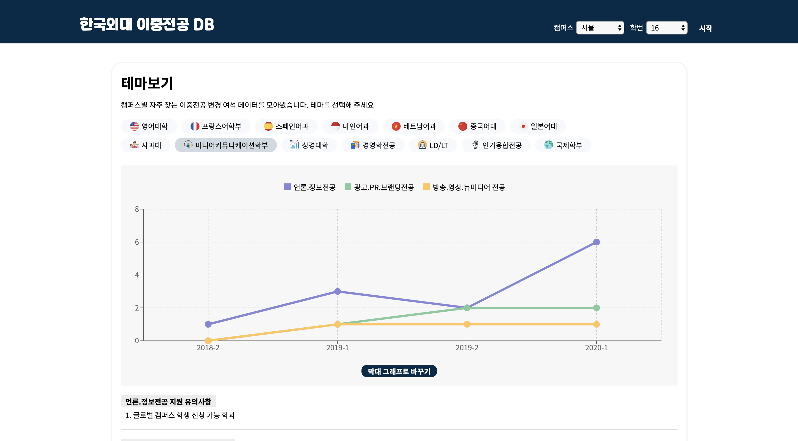

This post is a quick retrospective on a service targeted at students at my university. I'm going to introduce the project and write down some of the things I've realized or thought about how I could do better while working on my personal project of creating a small service for my school.

## ✌🏻 Two projects.

This year, I created a chrome extension for my school's end-of-term clock in March and a DB web service for my school's double major in May, and promoted them to the school community. Let me briefly describe the projects!

### End of day clock

The [School End Clock](https://github.com/MaxKim-J/HUFS-Semester-Clock-Extension) is a new tab-themed Chrome extension that appears whenever you create a new tab. It basically shows you how much time is left until the end of the semester and how much time has passed since you started college. It also has a customizable wallpaper and a handy feature that allows you to view academic announcements and the weather around your school.

### Hankuk University Double Major DB

The [Hankuk University Dual Major DB](https://github.com/MaxKim-J/HUFS-Second-Major-Visualize) is a web service that organizes and visualizes the data required for students to change their dual majors. In the case of Hankuk University of Foreign Studies, a double major or minor is required, and you can change or apply for a double major every semester. Every semester, an excel file with the number of seats available for each double major department is posted in the academic announcement, and this web service allows you to easily view the excel file through graphs.

### Results.

The chrome extension of the end of semester clock is currently being used continuously by about 190 users. As for the double major DB, it's gotten a little over 1000 pageviews since its launch in May... Both have been well received by the school community! It's not a huge amount of traffic, but the fact that there are still people using my apps makes me realize that I need to keep maintaining them responsibly!

Next, I'd like to talk about why I created a service targeted at school users, how I approached project planning and development, and the pros and cons of working on a school-based project like this!

## 🏃🏻 Approach

### Planning a service that "didn't exist"

Schools are small societies with specialized needs that make them different from the average user. But because they're smaller than the average user group, it doesn't make financial sense to create a commercial product that's designed to make a profit. In other words, products that fulfill the specialized, small needs of school members don't come along very often. So from the perspective of a developer who can create a service, schools are a land of opportunity. You can create a "really useful" app that fulfills a small, but somewhat specialized need, and attract traffic. That's something you can't get from clone coding or tutorials.

So what should you build? It's easy to think about if you're a member of the school, because your pain points are the pain points of your students, your users, and you have access to the specific needs of your users. For example, in my project, the pain point that the foreign double major database solves was also a pain point for me. I was doing a different double major in the past, and I wanted to switch to a software convergence major, so I was comparing the double major change availability information for the third semester in the academic bulletin to see if I could get a spot in the current semester, and the excel file was really hard to read, so I thought it would be nice to graph it and see it at a glance. And I realized that it wasn't just a pain point for me, so I built the app.

Launching quickly, even if you don't have ###.

With my personal project, I wanted to try out technologies I hadn't used before. At the same time, I had a lot of doubts about whether I could build a complete service with these new technologies. I wanted to launch the app in as perfect a state as possible, but I was in the middle of a semester and didn't want to be on a schedule with my personal project, so I decided to launch quickly, promote it, get feedback, and fix it. Because of the rapid deployment cycle, the app wasn't always perfect, and there were quite a few times when I would launch and realize, "Why didn't I fix this here?" But I was able to get a lot of feedback and it got better and better. I think it's because we have a small user base and we're not doing it for profit, so bugs and errors in the app don't cause us to lose a lot of money.

## 👍🏻 Pros

### Relatively easy to promote, easy to grow users early on

The developers are also students at the school, so they know what channels work well with students. We have access to communities that only students have access to, and promoting something new that helps students gets a lot of attention in the community. I think the first post announcing the launch of the end of the day clock was on the top message board of the school community for about two weeks, so it's easy to get users early on. Of course, it requires constant maintenance and expansion to not lose the early users. Because it's a small service, users can easily leave if they encounter a flaw in the app or feel that they don't need it.

### You can get feedback from your users

When a service generates some traffic, developers can put themselves in the shoes of the users, or users can actively give feedback, which is a great motivation to keep maintaining the app. When we first launched the app, we thought we had a pretty complete service, but we got a lot of feedback from people through the email address we listed on the app. The feedback included typos, bugs on operating systems that I don't use, and users from different campuses of the same school pointing out information that I hadn't noticed before. The feedback helped us to make the app more complete.

## 👎🏻 Cons

### Ongoing promotion can be difficult

Promoting through your school community has its limitations. At first, people responded to the app a lot, but I can see the interest decreasing even if I post different posts and promote it. It may be embarrassing to keep posting on the bulletin board when you don't have a specific space in the community. I think that the service should stop relying on school community promotion and go viral in order to grow more quantitatively. It means that students in the school classroom see a friend who uses the service I made and install it... That should happen a lot. But nowadays, it is difficult to expect due to non-face-to-face classes due to the coronavirus....😿

### There are limits to expanding functionality

Although the needs of school users are clear, they are not that diverse. Therefore, if you make an app that solves a certain problem, it is difficult to continue to add features by expanding the purpose of the original function. This is the case with the dual major DB. In a way, it provides a clear function of providing data related to dual majors in a graph, but there is no problem that this service can solve. However, if you develop another function, it is not good because it does not fit the purpose of the app and feels foreign. It would be good to think about how the app can be expanded and what features can be added in the mid- to long-term during the planning stage.

## 😎 Good posture to take

I think it would be good to have this kind of thinking when doing a personal project at school.

### Let's stop illusion driven development and just make a (good) app first

I like the phrase ["illusion-driven development"](https://jojoldu.tistory.com/496), which is a phrase that developer Dongwook Lee used in one of his blog posts. It's a phenomenon where you get excited (?) because you think something you made is going to be a big hit. I made this, and the idea is so good. What if it's so good that it costs too much for the server?" I've thought about that a lot during my projects, but it doesn't happen very often (fact). So I think it's better to just build it, measure the performance, and if it's really good, it's never too late to think about it.

It's so obvious, but a good app, an app that solves a pain point effectively, keeps users coming back for more. Before I started the project, I looked up some student-developed apps at school, and some of them stopped updating, but the good ones, even if they stopped updating, you could easily find comments like "Why did it stop, please do it again" in the app store comments. I aimed to make such an app.

Let's put the ### on them.

I had never built an app that I was solely responsible for maintaining and that was actually used by users. I started the project more because I wanted to do a serious personal project than because I wanted to solve a user's problem, but when I launched it and measured how much users were using it, I had to put pressure on myself. I didn't want users to feel uncomfortable while using the app because it was my name on it, and I wanted them to get more out of it. For those who haven't worked in a company or built a product on their own, I think the project at school can give you a sense of pressure and responsibility. I think it made me a better developer because I became more cautious with each version and less impatient to get things done quickly.
