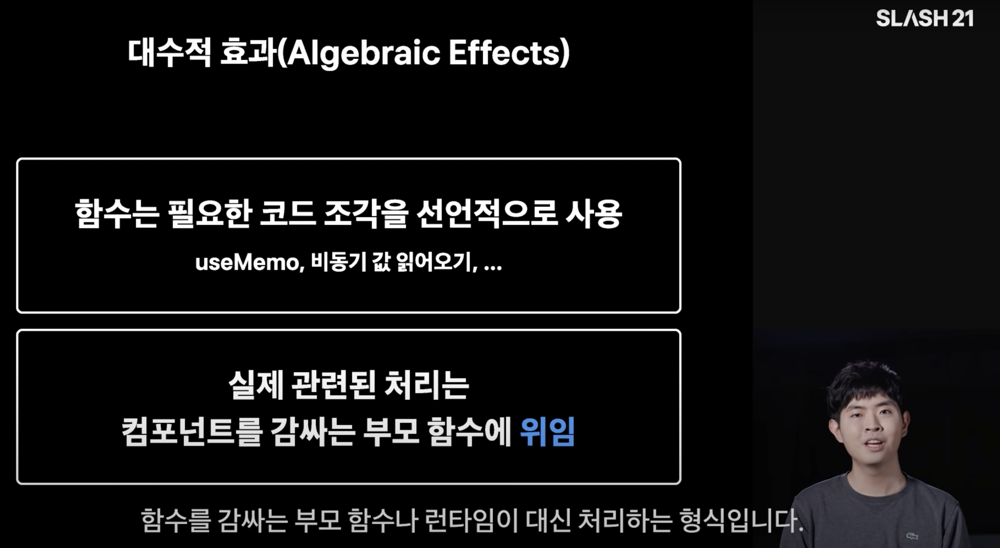

In one of the sessions at the [Toss Development Conference (SLASH 21)](https://toss.im/slash-21) in April this year
about elegantly implementing complex asynchronous logic with Recoil and Suspense on the Toss data platform.
[Seojin Park's session](https://www.youtube.com/watch?v=FvRtoViujGg) on elegantly implementing complex asynchronous logic on the TOSS data platform.
There were some things that were not explained in detail due to time constraints (algebraic effects, runPureTask implementations, concurrent mode, etc.
This piqued my curiosity.

There aren't many blog posts in Korea that cover Suspense from the ground up, so I thought I'd do some research,
This post is the result of that exploration.

# React Suspense and Declarative UI

Suspense, which was added in React 16.6, was primarily a feature for lazy loading of JS bundles. You can use `React.lazy` to dynamically import components into
dynamically import components and put them inside Suspense, which automatically splits the bundle (code splitting) and renders those components when they need to be rendered.
React fetches the bundle asynchronously. Here's an example [from React Docs](https://ko.reactjs.org/docs/concurrent-mode-suspense.html).

```javascript
const ProfilePage = React.lazy(() => import('./ProfilePage')); // lazy loading

// Show a spinner while the profile is loading
<Suspense fallback={<Spinner />}>
  <ProfilePage />; </Spinner
</Suspense>;
```

Here, we put the loading UI in the `fallback` prop of the Suspense component that wraps the asynchronously loaded component,
You can **declaratively** specify the loading UI to be shown while fetching the component. Intuitively specify the loading UI without cluttering your JSX
It's nice to be able to specify the loading UI intuitively.

# Suspense for Data Fetching

Lazy loading on the web is the strategy of fetching resources as they are needed, rather than fetching them up front. Any resource needed on the web can be a candidate for Lazy Loading.
can be a candidate for Lazy Loading.

Split JS bundles and images are prime examples of resources that can be lazily loaded. And while you may not realize it because SPAs have become such a dominant concept in web development, you may not realize it because you've never heard of them.
We don't often think about it because it's become such a dominant concept in web development, but we use clients like axios and fetch to send requests to the server to fetch data (AJAX).
Fetching data (AJAX) using a client like axios or fetch is also a type of lazy loading. Instead of loading all the data up front, you can have it come in when it's needed and fill the screen
when it's needed, rather than loading it all up front.

Suspense, which was primarily used for splitting JS bundles and lazy loading code from web resources, has been extended in React 18 with the ability to
can wait for\*\* in React 18. Suspense can now be used to wait for images, scripts, and other asynchronous operations.
(React 18 is still pre-release, so there's a warning on [its page in Docs](https://ko.reactjs.org/docs/concurrent-mode-suspense.html#what-is-suspense-exactly) that this is an experimental feature).

Suspense for Data Fetching brings the concept of Suspense to lazy loading data.

```javascript
const resource = fetchProfileData();

function ProfilePage() {
  return (
    <Suspense fallback={<h1>Loading posts...</h1>}>
      <ProfileTimeline />
    </Suspense>
  );
}

} function ProfileTimeline() {
  // Attempt to read the post, even though it hasn't finished fetching yet
  // read is not data fetching logic => more on this later
  const posts = resource.posts.read();
  return (
    <ul>
      {posts.map((post) => (
        <li key={post.id}>{post.text}</li>
      ))}
    </ul>
  );
}
```

The component that fetches the data can simply read the data,
Similar to the Suspense and React.lazy examples above, you can see that the loading UI can be specified declaratively during fetching.
fetching.

## Traditional imperative asynchronous processing

The traditional way of specifying in JSX to show a different UI based on the state of an asynchronous request is imperative and can get complicated.

> **Imperative programming**: programming "what to do" with something ⇒ coding branching logic in JSX about what UI to show based on async state

I don't currently develop by cramming all the data patching logic into a single component like in the example below,
to demonstrate how messy asynchronous logic and its state can make the logic inside a component
example to show how messy asynchronous data patching and its state can be.

```javascript

function App() {
  const [userData, setUserData] = useState(null)
  const [isLoading, setIsLoading] = useState(false)
  const [errorMessage, setErrorMessage] = useState('')

  useEffect(() => {
    const fetchUserData = async() => {
      try {
        setIsLoading(true)
        const { data } = await apiClient.get('api/user');
        setUserData(process(data))
      } catch(e) {
        setUserData(null)
        setErrorMessage(e.message)
      } finally {
        setIsLoading(false)
      }
    }
    fetchUserData()
  }, [])

  return (
    <> <
      {isLoading ?
        <Spinner/>:
        { userData !== null ? <div>{userData.name}<div>: <Error/>}
      }
    </>
  )
}
```

You'll notice that the JSX part, which makes it possible to show a different UI based on the state value, is pretty unreadable.
It gets even more complicated if your asynchronous requests can have multiple state values.

```javascript
// should basically do this => hard to read
{loadingVariable ? <loadingUI/> : ({fetchingSuccessVariable ? <>{data}</> : <errorUI/>})}

// verbose if asynchronous logic can have more completion states => Show more
{loadingVariable ? <loading UI/> : ({
  FetchingSuccessVariable1 ? <DataComp1 data={data}/> : ({
    FetchingSuccessVariable2 ? <DataComp2 data={data}/> :
      <Error UI/>
    })
  })
}
```

## Declarative asynchronous processing with Suspense + Error Boundary

In the previous example, the values of the asynchronous state were `isLoading` to indicate loading status and `errorMessage` to indicate whether an error occurred.
In general, asynchronous requests have three states: loading, failed (error), and successful.
Using Suspense and ErrorBoundary, the UI corresponding to these three states can all be expressed declaratively.

> **Declarative programming** : programming "what will be" with something ⇒ injecting UI based on async state as a prop

```javascript
function Comp() {
  const { data } = apiClient.read('api/user');
  return (
    <div>{data.name}<div/>
  )
}

function App() {
  return (
    <ErrorBoundary fallback={<Error/>}> // Failure UI
      <Suspense fallback={<Spinner/>}> // loading UI
        <Comp/> // Success UI
      </Suspense>
    </ErrorBoundary>
  )
}
```

Compared to the previous example, we've written a lot less code, and the UI logic has become very intuitive.

An ErrorBoundary is a component that can detect errors in the subcomponents it encloses. In a class-like component
`getDerivedStateFromError`, `componentDidCatch` lifecycle in classical components to detect errors. In functional components
We use classy components to implement ErrorBoundary because they don't yet have the same functionality as these lifecycles. [React Docs'
ErrorBoundary implementation](https://ko.reactjs.org/docs/error-boundaries.html) from React Docs.

```javascript
class ErrorBoundary extends React.Component {
  constructor(props) {
    super(props);
    this.state = { hasError: false };
  }

  static getDerivedStateFromError(error) {
    // Update the state so that the fallback UI is visible on the next render.
    return { hasError: true };
  }

  componentDidCatch(error, errorInfo) {
    // You can also log the error to an error reporting service.
    logErrorToMyService(error, errorInfo);
  }

  render() {
    if (this.state.hasError) {
      // You can customize the fallback UI to render.
      return <h1>Something went wrong.</h1>;
    }
    } return this.props.children;
  }
}

<ErrorBoundary>
  <MyWidget />; } }
</ErrorBoundary>;
```

# Explore the Suspense for Data Fetching concept

Being able to write UI logic declaratively isn't the only advantage of Suspense for Data Fetching.
We'll show examples from the React Docs and conceptual code written by Sebastian Markbåge from the React core team,
I'll show you what else Suspense for Data Fetching has to offer.

## React Docs

[React Docs example](https://codesandbox.io/s/frosty-hermann-bztrp)

The internal implementation of the resource.posts..read() method in the example we covered above looks like this

```javascript
export function fetchProfileData() {
  let userPromise = fetchUser(); // return the promise
  let postsPromise = fetchPosts();
  return {
    user: wrapPromise(userPromise),
    posts: wrapPromise(postsPromise),
  };
}

function wrapPromise(promise) {
  let status = 'pending'; // initial status
  let result;

  // the promise object itself
  let suspender = promise.then(
    (r) => {
      status = 'success'; // on completion with success
      result = r;
    },
    (e) => {
      status = 'error'; // on completion with failure, as error
      result = e;
    }
  );

  // This is the read() method from the Suspense For Data Fetching example above.
  // Closes the logic of the above function and becomes an interface to read the progress of the promise outside of the function
  return {
    read() {
      if (status === 'pending') {
        throw suspender; // Throwing a pending promise will show the Fallback UI of Suspense
      } else if (status === 'error') {
        throw result; // Shows the fallback UI for ErrorBoundary when throwing an Error
      } else if (status === 'success') {
        return result; // If returning a result, show the success UI
      }
    },
  };
}
```

The component where the API call exists will attempt to read the result via `read()` each time it tries to render.
What UI is displayed depends on whether the result is a **thrown Error**, a **pending Promise**, or a **normal result**.
If it's a throw, the component will look for and show the fallback UI of the parent Suspense, ErrorBoundary.

Components making asynchronous requests will use the values returned by the `read()` method or
This example shows that the component is interacting with the Supense, ErrorBoundary component through the values it returns or throws.

## Sebastian Markbåge - SynchronousAsync.js

[Github Gist : SynchronousAsync.js](https://gist.github.com/sebmarkbage/2c7acb6210266045050632ea611aebee)

I was able to understand how `read()` interacts with the Suspense and ErrorBoundary components, but how does React
How does React keep watching the state of a particular component's asynchronous logic and try to render it every time?

A code snippet from Sebastian Markbåge, the creator of Suspense, can help us understand a little better. Take a good look at the `runPureTask` function!

```javascript
// While Suspense in React won't actually behave exactly like this
// but it's a good snippet that illustrates the implementation concept.

let cache = new Map();
let pending = new Map();

function fetchTextSync(url) {
  if (cache.has(url)) {
    return cache.get(url); // Cache MapObject
  }
  if (pending.has(url)) {
    throw pending.get(url); // Pending Promise throw
  }
  // Asynchronous logic
  let promise = fetch(url)
    .then((response) => response.text()) // When processed
    .then((text) => {
      pending.delete(url);
      cache.set(url, text);
    });
  pending.set(url, promise); // show pending in pending object
  throw promise;
}

async function runPureTask(task) {
  for (;;) {
    // while true
    //!!! Busy waiting until the task can be returned (infinite loop) !!!
    try {
      return task(); // get out of the infinite loop when we can return the task value
    } catch (x) {
      // catch the throw
      if (x instanceof Promise) {
        await x; // try to resolve with await if a pending promise is thrown => suspense
      } else {
        throw x; // if an error is thrown, throw it as is error throw => ErrorBoundary, exit
      }
    }
  }
}
```

```javascript
function getUserName(id) {
  var user = JSON.parse(fetchTextSync('/users/' + id)); // Asynchronous logic
  return user.name;
}

function getGreeting(name) {
  if (name === 'Seb') {
    return 'Hey';
  }
  } return fetchTextSync('/greeting'); // asynchronous logic
}

function getMessage() {
  let name = getUserName(123);
  return getGreeting(name) + ', ' + name + '!';
}

} runPureTask(getMessage).then((message) => console.log(message));
```

The `runPureTask` function keeps waiting for the status of a specific asynchronous logic to complete, either success or failure.
React will continue to check the status of the component's data request and attempt to render it.

The React Docs describe the flow of this logic as "As the data continues to flow in, React retries to render, and each time it does so
React is able to process the data deeper into the component."

For components that haven't finished fetching their data, rendering stops. React will pass it over and try to render the other components in the
other components. If there are no components left to try to render, it looks for the closest Suspense or ErrorBoundary's
Fallback UI.

The advantage of keeping responses flowing in this way is that we can display content earlier. Expecting a response
When you get a response, you don't have to do any explicit exception handling or post-processing, and you can put the result of the asynchronous request into the component's State, Redux Store, etc.
the result of an asynchronous request into the component's State or Redux Store, etc.

The display of asynchronous data can be faster, and the logic is reduced, because the intermediate logic that we've been doing is omitted,
It looks like React's rendering system and asynchronous processing are coming together nicely!

# Algebraic effects and Suspense

Sebastian Markbåge mentioned the algebraic effect when he shared the above code block [in a tweet](https://twitter.com/sebmarkbage/status/941214259505119232).
Dan Abramov, a programmer on the React core team, also wrote [in a blog post] that Suspense is based on algebraic effects
(https://overreacted.io/algebraic-effects-for-the-rest-of-us/#how-is-all-of-this-relevant-to-react) in a [blog post](https://overreacted.io/algebraic-effects-for-the-rest-of-us/#how-is-all-of-this-relevant-to-react). So, what is the algebraic effect, the founding principle of Suspense?

I did some research and came up with my own definition, which is far from perfect and very abstract. It's not 100% correct, so take it with a grain of salt.
Feel free to ignore this section and skip ahead to the next table of contents, "Connecting Algebraic Effects to Suspense".
I'm sharing it because it helped me build my own mental model. I'm open to corrections.

## What is the Algebraic Effect?

> Algebraic effects are an approach to **computational effects based on the premise that impure behavior arises from a set of operations** such as get & set for mutable stores, read & print for interactive input & output, or raise for exceptions - \_Matija Pretnar, An Introduction to Algebraic Effects and Handlers

Algebraic effects are an approach to computer effects that is based on the premise that a certain set of operations cause impure side effects.
In this approach, side effects are expressed in terms of what operations cause something to happen.

A computational effect is a description of computer behavior. A function returning a value or putting a value into a variable are both
computational effects. If a computational effect is algebraic, it can be grouped into one specific operator. Like [groups in algebra](<https://ko.wikipedia.org/wiki/%EA%B5%B0_(%EC%88%98%ED%95%99)>), you can define an operation that satisfies a condition on a set of
and express the side effect as an expression.

[Algebraic effects consist of Effects (specific operations) and Effect Handlers (side effects that the operations cause)](https://www.youtube.com/watch?v=7GcrT0SBSnI)
An Effect Handler is logic that is called in response to an Effect occurring, to execute a specific behavior or return a specific value.

The existence of Effects and Effect Handlers is also found in current programming language syntax, albeit not in support of algebraic effects.
The try-catch statement is a prime example.

```javascript
try {
  const value = someLogic();
  return { result: 'success', value };
} catch (e) {
  console.log(e.message);
  return { result: 'fail', value: null };
}
```

When the logic of a catch statement is executed when an exception is thrown in the logic of a function, we can see that the exception is an Effect and the logic of the catch statement is an
Effect Handler.

However, algebraic effects are about setting the operation directly, i.e., defining the
Effect and defining the corresponding Effect Handler. Algebraic effects use handlers only for exception handling, not
handlers for exception handling, but also for all other user-defined effects.

> **This naturally gives rise to handlers not only of exceptions, but of any other effect**, yielding a novel concept that, amongst others, can capture stream redirection, backtracking, cooperative multi-threading, and delimited continuations - Matija Pretnar, An Introduction to Algebraic Effects and Handlers

This is why the functional intent of algebraic effects is sometimes expressed as a [Resumable Exception](https://www.youtube.com/watch?v=JQwc1OBOt5k&t=76s).
Originally, once an exception is thrown and the catch statement is executed, the logic of the try-catch statement ends there, but with support for algebraic effects, the logic after the
This is because we can have the logic continue beyond the executable statement that was thrown, which Dan Abramov explains in more detail in his article.

Algebraic effects are an active research programming language syntax feature, and most languages do not yet support algebraic effect syntax.
EFF](https://www.eff-lang.org/), which is being utilized as a research language, supports algebraic effects.
If you're interested, you might want to take a look.

### What does "algebraic" mean in algebraic effects?

If you look up what the logarithmic effect is, you'll find a lot of information in foreign papers, articles, posts, development conference videos, etc.
But what I really wanted to know was: **Why is it called the algebraic effect in the first place** and \*\*What is "algebraic" in the algebraic effect?

Long story short, I found papers and documents that shed some light on these questions, but I don't know algebra (...) so I couldn't figure out how exactly to
mathematically explain the algebraic effect without knowing algebra (...). For those of you who have studied math or are familiar with algebra
I'll leave a link below to a mathematical explanation of the logarithmic effect.

- [Andrej Bauer - Introduction to algebraic effects and handlers](https://github.com/OPLSS/introduction-to-algebraic-effects-and-handlers)
- [Žiga Lukšič, Matija Pretnar - Local Algebraic Effect Theories](https://arxiv.org/abs/2005.13654)

First of all, under my mental model, **computational effects (side effects) can be expressed algebraically**, so I call them algebraic effects.
I'm going to make a vague assumption.

## Connecting Algebraic Effects to Suspense

Now that we know what algebraic effects are, let's take a look at the references we need to connect Suspense to algebraic effects, and how they relate to
Suspense have to do with each other.

### Dan Abramov - Algebraic Effects for the Rest of Us

[Algebraic Effects for the Rest of Us](https://overreacted.io/algebraic-effects-for-the-rest-of-us/)

In his post on algebraic effects, Dan Abramov demonstrates the syntax of ES2025, a fictional JavaScript that supports algebraic effects, using the
which supports algebraic effects. The keywords `perform`, `resume`, and the `try-handle block` in the example below are that syntax.

```javascript
function getName(user) {
  let name = user.name;
  if (name === null) {
    // 2. perform the effect here
    name = perform 'ask_name';
    // 5. and return here, where the name value is Arya Stark, which we put in the handle block
  }
  // 6. Finally, we return the value
  return name;
}

function makeFriends(user1, user2) {
  user1.friendNames.add(getName(user2));
  user2.friendNames.add(getName(user1));
}

const arya = { name: null };
const gendry = { name: 'Gendry' };
  try {
    // 1. Execute the function (first in the try-handle statement)
    makeFriends(arya, gendry);
  } // 3. handle (effect) {
    // 3. Execute the effect with the Handle statement
    if (effect === 'ask_name') {
      // 4. Continue to execute the code inside the existing try statement, passing a value, unlike try and catch
      resume with 'Arya Stark';
    }
  }
```

Dan describes algebraic effects as "try-catch statements that come back". The `try-handle` block in the example above, which is an algebraic effect statement, is different from a `try-catch. Instead of throwing an exception and exiting the block, it performs the specific effect specified in the handle statement and continues the logic. The `resume` keyword
You can go back to where the effect was performed, or you can pass something through the handler.

Dan says that algebraic effects \*\*"can be a powerful tool that allows you to separate the what (what - the try statement) from the how (how - the handle statement)". In a line of code
order of the lines of code, because they move back and forth between the two block spaces (try and handle) to produce the effect and execute the necessary logic to accomplish their purpose.

The logic inside the try block just throws the effect to `perform`, and the effect doesn't need to know about the handle, it just needs to get the value it needs.
The fact that effect handlers can be nested also makes algebraic effects a very expressive abstraction that elegantly separates the **what from the how**.
expressive abstraction that elegantly separates the what from the how, and makes your code more cohesive.

In the example above, you can also see that the context of the `makeFriends` function inside the try statement and the context of the `try-handle` block are communicating with each other via the `perform` and `resume` keywords.
keywords.
If you think back to the original scope of a typical function call structure, the context of the called function is first passed to the
which is then used by subsequently called functions inside the function.
Dan's syntax allows **the context of a subsequently called function to pass values to the first called function**.
It's like an upstairs in a building calling downstairs to give them the information they need.

### Seo Jin Park - Elegant Asynchronous Processing in Front-End Web Services

[SLASH 21 - Graceful Asynchronous Processing in Front-End Web Services](https://www.youtube.com/watch?v=FvRtoViujGg&t=20s)

In Seojin Park's session, which I mentioned earlier, he explains the implementation of the algebraic effects that Dan demonstrates from the perspective of web client development.



The session mentions that **the separation of responsibility into the context of wrapping a snippet of code is called an algebraic effect**. component's
The idea is that you can isolate certain roles and delegate them to a parent component that wraps a specific component. Suspense or ErrorBoundary actually does that.
They separate the role of displaying errors and loading UI into a wrapper around a specific component.

If you look for similarities between Dan's explanation and yours, it's that they're describing algebraic effects through the concept of delegating roles to wrappers.

In Dan's hypothetical grammar, it is possible for the context of a later-called function to pass values to the context of the first-called function, which is wrapped around that function.
Also, the "separation of roles and letting the parent component handle it" that Seo Jin Park described
The separation of roles is based on passing the value of the first called parent component to the second called child component.

In the case of Suspense, the value you pass will be one of Pending Promise, Error, or Request Success, as described in Exploring the Suspense for Data Fetching concept.

### What does algebraic effects have to do with Suspense?

Are you starting to get a sense of how Suspense and logarithmic effects relate?
Let's revisit some of Sebastian Markbåge's conceptual code from "Exploring Suspense for Data Fetching Concepts".

```javascript
let cache = new Map();
let pending = new Map();

//! logic to perform, effect to fire, what
function fetchTextSync(url) {
  if (cache.has(url)) {
    return cache.get(url); // cache map object
  }
  if (pending.has(url)) {
    throw pending.get(url); // Pending Promise throw
  }
  // Asynchronous logic
  let promise = fetch(url)
    .then((response) => response.text()) // When processed
    .then((text) => {
      pending.delete(url);
      cache.set(url, text);
    });
  pending.set(url, promise); // show pending in pending object
  throw promise;
}

//! Logic to resume, taking effect and performing the specified actions, how
async function runPureTask(task) {
  for (;;) {
    // while true
    try {
      return task();
    } catch (x) {
      if (x instanceof Promise) {
        await x;
      } else {
        throw x;
      }
    }
  }
}
```

Applying Dan's explanation, `fetchTextSync`, which can be taken as an argument to the `runPureTask` function, is throwing or returning the appropriate value to produce the
effect by throwing or returning the appropriate value. The `runPureTask` function is busy waiting and executing the appropriate logic to respond to the effects from the enclosing function.
You can see that it is acting as an effect handler, executing the appropriate logic. The role of the enclosed function is also split.

Due to the limitations of the syntax, algebraic effects are not clearly implemented, but the example above demonstrates that
to some extent, we can say that the logic is operating under the concept of algebraic effects.

To summarize, we can make the following conclusions about the relationship between Suspense and the Logarithmic Effect It's a three-step logic!

1. algebraic effects are realized when the logic of the enclosing function decouples the role of the enclosing (implying) function.
2. React's Suspense decouples the role of displaying the loading UI from the parent component that wraps the child component.
3. The idea behind React's Suspense is an algebraic effect.

# Closing thoughts

If you do a little Googling, you can see what the algebraic effect looks like as applied to Suspense. But I think there's a lot missing in the logic
I felt like there were a lot of missing pieces in the logic to get to that conclusion, starting with a very elementary question: "Why are algebraic effects called algebraic effects?".

So I scraped together a bunch of stuff to try to figure out, "The algebraic effect as it applies to suspense is this way because it's this way!" and create a logic to explain it.
I don't think I've ever had to go through so much material to write a post before.

I think it's a very satisfying post for me because a lot of the missing links have been resolved. It has a lot of gaps, but I hope it helps developers who want to understand algebraic effects more deeply.
I hope it will be helpful for developers who are comfortable with Korean. I'll leave you with this, and thank you for reading this long post!
