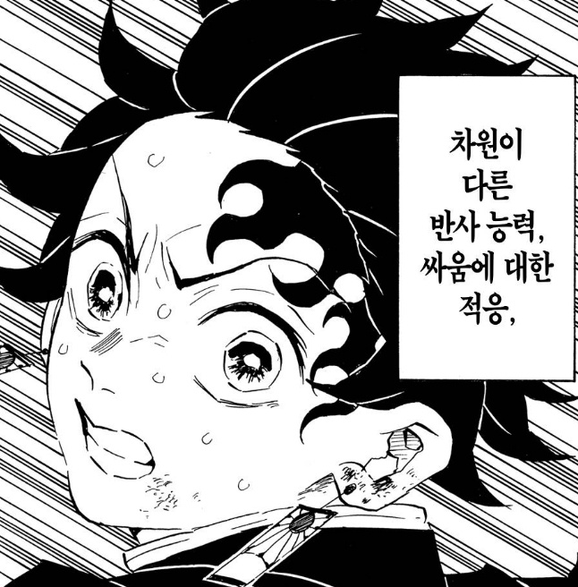

귀멸의 칼날 주인공이다. 내가 인생 살면서 봤었던 소년만화 주인공 중 최고다.

더 이상 성장할 필요 없는 완벽한 인격을 가지고 있다. 소년만화의 메타는 약하던 주인공이 강해지고 주위 사람들에 좋은 영향을 끼치게 되는 것을 보며, 주인공의 능력적, 사회적 성장을 기특한 눈으로 보고 자식 키우듯 응원하는 것이다.
싸움 실력적인 면에서야 계속 발전한다. 하지만 그의 이미 완성된 인격에는 존경심만 든다.

착한 인물이어서 더 그런 것 같은데 동시에 극단적일 정도로 악의 안티테제다. 어떤 선과악 싸움 구도의 컨텐츠에서도 이렇게까지 빌런을 싫어하고 처단하려 하는 주인공은 본 바가 없다.
아군에게는 한없이 친절한데 적에게는 분노하며 일갈을 해댄다. 그리고 이게 모든 차원에서 맞는 말이라서 적의 부조리함과 개소리가 매우 낱낱이 반박되는 효과가 있다. 아침이 오자 도망가는 적을 보며 작살난 몸으로 이렇게 소리친다.

> **우리 귀살대는 언제나 너희에게 유리한 밤의 어둠 속에서 싸우고 있어!! 살아있는 인간이!! 상처도 쉽게 아물지 않는데! 잃어버린 팔다리가 돌아오는 일도 없는데!! 도망치지 마 이 바보!! 멍청아!! 이 비겁자야! 너 같은 놈보다 렌고쿠 씨가 훨씬 더 대단해! 강해!! 렌고쿠 씨는 지지 않았어! 아무도 죽게 놔두지 않았어! 끝까지 싸웠고!! 끝까지 지켜냈다! 네가 진 거야! 렌고쿠 씨의 승리라고!!**

그런데 주위 인물들에게는 한없이 친절하게 대하니, 정말 얘는 진짜 인생을 걸고 오니를 없애려 하는구나... 하는 깨달음이 온다. 이런 탄지로의 진정성에 또 정신을 못차리게 된다.

개인적인 영달을 위한 욕망이 보이지 않는다는 점도 특징이다. 해적왕이나 호카게가 되겠다는 식의 말을 만화책 23권동안 단 한번도 한 적이 없다. 꿈이나 낭만 타령도 안 한다.
그냥 "사람 먹는 오니 싹 다 죽었으면 좋겠다." "네즈코가 사람이 되었으면 좋겠다." 이게 거의 숭고하기까지 하다.

극장판인 [무한열차](https://watcha.com/ko-KR/contents/tlObjnj) 보면서 개인적으로 가장 기억에 남았던 장면이 있다. 적이 자신의 능력으로 탄지로를 정신공격하려고 그의 내면의 세계에 침투하는데, 그 내면 세계가 고요하고 [티끌 하나 없는 호수처럼 묘사된다.](https://namu.wiki/w/%EC%B9%B4%EB%A7%88%EB%8F%84%20%ED%83%84%EC%A7%80%EB%A1%9C?from=%ED%83%84%EC%A7%80%EB%A1%9C#s-2.2)

정신공격을 시도했던 적은 삽시간에 뉘우치며 한없는 따뜻함 같은 걸 느낀다. 저 장면 보면서 나는 너무 정신을 못차린 나머지 진짜 쟤는 미친새끼라고 되뇌었다. 저런 인격이 해만 떨어지면 개에바 괴물들이 나와서 사람을 잡아먹는 세계관에서 나온 것이다.

현실에 견주어 보면 10대 소년이 험악한 세상에서 친절함을 잃지 않으며 적을 진심을 다해 썰어내는 모습이 굉장히 비현실적이어서, 여기서는 어떤 키치함이나 광기까지 느껴진다. 약간 요새 밈으로 많이 돌아다니는 [진짜 vs 가짜 광기 짤](https://m.post.naver.com/viewer/postView.naver?volumeNo=29284697&memberNo=5079266)에서 진짜 광기쪽에 있는 사람을 계속 보는 느낌이랄까.

문제해결력이 뛰어나다. 이거 너무 스타트업 종사자 같은 말이라 요런 뻘글에는 넣기가 좀 짜치지만 그냥 쓴다. 스타트업에서 일한다면 EO뿐 아니라 응당 귀멸의 칼날을 봐야한다.

매 순간의 까다로운 싸움에서 기회를 100% 활용해 매우 빠른 성장을 해낸다. 만화에 등장하는 까다로운 적들은 능력이 꽤 복잡하다. 무슨 막... 적이 분열하니 본체를 때려야되는 식이라 파훼법을 찾아내기가 쉽지 않은데,
전투에 임할 때 스스로에게 계속 질문을 던지고 가설을 검증해내며 적의 양상을 가늠한다. 거기에 적의 특성에 알맞는 각성까지 더해져 적을 처단할 수 있게 된다.

항상 적에게 마지막 일격을 날릴 때 빈사상태다. 얼굴에는 피 칠갑을 하고 꼭 관절마디가 하나 부러진 상태로 승리를 쟁취한다.
2기 애니에서 손가락 관절이 2개가 부러진 채로 엄청난 고통을 참으며 적에게 일격을 날리는 묘사가 아주 자세히 나오는데, 얼굴을 일그러뜨리며 볼 수 밖에 없다. "진짜진짜 아프겠다." 식의 딱 그 느낌이다.
마침내 그 지난한 과정을 지나고 적을 쓰려트렸을 때, 소울류 게임에서 보스 수백대 때려서 겨우 잡을 때의 쾌감과 편안함이 느껴져서 또한 정신을 못차리게 된다.

얼마 전에 다 보았던 [3기 애니](https://watcha.com/ko-KR/contents/tlnN6J1)도 훌륭했다. 마지막화의 마지막 장면 묘사가 너무 좋았고 만화로 볼 때에는 잘 알지 못했던, 서사 자체를 크게 관통하는 그 한 장면의 의미를 알게 되었다.
사실 내 블로그에 글 쓸 때 스포 신경 크게 안 쓰고 싶다(제목이나 부제목에 표시를 하며). 그런데 이건 말하고 싶지 않은 것이 진짜 3기 애니 마지막 장면은 한 번 보시면 좋겠다는 마음에서다.

흑흑 이런 뻘글은 아무도 보지 않겠지만 진짜 보시고 저랑 비슷하게 느끼셨으면 좋겠다.

(끝)
