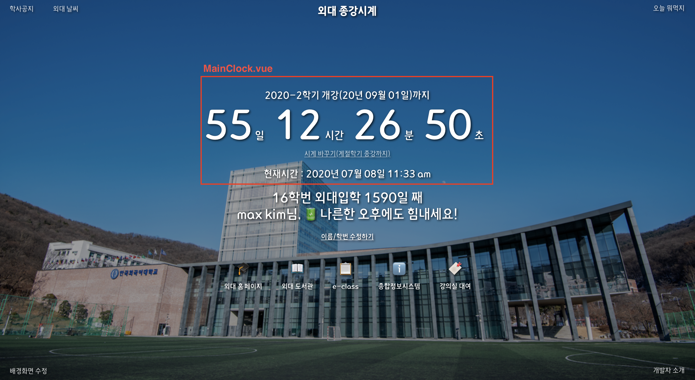
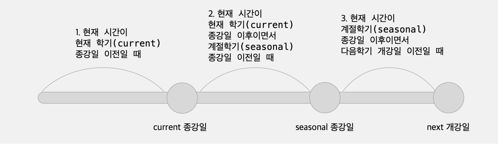
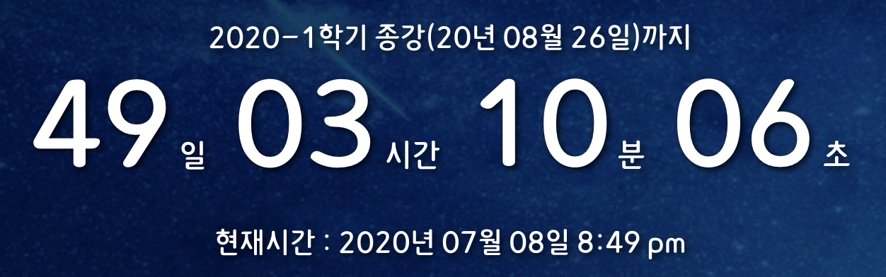
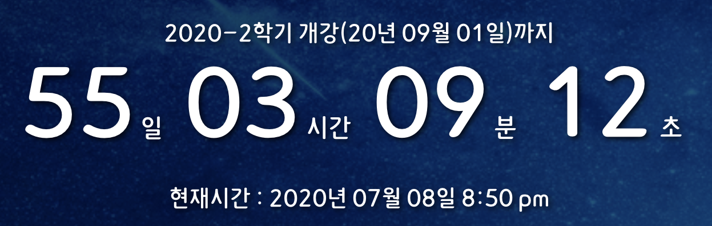
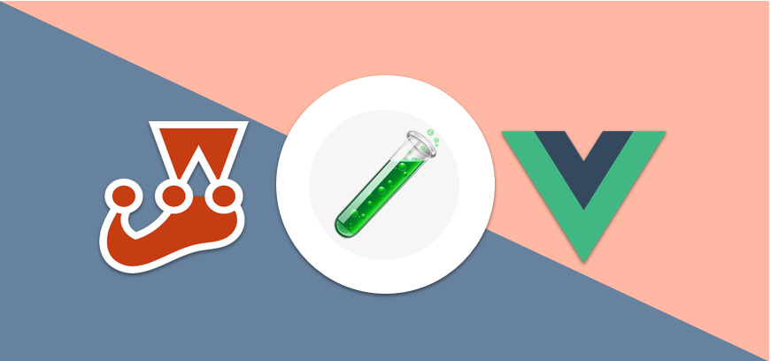

I'm learning about test-driven development (TDD), so I've been practicing adding test code to the project I'm building, maintaining, and maintaining, [The World Clock Chrome Extension](https://chrome.google.com/webstore/detail/%EC%99%B8%EB%8C%80-%EC%A2%85%EA%B0%95%EC%8B%9C%EA%B3%84/jadlpknbgnmmelikpcaogikohieafaem?hl=ko). First, I added test code to the most important component of the project, the clock component that displays the end time, `MainClock.vue`. I'd like to share my experience!

## MainClock.vue



First off, the MainClock.vue component is the clock part of the app. It's the most essential part of the bell clock app, as it displays the time from the current moment to the end of the day. Rather than going through the component's code piece by piece, I'll outline the main behavior and the variables we'll be testing.

### Key variables

- `this.semesterInfo`: This is a property of the object returned by the component's `data()` that contains the reference end/start time information currently displayed on the clock. We'll be using the Vuex store to update this value, and initially the Vuex store will have the semester information stored as shown in the following code block. The update is done by evaluating the current time in the component's created lifecycle and assigning one of the appropriate time information from the Vuex store to the `semesterInfo` variable.

```javascript
semesterInfos: {
  // current semester
  current: {
    act: "End of semester",
    id: "2020-1",
    due: Date(...), // end date of the current semester
  },
  // Next semester
  next: {
    act: "Start",
    id: "2020-2",
    due: Date(...), // Current semester start date
  },
  // next seasonal semester
  seasonal: {
    act: "Ends",
    id: "Summer 2020",
    due: Date(...), // End date of the next seasonal semester
  },
},
```

- `this.gapTime` : The object that holds the result of calculating the gap from the current time based on the time information in `semesterInfo`, and is also a property of the object returned by `data()`. It has day, hour, minute, and seconds as properties. When the `created` lifecycle evaluates the current time and finishes setting up `semsterInfo`, it calculates the time remaining from the current time based on this time value and stores the resulting date, hour, minute, and second integer values in these variables, which are then rendered on the clock.

- `.tab-clock-main-btn`: The name of the CSS class bound to the button used to change the term information. This is used to select the button element for the clock.

### How the component works



We mentioned that the time information assigned to the `this.semesterInfo` variable is determined by evaluating the current time, so the `MainClock` component behaves differently depending on what point in time we are at. There are three main points of view behavior.

### 1. When the current time is before the last day of the current term



- The gap time information (a property of gapTime) is represented by an integer greater than or equal to 0
- The semester information to be calculated (semesterInfo) must be the current semester (current)
- The clock change button should not appear

### 2. When the current time is after the end of the current semester but before the end of the seasonal semester


- The gap time information (property of gapTime) is represented as a zero or greater integer
- The semester information (semesterInfo) to be initially computed should be the next semester (next)
- A clock change button should appear
- When the clock change button is clicked, the next information assigned to semesterInfo should be replaced with seasonal information.

### 3. When the current time is after the end of the seasonal semester but before the start of the next semester



- The semester information (semesterInfo) to initially compute must be the next semester (next)
- The gap time information (a property of gapTime) should be represented by an integer greater than or equal to 0
- The clock change button should not appear

## MainClock.test.js

We've described how the component should behave at different points in time, and that pretty much tells us what test cases to create. We're going to move the point-in-time behavior into a test case **as-is**.

You can think of this way of testing point-in-time as a kind of [**state transition method**](https://github.com/meshkorea/front-end-engineering/blob/master/tests/test_case_design_methods.md). It's a way of deriving test cases from situations where the system has states and behaves differently depending on the state. You can also check out other test design approaches in the [Mesh Korea Front-end Engineering](https://github.com/meshkorea/front-end-engineering) GitHub repository, which I found very helpful when I was studying TDD.

Now, let's write the test code. For the test, I used `jest`, a JavaScript testing framework, and `vue-test-utils`, which helps to test Vue components.

### 1. Create a localVue

In this component, we are using two external modules (`vue-moment`, `Vuex`), so we need to create a `localVue` instance and load the modules.

```javascript
import { mount, createLocalVue } from '@vue/test-utils';
import MainClock from './MainClock.vue';
import Vuex from 'vuex';

// Create a local view to use for testing and load the module.
const localVue = createLocalVue();
localVue.use(Vuex);
localVue.use(require('vue-moment'));
```

### 2. Create and mount a virtual Vuex store

We'll split the three points in time in our test into three describe() functions. In the callback of each describe(), we'll create a situation where we have different data in the Vuex store. For example, when the current time is before the last day of the current semester, we'll configure the store like this

```javascript

// The current time and the month of the current time
const now = new Date();
const month = now.getMonth();

describe("When the current time is before the last day of the current semester", () => {
const state = {
  semesterInfos: {
    current: {
      act: "Ends",
      id: "2020-1",
      // current time + 1 month : current time is before the end date of the current semester!
      due: now.setMonth(month + 1),
    },
    next: {
      act: "Commencement",
      id: "2020-2",
      // current time + 3 months
      due: now.setMonth(month + 3),
    },
    seasonal: {
      act: "End of school",
      id: "Summer 2020",
      // current time + 2 months
      due: now.setMonth(month + 2),
    },
  },
};

// Construct a fictitious store
const store = new Vuex.Store({
  state,
});

// Mount the configured store
const cmp = mount(MainClock, { store, localVue });

// a place to put our test code (it)
...

```

### 3. Write test cases

Now we just need to write the test cases! If the current time is before the last day of the current semester, we need to pass 3 tests.

- The semester information to be computed (semesterInfo) must be the current semester (current)
- The gap time information (a property of gapTime) must be represented by an integer greater than or equal to 0
- The clock change button should not appear

Using the `it` function, we can write the following

```javascript
// Validate the value being assigned to the semesterInfo variable.
it('The semester information (semesterInfo) displayed on the clock will be the current semester.', () => {
  expect(cmp.vm.semesterInfo).toBe(state.semesterInfos.current);
});

// Traverse the gapTime object and verify that the values of all properties are integers greater than -1.
it('The time remaining until the end of the semester is represented as an integer greater than zero.', () => {
  const calculatedDistances = Object.entries(cmp.vm.gapTime);
  calculatedDistances.forEach(([key, value]) => {
    expect(parseInt(value)).toBeGreaterThan(-1);
  });
});

// In the render output, find the element by the class name of the clock change button and determine if it exists.
it('Displays a clock change button that toggles between the next semester and the seasonal semester.', () => {
  expect(cmp.find('.tab-clock-main-btn').exists()).toBe(false);
});
```

You can write test cases for other `describe` callbacks similarly. For example, the value of `semesterInfo` should change when the clock change button is pressed when the current time is after the end of the current semester but before the end of the seasonal semester. This behavior could be covered by a test case like this

```javascript
// select the button, fire the click event, and then validate the value of semesterInfo
it('When you click the change clock button, semesterInfo is replaced with the seasonal semester information.', () => {
  cmp.find('.tab-clock-main-btn').trigger('click');
  expect(cmp.vm.semesterInfo).toBe(state.semesterInfos.seasonal);
});
```

I've written all of these test cases for a single point in time, but listing all of the describe functions and test cases would make the post too long. You can check out the complete test code for the component [here](https://github.com/MaxKim-J/HUFS-Semester-Clock-Extension/blob/release/1.4.3/src/components/MainClock/MainClock.test.js)!

## Thoughts.



\*\*The issue of "what values should I test with" seems to be a pretty important one for front-end testing. When I was learning server-side JavaScript, I used to write test code on a server implemented with Express.js. REST APIs unconditionally provide a status code as a response to any request, and also provide a value through the body. Of course, you can apply other testing methods, but for a backend with such clear input and output, testing the status code and the value provided as a response is a good way to know if the code works.

But in a front-end environment, it's a little different. You can apply different testing methods to determine that your component is rendering exactly as the developer intended. For Vue component testing, you can test the properties of the object returned by `data()`, or you can test the values returned by the methods of the `methods` object. You can also test the elements that are actually rendered by finding them in the template with `find`.

Following the famous TDD adage of **test the result (interface), not the inner behavior**, it seems that testing the template directly might be the only way to go. However, if it's easier and more readable to test the other data in the component than to test the template, it doesn't seem necessary to insist on testing the template. In a template, you have to find the elements and test them separately, whereas if you test them as variables in the component, you can do it all at once...or something like that.

However, I think one thing to consider is the changeability of the test code. In order to make the test code last as long as possible and only modify it when necessary, I think you should test it with a critical value that is unlikely to change. And this value can vary depending on the situation, so it's up to the developer to choose it well. It could be an element in a template, or it could be data in a component. If there is a possibility that the selectors (classes, etc.) applied to the template will be renamed, but the variables used in the component will never be renamed, I don't think it's necessary to insist on testing the template.

...Of course, this could be just my brain thinking as I'm still learning TDD. I need to think about and experience what is a more efficient way of testing and what is the canonical way on the frontend.

And TDD is supposed to write test code before building the implementation, not after... I think I'll try TDD from the beginning for my next project...!

## Reference

- [Mesh Korea Front-end Engineering](https://github.com/meshkorea/front-end-engineering)
