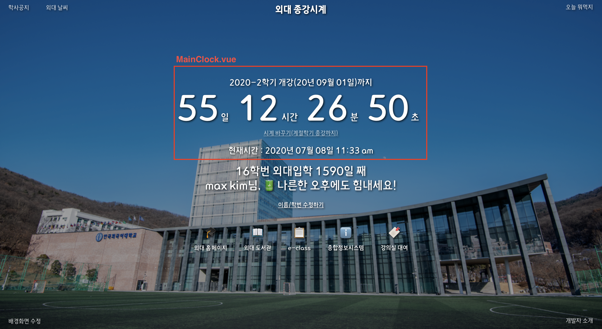
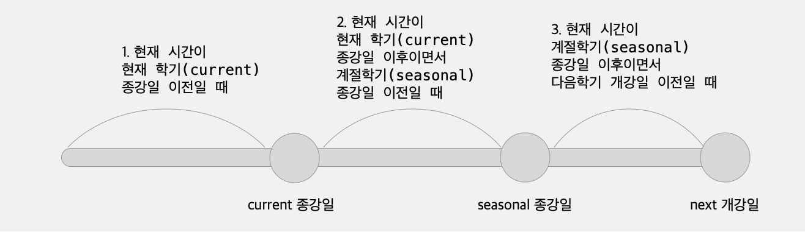
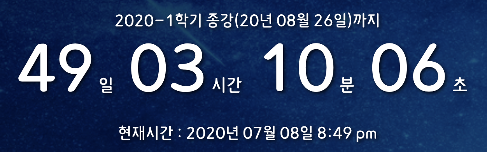
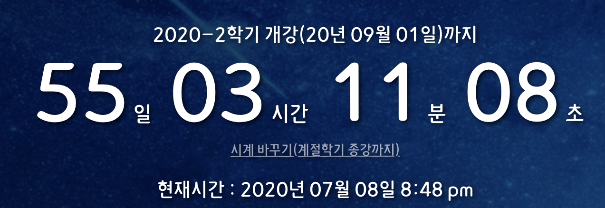
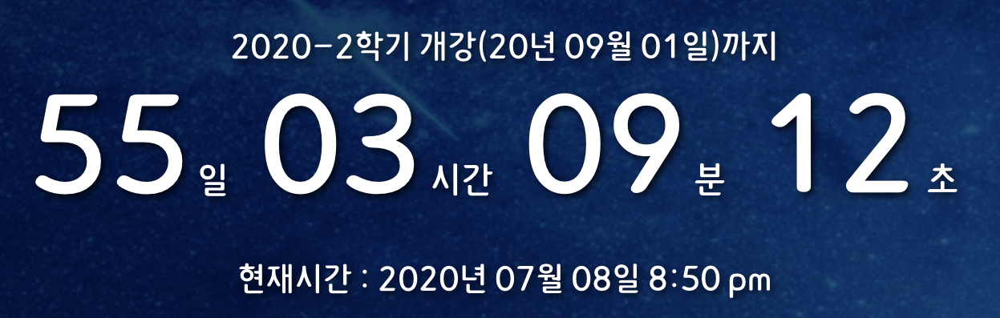
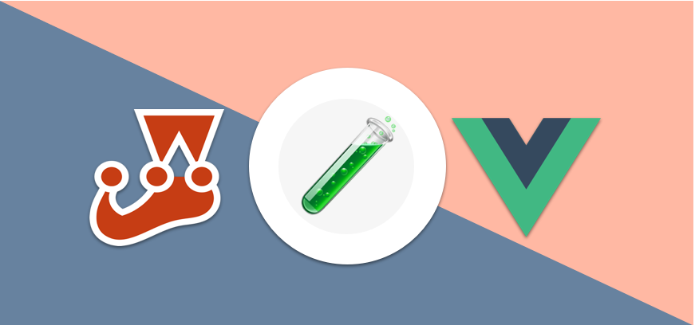

테스트 주도 개발(TDD)에 대해 공부하는 중입니다. 그래서 빌드하고 유지, 보수중인 [외대종강시계 크롬 확장앱](https://chrome.google.com/webstore/detail/%EC%99%B8%EB%8C%80-%EC%A2%85%EA%B0%95%EC%8B%9C%EA%B3%84/jadlpknbgnmmelikpcaogikohieafaem?hl=ko) 프로젝트에 테스트 코드를 붙여보는 연습을 했습니다. 먼저 프로젝트에서 가장 중요한 컴포넌트라고 할 수 있는 종강 시간을 표시하는 시계 컴포넌트, `MainClock.vue`에다가 테스트 코드를 붙여보았는데요. 이 경험을 공유하고자 합니다!

## MainClock.vue



일단 MainClock.vue 컴포넌트는 앱에서의 저 시계 부분입니다. 현재서부터 종강까지의 시간을 표시한다는 점에서 종강시계 앱의 가장 핵심적인 부분이죠. 컴포넌트의 코드를 하나하나 설명하기보다는, 주요한 동작 방식과 테스트에 쓰일 변수들을 간략히 설명해보겠습니다.

### 주요 변수

- `this.semesterInfo`: 현재 시계에 표시되는 기준 종강/개강 시간 정보를 담고 있는 객체이며 컴포넌트의 `data()`가 리턴하는 객체의 프로퍼티입니다. Vuex 저장소를 사용해서 이 값을 업데이트하게 되는데요, 처음에 Vuex store에는 학기 정보가 다음 코드 블럭에서처럼 저장되어 있습니다. 컴포넌트의 created 생명주기에서 현재 시간을 평가하여 Vuex 저장소에서 적합한 시간 정보 중 하나를 `semesterInfo` 변수에 할당하는 식으로 업데이트가 이루어집니다.

```javascript
semesterInfos: {
  // 현재 학기
  current: {
    act: "종강",
    id: "2020-1",
    due: Date(...), // 현재학기 종강 날짜
  },
  // 다음 학기
  next: {
    act: "개강",
    id: "2020-2",
    due: Date(...), // 현재학기 개강 날짜
  },
  // 다음 계절학기
  seasonal: {
    act: "종강",
    id: "2020 여름",
    due: Date(...), // 다음 계절학기 종강 날짜
  },
},
```

- `this.gapTime` : `semesterInfo`의 시간 정보를 토대로 현재 시간과의 차이를 계산한 결과를 가지고 있는 객체이며 역시 `data()`가 리턴하는 객체의 프로퍼티입니다. 프로퍼티로 day, hour, minute, seconds를 가집니다. `created` 생명주기에서 현재 시간을 평가해 `semsterInfo`의 설정이 끝나면 이 시간 값을 토대로 현재 시간에서부터 남은 시간을 계산하여 계산 결과의 날짜, 시간, 분, 초 정수 값을 이 변수에 저장하고 이 값은 시계에 그대로 렌더링됩니다.

- `.tab-clock-main-btn` : 학기 정보를 바꿀때 사용하는 버튼에 바인딩된 CSS 클래스명입니다. 시계 바꾸기 버튼 element를 선택하는데 쓰입니다.

### 컴포넌트 동작 방식



`this.semesterInfo` 변수에 할당된 시간 정보가 현재 시간을 평가해서 정해진다고 했었죠? 그래서 `MainClock` 컴포넌트는 현재 시각이 어떤 시점에 있느냐에 따라 다르게 동작합니다. 크게 3개의 시점에 따른 동작방식을 가지고 있습니다.

### 1. 현재 시간이 현재 학기(current) 종강일 이전일 때



- 남은 시간 정보(gapTime의 프로퍼티)가 0이상의 정수로 표현될 것
- 연산할 학기 정보(semesterInfo)가 현재 학기(current)여야 함
- 시계 바꾸기 버튼이 나타나면 안 됨

### 2. 현재 시간이 현재 학기(current) 종강일 이후이면서 계절학기(seasonal) 종강일 이전일 때



- 남은 시간 정보(gapTime의 프로퍼티)가 0이상의 정수로 표현될 것
- 최초에 연산할 학기 정보(semesterInfo)는 다음 학기(next)여야 함
- 시계 바꾸기 버튼이 나타나야 함
- 시계 바꾸기 버튼을 클릭하면 semesterInfo에 할당된 다음학기(next) 정보가 계절학기(seasonal) 정보로 바뀌어야 함

### 3. 현재 시간이 계절학기(seasonal) 종강일 이후이면서 다음학기 개강일 이전일 때



- 최초에 연산할 학기 정보(semesterInfo)는 다음 학기(next)여야 함
- 남은 시간 정보(gapTime의 프로퍼티)가 0이상의 정수로 표현될 것
- 시계 바꾸기 버튼이 나타나면 안됨

## MainClock.test.js

컴포넌트의 시점별 동작 방식을 설명해 드렸는데요. 사실 이것으로 어떤 테스트 케이스를 만들어야 할지는 정해진 셈입니다. 시점별 동작 방식을 **그대로** 테스트 케이스로 옮길 것입니다.

이렇게 시점별로 테스트를 하는 방법을 일종의 [**상태 전이 방식**](https://github.com/meshkorea/front-end-engineering/blob/master/tests/test_case_design_methods.md)이라고 볼 수 있습니다. 시스템이 상태를 가지고 있고, 상태에 따라 다르게 동작하는 상황에서 테스트 케이스를 도출하는 방법입니다. TDD를 공부할 때 많이 도움이 되었던 [Mesh Korea Front-end Engineering](https://github.com/meshkorea/front-end-engineering) 깃헙 레포지토리에서 다른 테스트 설계 방식도 확인해보실 수 있습니다.

이제 테스트코드를 작성해 보겠습니다. 테스트에는 자바스크립트 테스트 프레임워크 `jest`와 Vue 컴포넌트의 테스트를 도와주는 `vue-test-utils`를 사용했습니다.

### 1. localVue 만들기

이 컴포넌트에서는 외부 모듈 두 가지(`vue-moment`, `Vuex`)를 사용하고 있습니다. 따라서 `localVue` 인스턴스를 만들고, 모듈을 불러와야 합니다.

```javascript
import { mount, createLocalVue } from '@vue/test-utils';
import MainClock from './MainClock.vue';
import Vuex from 'vuex';

// 테스트에 사용할 로컬 뷰를 만들고 모듈을 불러옵니다.
const localVue = createLocalVue();
localVue.use(Vuex);
localVue.use(require('vue-moment'));
```

### 2. 가상의 Vuex 스토어 만들어 마운트하기

테스트의 세 시점을 3개의 describe() 함수를 통해 나눌 것입니다. 각 describe()의 콜백에서 Vuex 스토어의 데이터를 다르게 상정하여 다른 데이터를 가지고 있는 상황을 만들어 줄 것입니다. 가령, 현재 시간이 현재 학기의 종강일 이전일 때는 다음과 같이 스토어를 구성합니다.

```javascript

// 현재 시점과 현재 시점의 월(month) 정보
const now = new Date();
const month = now.getMonth();

describe("현재 시간이 현재 학기(current) 종강일 이전일 때", () => {
const state = {
  semesterInfos: {
    current: {
      act: "종강",
      id: "2020-1",
      // 현재 시간 + 1달 : 현재 시간이 current 학기 종강일 보다 이전!
      due: now.setMonth(month + 1),
    },
    next: {
      act: "개강",
      id: "2020-2",
      // 현재 시간 + 3달
      due: now.setMonth(month + 3),
    },
    seasonal: {
      act: "종강",
      id: "2020 여름",
      // 현재시간 + 2달
      due: now.setMonth(month + 2),
    },
  },
};

// 가상의 스토어를 구성함
const store = new Vuex.Store({
  state,
});

// 구성한 스토어를 마운트함
const cmp = mount(MainClock, { store, localVue });

// 테스트 코드(it)들 들어갈 자리
...

```

### 3. 테스트 케이스 작성하기

이제 테스트 케이스만 작성해보면 될 것 같습니다! 현재 시간이 current 학기의 종강일 이전이면 3개의 테스트를 통과해야 합니다.

- 연산할 학기 정보(semesterInfo)가 현재 학기(current)여야 함
- 남은 시간 정보(gapTime의 프로퍼티)가 0이상의 정수로 표현될 것
- 시계 바꾸기 버튼이 나타나면 안됨

`it` 함수를 이용해 다음과 같이 작성할 수 있습니다.

```javascript
// semesterInfo 변수에 할당되는 값을 검증합니다.
it('시계에 표시되는 학기 정보(semesterInfo)가 current 학기가 된다.', () => {
  expect(cmp.vm.semesterInfo).toBe(state.semesterInfos.current);
});

// gapTime 객체를 순회하여 모든 프로퍼티의 값들이 -1을 넘는 정수임을 검증합니다.
it('학기 종강까지 남은 시간이 0 이상의 정수로 표시된다.', () => {
  const calculatedDistances = Object.entries(cmp.vm.gapTime);
  calculatedDistances.forEach(([key, value]) => {
    expect(parseInt(value)).toBeGreaterThan(-1);
  });
});

// 렌더링 결과물에서 시계 바꾸기 버튼의 클래스명으로 element를 찾아 존재 여부를 판단합니다.
it('next 학기와 seasonal 학기를 전환하는 시계 바꾸기 버튼을 표시한다.', () => {
  expect(cmp.find('.tab-clock-main-btn').exists()).toBe(false);
});
```

다른 `describe` 콜백의 테스트 케이스도 유사하게 작성해보면 됩니다. 가령 현재 시간이 현재 학기(current) 종강일 이후이면서 계절학기(seasonal) 종강일 이전일 때 시계 바꾸기 버튼을 누르면 `semesterInfo`의 값이 바뀌어야 하는데요. 이러한 동작은 다음과 같은 테스트 케이스로 커버할 수 있습니다.

```javascript
// 버튼을 선택해 클릭 이벤트를 발생시킨 후 semesterInfo의 값을 검증합니다
it('시계 바꾸기 버튼을 클릭하면 semesterInfo가 계절학기 정보로 바뀐다.', () => {
  cmp.find('.tab-clock-main-btn').trigger('click');
  expect(cmp.vm.semesterInfo).toBe(state.semesterInfos.seasonal);
});
```

이렇게 하나의 시점에 대한 테스트 케이스를 모두 작성해보았는데요. 모든 describe 함수와 테스트 케이스를 나열하면 포스팅이 너무 길어질 것 같습니다. 컴포넌트의 전체 테스트 코드는 [여기](https://github.com/MaxKim-J/HUFS-Semester-Clock-Extension/blob/release/1.4.3/src/components/MainClock/MainClock.test.js)서 확인해보실 수 있습니다!

## 생각해본 것들



**"어떤 값으로 테스트를 해야 하나"**라는 이슈는 프론트엔드 테스팅에 꽤 중요한 문제인 것 같습니다. 서버사이드 자바스크립트를 배우면서 `Express.js`로 구현한 서버에 테스트 코드를 작성해본 적이 있는데요. REST API는 어떤 요청에 대해서 무조건 상태 코드를 응답으로 제공하고, body를 통해 값을 제공하기도 합니다. 물론 다른 테스팅 방법을 적용할 수도 있겠지만, 이렇게 입출력이 명확한 백엔드의 경우에는 그 상태 코드와 응답으로 제공하는 값을 테스팅하면 코드가 잘 동작하는지 알 수 있습니다.

하지만 프론트엔드 환경에서는 좀 다릅니다. 컴포넌트가 정확히 개발자의 의도대로 렌더링되고 있다는 것을 판단하기 위해 여러가지 테스팅 방법을 적용시켜볼 수 있습니다. Vue 컴포넌트 테스팅의 경우에는 `data()`가 리턴하는 객체의 프로퍼티를 테스팅할 수도 있고, `methods` 객체의 메서드가 리턴하는 값을 테스팅해볼 수도 있습니다. 실제로 렌더링되는 요소를 템플릿에서 `find`로 찾아 테스팅해볼 수도 있습니다.

**내부 동작을 테스트하지말고 결과(인터페이스)를 테스트하라는 TDD의 유명한 격언**에 따르면, 템플릿을 직접 테스트하는 방식만이 옳은 방식일 수도 있을 것 같습니다. 템플릿이 컴포넌트의 최종 결과값이라고 생각할 수 있으니까요. 하지만 템플릿을 테스트하는 것 보다 컴포넌트의 다른 데이터를 테스트하는게 더 가독성이 좋고 쉬운 방법이라면, 굳이 템플릿 테스트를 고집할 필요는 없는 것 같습니다. 탬플릿에서는 따로 요소들을 찾아 테스팅을 해야하는데, 컴포넌트의 변수로 테스트를 하면 한번에 할 수 있다거나...그럴 때 말이죠.

다만 고려해야할 것은 **테스트 코드의 변경 가능성**인 것 같습니다. 최대한 테스트 코드를 오래 사용하고 필요할 때만 수정하기 위해서는, **바뀔 가능성이 적은 중요한 값**을 사용해서 테스트를 해야 하지 않나 생각합니다. 그리고 이 값은 상황에 따라 달라질 수 있어 개발자가 잘 선택해야 합니다. 템플릿의 요소일수도 있고, 컴포넌트의 데이터일 수도 있습니다. 만약 템플릿에 적용한 선택자(클래스 등)의 이름이 바뀔 가능성이 있는데, 컴포넌트에 쓰이는 변수의 이름은 절대 바뀌지 않는 상황이라면 더더욱 템플릿 테스트를 고집할 필요는 없지 않나 생각해봅니다.

...물론 이 생각은 아직 TDD를 공부하기 시작한 저의 뇌피셜일 수도 있습니다. 좀 더 효율적인 테스트 방식과 프론트엔드에서의 정석적인 방식은 뭔지 한 번 생각해보고 경험해봐야 할 것 같습니다.

그리고 TDD는 구현체를 빌드 한 후가 아니라 그 전에 테스트 코드를 작성하는게 정석이죠. 다음 프로젝트는 처음부터 TDD로 진행해보고 싶다는 생각이 들었네요..!

## Reference

- [Mesh Korea Front-end Engineering](https://github.com/meshkorea/front-end-engineering)
