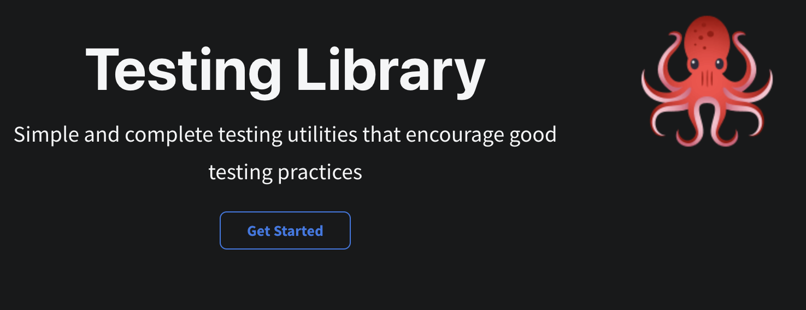

One of the things I've been focusing on while creating this version 2.0 of the [Outside Clock](https://github.com/MaxKim-J/hufs-semester-clock-v2) is the use of semantic tags and web accessibility compliance.
I had to learn a lot of new tags, role attributes, WAI-ARIA, and debugging screen readers while working on the project.

As a result, I was able to create a web app that can be used with a screen reader and achieved an accessibility score of 100 according to Lighthouse. Of course, this is my current view of how accessible the web is, and a score is a score, so I still think it is far from perfect.


Creating web accessibility-compliant markup like this made me realize that I've been misunderstanding web accessibility all along, and I learned about some unexpected benefits of developing with web accessibility in mind.

In this post, I'll go over what web accessibility is, and the benefits of following it from a user perspective, a developer perspective, and a service perspective.

# The essence of web accessibility

> Web accessibility means that websites, tools, and technologies are designed and developed so that **people with disabilities can use them.** - W3C

According to the web standards organization W3C, web accessibility means that websites, tools, and technologies are designed and developed so that people with disabilities can use them. The goal of web accessibility is to make the web available to all the world's diverse users, regardless of their disabilities.

At its core, web accessibility is about the user.

As someone who was only familiar with semantic markup as a technique related to web accessibility, the benefits of using semantic tags were SEO optimization and increased collaboration through semantic markup.

But now that I've been using semantic tags and debugging screen readers, I'm starting to realize that that's a gross underestimation of web accessibility. Web accessibility has a big vision of making the web accessible to all users.

Non-semantic tags like the `div` tag can prevent blind and low vision users using screen readers from using many features of the web at all. The photos below show elements of a foreign university's pocket watch app being read using Apple's voiceover.


The `button` element is described as a button, but the `div` element is not, so the screen reader user doesn't realize it's a pressable element.


```html

```

The `img` element describes an image and reads the description of the image specified in the `alt` element. Without the `alt` attribute, the `src` attribute of the image is read, which breaks screen reader usability.

This is a brief overview of the nature of web accessibility and how it affects users. In the next section, we'll look at the benefits of web accessibility.

# Benefits of web accessibility compliance

## 1. User perspective: UX for everyone

Of course, screen readers aren't the end-all be-all of web accessibility compliance.

The goal of web accessibility is "all users". Web accessibility isn't just about total blindness and low vision, it's also about web access for users with temporary disabilities, such as those who may have colorblindness, photosensitivity attacks, or who need to access the web with limited hardware.

Because web accessibility considers the UX for all users, even users who can access the web with relative ease can benefit from web accessibility-compliant markup.

A real-world example of how accessibility has improved the experience for all users is the elevators that are now installed in many subway stations. The elevators, which began to be installed in many subway stations in the 2000s, [are the result of the disability rights movement and steady demands](https://www.hani.co.kr/arti/society/rights/1023822.html)

However, these elevators are not only accessible to people with disabilities, but also to the elderly who have limited mobility, and to people without disabilities who find it difficult to climb stairs. In this way, accessibility considerations make life easier for everyone.

In web accessibility, the most obvious example is **keyboard usability**. Focusable elements such as `button`, `a`, and `input` are quickly accessible with the tab key on the keyboard.

Improving keyboard usability makes it easier for screen reader users to find the elements they need to interact with the web, but it's also helpful enough for users who need to do quick tasks in apps like back office. The image below is an example of navigating to focusable elements in the Foreign Language Clocks using only the tab key.


When accessed with a screen reader on, the text reads like this


The order in which different focusable elements are focused, or even whether they are focused at all, can be modified using the [tabindex](https://developer.mozilla.org/ko/docs/Web/HTML/Global_attributes/tabindex) attribute.

The order of the focus elements is not the UX that is commonly considered in development, and it is a good reminder that there are different kinds of UX. **Web accessibility broadens the scope of what is commonly thought of as UX** and considers not only the UX of typical web users, but also the UX of specialized web users.

Another example of this is UX writing. Screen readers read the text on the screen, so if the text on the screen is descriptive enough, a screen reader user will be able to hear the element and know what it is, but the opposite is not true. Let's look at a simple example: the submit button on a form that modifies user information.

```html
<!-- The text doesn't provide enough description for the button element. -->

<button type="submit" onClick="{onClickHandler}">Submit</button>

<!-- Provides enough text to describe the button element. -->

<button type="submit" onClick="{onClickHandler}">Modify User Information</button>
```

However, if you can't modify the UX writing to better describe the element from a planning or design perspective, from a web accessibility perspective, you can use the WAI-ARIA standard to give the element an additional description, an accessible name, and make it readable to screen readers. (`aria-label`, `aria-labelledby`, `aria-describedby`)

```html
<!-- You can provide additional information about an element with the aria-label attribute. -->

<button type="submit" onClick="{onClickHandler}" aria-label="Edit User Information">Edit</button>
```

You can use any of the description elements defined by WAI-ARIA, but the best ones are those where the content of the text and the semantic tags are sufficient to describe the element.

This is where web accessibility expands the scope of UX writing and makes you think about whether the text on an on-screen element describes the element well, or whether it needs further explanation.

### +) Web Accessibility in Charts

We mentioned that for screen reader users, the text on an element should be descriptive of the element.

But what about elements that are entirely visual in nature, such as charts (graphs)? This is where the WAI-ARIA standard comes into play.

Since the World Clock also has a line chart of coronavirus cases, we needed to think about the screen reader UX of this element.

First, we drew the chart in SVG to make it accessible to screen readers. We also separated the element's label from the chart and made sure that when a screen reader reads the element's label, it reads the label and the numbers together. We used `aria-label` to provide additional descriptions.


Note that `aria-label` has a higher priority than text, so if you set `aria-label`, the description you set with `aria-label` will be read instead of the text inside the element.

## 2. Developer Perspective: Collaboration and Testing Made Easy (feat.React-Testing-Library)

This time, the benefits of web accessibility compliance from the development side. With semantic markup, it's easier to look at the markup and figure out what the structure is, rather than just writing `div`.

The [layout elements](https://www.w3schools.com/html/html_layout.asp) like `footer`, `header`, `main`, and `nav` give you an idea of the layout of the page, and elements like `p` and `button` give you an idea of what kind of elements are present. Tags like `div` and `span` should only be used for non-meaningful, styling elements.

Additionally, when thinking about screen-reader support, I've become wary of getting too deep in the tag structure, as I need to keep things concise and easy to read.

Adhering to web accessibility can also be beneficial for front-end testing. I'd like to mention the [React-Testing-Library (RTL)](https://testing-library.com/docs/react-testing-library/intro), which I used for the first time during this project and had a great experience with.



> The more your tests resemble the way your software is used, the more confidence they can give you.- [Testing Library Guiding Principles](https://testing-library.com/docs/guiding-principles)

RTL encourages you to write test cases from the user's point of view. In this context, of the many queries RTL provides to find the element you are testing, the one it recommends as the highest priority [https://testing-library.com/docs/queries/about#priority] is `~ByRole(getByRole, findByRole, queryByRole)`, which queries the element via the element's `role` attribute and `accessible name`.

The `role` is an attribute that expresses the role of a semantic element. Elements can have a `role` implicitly, or the developer can specify the possible `roles directly. For more information, see MDN's Using [ARIA documentation](https://developer.mozilla.org/en-US/docs/Web/Accessibility/ARIA/ARIA_Techniques) and the Resin [WAI-ARIA Guidelines](https://tech.lezhin.com/2018/04/20/wai-aria)!

I think the reason RTL recommends querying via `role`, which plays an important role in web accessibility, is that finding elements via `role` mimics the behavior of a user.

When interacting with the web, users look for "elements that **act** as buttons" or "elements that look like buttons", not for the text of a button first. Even when looking for an `input` element, queries like `getByLabel` or `getByPlaceholder` also have a high priority after `getByRole` because users see a `label` or `placeholder` and think about what the input element is for.

Querying through `role` also ensures that your tests don't break easily: if you used a query like `getByText` when testing a particular feature with RTL, the RTL wouldn't find the element when the text changes and the test would break, even if the feature is fine.

However, in a component that implements a specific feature, the roles of the elements that exist now are relatively immutable. For simplicity, consider the timer in the outer bell clock.


If I make updates in the future, the design of the timer may change. But if the timer is here to stay, it's likely that there will **also** be a start or stop button to control the timer, or a button element to increment or decrement the number on the timer.

If we can query these buttons by their `accessible name` and `role`, then our tests rely on the "existence of elements that act as buttons", which doesn't change very often.

Tests for timers are therefore relatively free from breaking tests due to something outside the scope of the test, until the button disappears.

Web accessibility naturally makes RTL easier to use because of RTL's query prioritization: most elements can be queried via `role`, which means less querying and fewer broken tests.

I think RTL is a library built with a pretty big picture in mind, not only for writing tests, but also for making good recommendations to follow web accessibility and better practices 😎.

##3. Service perspective: SEO, a service that doesn't give up on users

Finally, the service aspect.

Web accessibility-compliant markup is good for SEO. [Semantic markup helps search crawlers understand your content.](https://onextrapixel.com/html5-semantics-better-seo/) Search crawlers can read text, but without semantic markup, they can't read the importance and meaning of each element.

Search engines' crawlers try to understand the relationships and importance between website elements to optimize search results by putting important keywords wrapped in tags like `heading` into their search index. This gives your site a better chance of appearing in search engines for the most important keywords.

And by adhering to web accessibility, your service becomes one that no user will turn away from.

I believe that the team providing the service should strive to create a service that is loved by a diverse and large number of people.

In order to do that, I don't think certain users should be denied the opportunity to use, benefit from, and even love a service because of their limitations.

Of course, web accessibility compliance may not be a high priority among the goals of your current service. I know I can't drop everything in my company and shout "We need to be web accessibility compliant right now!!!" but I do think it should be considered at some point.

# closing remarks

> The power of the Web is in its universality.
> Access by everyone **regardless of disability** is an essential aspect. - Tim Berners-Lee

As Tim Berners-Lee, the creator of the web, said, the web is designed to be accessible and usable by all users, regardless of their disabilities.

We focused on the web accessibility of the School Clock because we want it to be a web app that can be used by all users. We want everyone in the school community to be able to use the app without any difficulties, and we want to continue to be a developer that makes apps that can be used by all users.

I hope my experience will give you a good insight into web accessibility and help create a better web ecosystem.

Finally, I'd like to end this post with some resources that I've found helpful while learning about web accessibility. Thanks for reading!

- [UCSF - Screen Reader Demo for Digital Accessibility](https://www.youtube.com/watch?v=dEbl5jvLKGQ&t=171s)
- [Google Developers - Making Accessible Web Apps Using HTML5 and ChromeVox](https://www.youtube.com/watch?v=x18vEEfpK3g)
- [TOSS FEED - Has Fintech Made Financial Life Easier for People with Disabilities?
- [FEConf - Mobile Web for All: Improving Screen Reader UX with Accessibility Compliance (Dohwan Kim)](https://www.youtube.com/watch?v=tKj3xsXy9KM&t=1086s)
- [Resin Web Accessibility Guidelines](https://github.com/lezhin/accessibility)
- [Google Web Fundamentals - Accessibility](https://developers.google.com/web/fundamentals/accessibility?hl=ko)
- [W3C - ACCESSIBILITY](https://www.w3.org/standards/webdesign/accessibility)

# References

- [Testing-Library Docs](https://testing-library.com/)
- [A Guide to HTML5 Semantics for Better SEO](https://onextrapixel.com/html5-semantics-better-seo/)
- [Han Gyerye - Subway elevator, installed by a disabled man](https://www.hani.co.kr/arti/society/rights/1023822.html)
- [MDN Web Docs](https://developer.mozilla.org/ko/)
