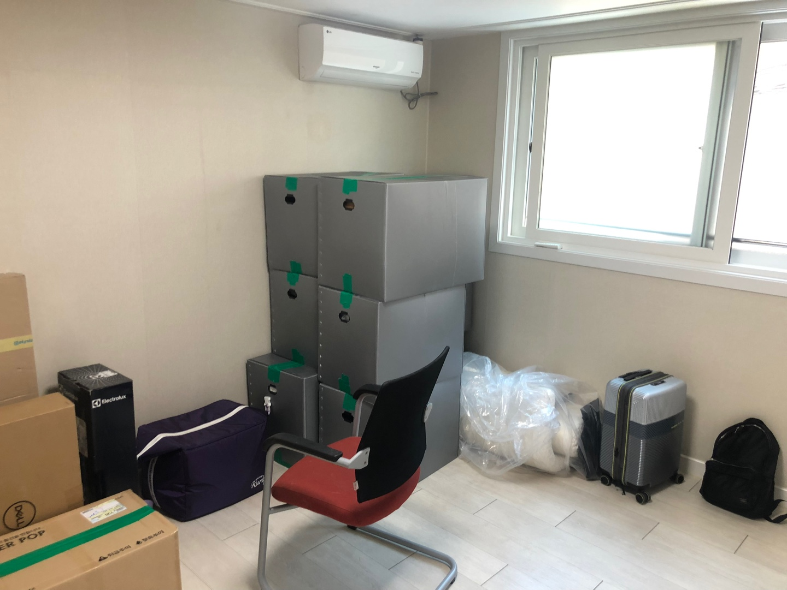
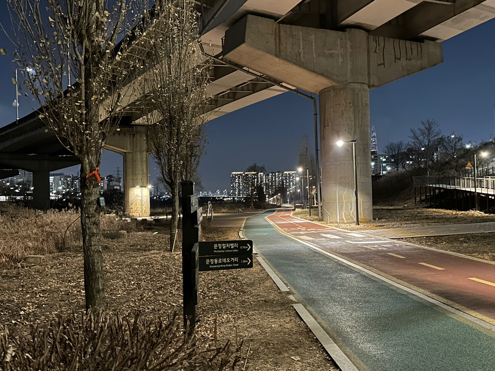

2022년은 꽤나 힘들었고 해가 넘어간 지금에서야 좀 괜찮습니다. 어려운 선택의 기로에 놓였고, 입사 첫 해기도 했구요, 이사와 같은 개인 차원의 큰 일도 몇 개 치렀습니다.

안온한 삶을 좋아하는데요. 사건이 많아 진이 많이 빠졌습니다. 나쁜 일만 있는건 아니었는데, 그냥 자극이 많아서 편안하게 살지 못했습니다. 체력도 달려서 연말이 갈수록 방전되는게 느껴졌구요.

온갖 것들이 밀려 들어오는 삶 속에서도 새로운 것을 많이 알고 해보게 되었고, 부쩍 복잡해진 삶을 관리할 필요를 느꼈습니다. 하지만 올해는 좀 안정된 상태였으면, 혹은 자극이 많고 사는게 복잡해도 그것을 견딜 수 있는 힘이 있었으면 좋겠습니다.

정말 일어난 일들만큼 뭐라 표현하기 복잡하네요. 작년에 있었던 이벤트들을 되짚어보겠습니다.

## 2022년

### 구직과 입사

1월부터 3월까지 구직 활동을 했고 4월에 입사했습니다. 최종 합격/탈락 통보, 입사 거절이 하루에 다 일어나고 타임어택 과제 이후 면접 두탕 뛴 말도 안되는 2월 25일이 시선을 강탈하네요.

구직 기간이 생각보다 오래 걸렸습니다. 12월부터 준비했고 입사가 결정된 것이 3월 중순이었으니 끝날때쯤엔 정신적인 에너지가 거의 남아있지 않더군요. 기쁘다는 생각도 못 했습니다. 그때쯤 브런치에 [이런 글](https://brunch.co.kr/@hwaseen/24)을 쓰기도 했었죠.

> 정신이 몹시 취약해져서 기쁨이나 보람같은 걸 잘 느끼지도 못하는 것 같다. 뭔가를 이룬 기쁨을 잘 느끼고 싶다면 노력하는 과정의 끝에 정신과 몸이 온전한 상태로 있어야 함을 깨달았다.

> 구직 성과가 조금씩 나고 있는 지금인데, 구직 직전에 느꼈던 불안이나 걱정은 그 결만 바뀐채 계속 존재하고 있다. 구직 망하면 어떡하지 류의 불안이 이제는 회사 가서 못하면 어떡하지 이런 식으로 바뀌고 있다.

지쳐버린데에는 구직 후반의 팀 선택에 대한 고민도 한 몫했습니다. 진짜 밤 새서 어딜 가야할지, 어떤게 저에게 가장 좋은 선택인지 고민했습니다. 또 제가... 거절을 잘 못해요. 신경 많이 써주신 리크루터 분들께 안 가겠다고 이야기하는 것도 힘들더라고요. 제 성격이니까 뭐 어쩔 수는 없고...

주변에서 축하를 꽤 받았습니다. 그게 미안할정도로 무지 찡찡거렸는데 얘기 다 들어주고 좋은 이야기 해준 가족, 친구, 지인들에게 감사한 마음도 무지 컸어요.

구직 과정에서 좋은 비즈니스의 멋진 리크루터, 리드, 선배 개발자분들을 만났던 것이 너무 좋은 기억으로 남아있습니다. 비전공자로 주위에 개발자가 한 명도 없던 환경에서 개발을 시작한 저에게는 행운 같은 일이라 느껴졌습니다. 저도 그렇게 선뜻 도움을 줄 수 있는 사람이 될 수 있었으면 좋겠다는 생각도 들었고요.

### 플렉스팀(1) - 역경

[플렉스팀](https://flex.team/)에 합류하고 싶었던 이유들은 출근하니 모두 현실로 다가왔습니다. B2B 비즈니스와 HR 도메인이 복잡한 만큼 웹 제품도 매우 방대하고 복잡했습니다. 뛰어난 분들도 너무 많이 계셨고, 회사도 너무 잘 성장하고 있었고 그랬습니다.

웹 제품의 개발 플랫폼과 구조를 개선하는 조직에 합류했습니다. 온보딩 기간 이후 합류한 팀에서 해야 하는 일이 너무 크고 생소해서 수개월간 어떤 작은 성과도 내지 못했다고 생각했었습니다.

PoC는 실패했고 실패를 문서로 기록하고만 있었습니다. 뛰어난 분들, 경력이 있으신 분들이 많은 팀에서 어떻게 저년차가 존재 가치를 증명하지 싶어 조바심도 들었습니다.
자신감이 없는 저는 팀 합류 후 한 6개월 정도를 겁에 질린채 살았던 것 같습니다. 당시 리드님과 했던 1:1에서 이런 얘기도 했는데요

> **"어렵고 복잡한 일 하고 싶어서 들어왔는데, 그때 제가 너무 깝쳤었던 것 같아요."**

사실 지난 몇개월간 겁에 질려 제때 도움을 청하지도 못하고 혼자 웅크리고 고민하면서 책상에 머리박기 하고 있었다는 것을 인정하기도 오래 걸렸습니다. 최근에야 깨닫고 이제 좀 말하고 다니는데요.

그랬다는 걸 깨달은 계기가 되게 역설적인데 "우리 팀이 진짜 좋은 팀이다"라는 사실을 확신했기 때문입니다. 동료분들과의 술자리에서 너무 크고 어려운 일에 대해 찡찡대고 있을 때,

> "종혁님이 하시는 일에 문제가 있었다면 팀에서 챌린지가 들어왔을 거예요."

라는 말을 들었는데, 사실 엄청 맞는 말이었습니다. **내가 일을 무지 못하고 있었다면 팀은 이걸 가만두지 않았을 것입니다.** 역량이 있는 팀이니까요. 도움을 주거나, 조치를 취하거나, 다른 일을 맡길수도 있었겠지만 저는 그렇게 힘들었던 기간동안 비교적 큰 자율권을 가지고 어려운 일들을 계속 할 수 있었습니다.

아, 그러면 내가 왠만큼은 잘하고 있었던 거겠구나. 살짝 자신감이 돌아왔습니다. 몇 달 전에 자신감을 가질 수 있었다면 더 잘 일할 수 있었겠다. 왜 그렇게 하지 못했을까... 까지 이어서 생각하다 "그때 겁에 질려있었구나" 하는 결론을 내렸던 것 같아요.

8월부터 실험의 실패들이 쌓여 의사결정이 이루어졌고, 방대한 크기의 제품에 큰 영향을 주는 업무를 시작했습니다. 그리고 연말 가까워져셔야 드디어 가시적인 성과가 나기 시작했습니다. 오래 준비한 만큼 임팩트가 있는 일이었고, 슬랙에서 평생 받을 따봉 다 받은 것 같습니다. 덕분에 연말은 꽤 보람있게 지냈습니다.

### 플렉스팀(2) - 좋은 팀

연말의 성과는 당연하지만 저만 고민하고 열심히 해서 나온 결과가 아닙니다. 팀 구성원분들의 도움이 아주 컸습니다. 값진 지혜를 떠먹여주시고, 제 결과물과 설계를 지적해주시고, 정제되지 않은 고민을 가지고 찾아가면 액션 아이템을 도출해주셨습니다.

일련의 역경을 거치며 팀을 크게 신뢰하게 되었습니다. 우리 팀은 모두가 팀의 목표를 이루기 위해 최선의 판단을 내리려 하고, 최선이 아닌 판단이라고 생각이 들면 더 좋은 결정을 위해 지적받고 지적합니다.
바로 그 지점에서, 저는 크고 복잡한 문제를 우리 팀이 멋지게 풀어낼 수 있을 것이라는 확신이 생깁니다.

재미있는 추억도 많이 쌓았습니다. FE 챕터 구성원분들과 함께 워크샵도 가고 컨퍼런스도 같이 구경하면서 즐거웠습니다.
앞으로도 재미있게 지내고 싶네요.

그리고 팀 합류 후 제가 요청하면 항상 받았던 도움들처럼, 저도 팀에게 적절한 도움을 더 많이 줄 수 있는 동료가 되고싶습니다.

### 학교(졸업 임박)

입사 후 상반기 동안은 학교 막학기를 병행했습니다. 비대면이라 가능했고 다행히 잘 마쳤습니다. 하반기에는 졸업논문과 졸업요건을 맞추기 위한 토익을 봤습니다.

졸업논문 쓰는게 약간 죽을맛이었습니다. 당시에 회사에서 하는 일 때문에 업무를 많이 하고 있었고, 이미 본업과 너무 떨어진 학교라 집중도 잘 안되고 주말에 시간 쓰는게 아깝고 그랬던 것 같았습니다. 그래도 통과했습니다.

회사를 다니면서 졸업요건을 모두 채우려고 해봤지만 무리였고 시험 하나 남았습니다. 사실 토익 점수를 과 사무실에 내는 기한을 놓쳐서 2023 겨울 졸업이 불가능하다는 사실을 연말에 알았습니다. 흑흑흑 그래도 업무 병행하면서 여기까지 온 스스로를 칭찬해봅니다.

입학한 이래로 학교를 8년째 다니는 셈이 되었습니다. 원래 언제 졸업하는게 무슨상관이겠냐 싶어서 차일피일 미루고 있었지만 이젠 빨리 해치워버리고 싶군요. 올해는 꼭 학생 신분을 박차고 사회인(?)으로 거듭나겠습니다.

### 이사

11월 초에 서울 올라온 후부터 6년간 지냈던 이문동 주변을 떠나 송파구로 이사갔습니다. 가긴 갈 것이었는데, 회사가 분당으로 옮겨가고 나니 빨리 가야겠다 싶었습니다. 이문동에서 분당까지 왕복 3시간 출퇴근하면 몸이 정말 너덜너덜해집니다. 이사로 통근시간이 거의 3분의 1 수준으로 줄었는데, 살만해졌습니다.

이 이사는 개인적인 의미도 큰데요. **서울에서 제가 처음으로 살기로 "선택"한 동네입니다.** 회사가 분당이기도 하고 굳이 여기로 이사갈 이유는 없었는데 이게 포인트입니다. 괜찮은 집이 있어서 가봤다가 마음에 드는 동네라서 왔습니다.

대학가보다 조용하고 생활 인프라도 좋아서 잘 살고 있습니다. 하지만 제일 좋았던 것은...

### 달리기 + 운동

바로 걸어서 10분 거리에 탄천이 있다는 것이었습니다. 흑흑 너무조아

그동안 달리기는 계속 해왔지만 학교 운동장을 회전초밥마냥 도는게 전부였습니다. 몇 바퀴 돌다가 바퀴 수 까먹었습니다. 그런데 이렇게 길이 잘 깔린 직선코스라니 맨날 달리고 싶습니다.

이사 오고 나서 주에 최소 한 번은 달리러 나갔던 것 같습니다. 퍼포먼스가 서서히 올라오고 있습니다. 좀 더 잘 달릴 수 있게 근력 운동도 시작했습니다. 올해는 좀 더 건강한 몸으로 여러 일들을 잘 해낼 수 있었으면 좋겠고, 짧은 코스 마라톤도 나가보고 싶습니다.

## 2023년

올해 제가 바라는 것들을 정리했습니다.

### 내 삶을 더 잘 다루고 싶다

작년에 어렵고 오래 걸리는 회사 업무를 하면서 개인적 차원의 일들도 많이 치뤘는데요. 그런 복잡함과 할일 많음 속에서 생활 리듬이 아주 쉽게 망가졌습니다. 앞으로도 수년간은 어려운 업무와 개인적 차원의 일들을 같이 수행해야 할텐데, 해왔던대로 하면 지속이 안 됩니다.

태스크를 마치는데 급급해하지 않고, 복잡함과 할일 많음 속에서 중심을 찾고 싶습니다. 많은 할 일들에 우선순위를 매기며 일들을 효과적으로 수행하면서도 정신과 신체의 건강을 지키고 싶습니다.

삶을 관리하기 위해 루틴과 습관을 더 잘 만들고 싶습니다. 요새 일어나자마자 책을 읽는 루틴을 해보고 있는데 깨자마자 생산적인 일을 한다는 것이 주는 보람이 좋아서 지속이 되더라고요. 루틴을 좀 더 잘 만들고 잘 지키고 싶습니다.

신체 능력을 올리고 싶습니다. 몸이 좀 더 좋은 상태로 있으면 어려운 것들을 더 잘 다룰 수 있을 것 같아요. 운동을 꾸준히, 더 많이 할겁니다.

### 좋은 영향을 주는 사람이 되고 싶다

항상 친절함을 유지하는 사람이 되고 싶습니다. 작년 한창 힘들 때 흑화해버려서 스스로의 친절함도 지키기가 어렵다는 생각이 많이 들었습니다. 자기 수양이 더 많이 필요할 것 같습니다. 힘들 때 느끼는 감정들이 무엇 때문인지 객관적으로 돌아볼 수 있는 수단이 필요합니다.

내가 가진 것들을 잘 나누는 사람이 되고 싶습니다. 작년엔 팀에서 정말 많은 도움을 받은 한 해여서 감사했고 저도 도움을 많이 드릴 수 있었으면 좋겠습니다.

팀 외적으로는, 원래 제가 멘토링을 할 수 없는 사람이라고 생각했고 관심도 없었는데요. 내 할 일도 잘 못하고 개발에 대해 잘 알지도 못하면서 남들에게 뭘 줄 수 있겠냐는 생각이 컸고 이건 회사 입사 전부터 늘 똑같은 생각이었습니다.

최근에는 생각이 좀 바뀌었는데요. 저도 많은 분들의 도움을 받아 무언가를 성취할 수 있었는데, 그런 가르침들이나 경험들을 저만 써먹고 나누지 않는다면 좀 이기적인게 아닌가 하는 생각이 문득 들더라고요.
과거의 저처럼 도움이 필요한데 어디서 도움을 구할 수 있을지 모르는 분들도 꽤 계시고요. 그래서 좀 더 도움이 필요한 곳에 찾아가려고 합니다.

### 적극적이지만 효과적인 사람이 되고 싶다

어... 사람을 좀 덜 무서워했으면 좋겠습니다. 다른 사람들에게 어떻게 보일지 혼자서 신경을 많이 쓰는 편이라 소극적인게 성격의 디폴트인데, 꽤 긴 기간동안 그걸 극복하려고 해왔습니다.

계속 극복 중이구요. 더 적극적으로 의견을 말하고 그것이 더 가치있고 유효한 것들이었으면 좋겠습니다. 개인적 차원에서 새로운 것들도 해보고, 새로운 사람들도 찾아 만나보고 싶습니다.

작년에 일하면서 깨달은 것 중 하나가 일을 붙잡고 혼자 미친듯이 고민하는 것 보다, 많은 분들에게 질문해 다양한 의견을 획득한 상태에서 더 좋은 판단이 나올 가능성이 높다는 것이었습니다.

효과적으로 의견을 찾아 구하고 스스로의 상태를 알려야 합니다. 이를 바탕으로 좀 더 자신감을 가지고 업무의 중요한 부분들을 잘 결정해나가는 사람이 되고 싶습니다.

### 기술적인 목표

구체적으로는 딱히 없습니다. 블로그도 원래 `김맥스 기술 블로그` 였는데 뻘글 많이 쓰려고 `기술`을 날려버렸고요.

작년에 팀에서 하는 고민들을 더 잘하기 위한 공부들도 제때 잘 못했던 것 같아 부채감이 큰데, 올해는 그것만 잘해도 될 것 같아요.

그저 시간과 노력과 눈물과 커피를 쏟은 회사의 장기 프로젝트가 잘 마무리 되었으면 좋겠다는 바람이 제일 큽니다. 제때, 집중해서 업무에 도움이 될만한 것들 잘 학습하고 그 외는 남는 시간에 흥미 위주로 공부하지 않을까 싶습니다.

아, 근데 개발 컨퍼런스 발표는 하나 해보고 싶습니다. 제가 고생했기 때문에 그동안 대체 뭐했는지 알리고 싶습니다. (끝)
