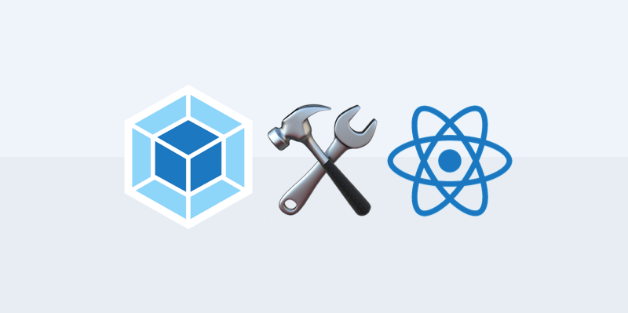

이 포스팅에서는 eject를 실행해 Create-React-App의 기본 웹팩 설정이 어떻게 되어있는지 살펴보고자 합니다.물론 웹팩 설정 파일은 매우 길고(주석까지 다 합치면 700줄 정도) + 저의 짧은 지식으로(...)모든걸 다 설명할 수는 없다는 판단 하에 전체적인 흐름과 중요한 설정 프로퍼티들만 짚을 예정입니다. 코드를 흐름 설명에 필요한 것만 발췌할 예정이므로 전체적인 코드는 직접 CRA의 `webpack.config.js` 를 참조하시면 됩니다. 그리고 웹팩의 개념과 설정 파일의 기본 구조에 대해서는 설명하지 않을 예정이라, 관련 지식이 있으면 좋을 것 같습니다.



## eject

```shell
npm run eject
```

기본적으로 CRA는 프로젝트 디렉토리를 간결하게 유지하기 위해서 웹팩 설정이나 script들의 자세한 동작을 명시한 script 폴더를 숨겨놓습니다. 하지만 숨겨진 세부 설정을 커스텀해야 할 필요가 있다면 콘솔 창에 `npm run eject`를 입력해 숨겨놓은 설정 파일들을 프로젝트 디렉토리에 표시되게끔 만들 수 있습니다. 다만 eject를 한 번 하면 이전 상태로 돌아갈 수 없으니 신중하게 생각하셔야 합니다.

명령어를 실행하면 프로젝트 디렉토리는 이와 같아집니다.

## webpack.config.js

eject 후에 생긴 `config` 폴더 안에 들어있는 웹팩 설정 파일입니다. 파일의 상단에는 빌드에 필요한 경로들에 대한 변수를 미리 지정해놓은 `paths.js`를 부르고 있고요, `module`에서 사용할 정규표현식들을 미리 선언해놨습니다. 이 설정파일에서는 기본적으로 익명 함수를 export하고 있는데요, 이 함수는 `webpackEnv` 인자에 따라 웹팩 설정 객체를 리턴합니다.

```javascript
// 로더에 쓰이는 정규표현식들 미리 선언
const cssRegex = /\.css$/;
const cssModuleRegex = /\.module\.css$/;
const sassRegex = /\.(scss|sass)$/;
const sassModuleRegex = /\.module\.(scss|sass)$/;

// 익스포트되는 모듈 함수로 적용 => 환경에 따라 다른 웹팩 설정 객체를 리턴
module.exports = function (webpackEnv) {
// development 모드와 production 모드의 웹팩 설정이 다름
  const isEnvDevelopment = webpackEnv === "development";
  const isEnvProduction = webpackEnv === "production";
  ...
  return {
  // webpackEnv 인자에 따라 mode가 달라짐
  mode: isEnvProduction ? "production" : isEnvDevelopment && "development",
  ...
  }
}
```

### entry

`paths.appIndexJs` 를 웹팩 빌드가 시작되는 진입점으로 설정합니다. 같은 폴더에 있는 `paths.js` 폴더에서 이 변수가 리액트 컴포넌트의 시작점이 되는 `src/index.js` 파일을 가리키고 있다는 것을 알 수 있습니다. `react-dev-utils`는 CRA에서 사용하는 웹팩 유틸리티인데, 다른 엔트리는 웹팩 dev server와 관련이 있는 것으로 보입니다. production 모드로 빌드될때는 entry 배열에 `src/index.js`만 남습니다.

```javascript
// 같은 폴더 내부의 paths.js에 빌드에 필요한 경로들 미리 설정
const paths = require("./paths");

entry: [
  // development 모드에서만 실행
  isEnvDevelopment && require.resolve("react-dev-utils/webpackHotDevClient"),
  // src/index.js를 진입점으로 설정
  paths.appIndexJs,
].filter(Boolean), // production 모드로 빌드되었을 때 false를 없애는 역할
```

### output

output의 `path`는 `build`폴더로 설정이 되어 있습니다. production 모드일때만 `build` 폴더가 생깁니다. production 모드일때는 번들링되는 파일 이름인 `[name]` 에 `[contenthash:8]`, 해쉬코드가 붙습니다. development 모드에서는 해쉬코드가 붙지 않습니다. `publicPath` 는 브라우저에서 참조될 때의 출력 파일의 공용 URL 주소를 지정합니다.

```javascript
output: {
  // paths.appBuild는 'build', 기본 빌드 폴더 이름이 'build'
  path: isEnvProduction ? paths.appBuild : undefined,

  // 모듈에 대한 정보가 포함된 주석으로 표시하는 옵션. production모드에서는 사용하지 않는다
  pathinfo: isEnvDevelopment,

  // production 빌드시에는 파일과 청크에 네임과 HashCode가 붙는다
  filename: isEnvProduction
    ? "static/js/[name].[contenthash:8].js"
    : isEnvDevelopment && "static/js/bundle.js",
  futureEmitAssets: true,
  chunkFilename: isEnvProduction
    ? "static/js/[name].[contenthash:8].chunk.js"
    : isEnvDevelopment && "static/js/[name].chunk.js",

  // public path를 설정해준다
  publicPath: paths.publicUrlOrPath,
      ...
}
```

production 모드로 빌드된 번들링 결과물에 해쉬코드를 붙이는 이유가 뭘까요? 브라우저에는 캐싱 기능이 존재하기 때문에 예전에 배포되었던 번들링 파일들의 일부를 저장하고 있습니다. 따라서 앱을 수정하고 다시 배포할 경우 캐싱되는 대상이 바뀌어야 하므로, 파일의 내용이 바뀌었다고 브라우저에게 알려줘야 할 필요가 생깁니다. 가장 쉽게 파일의 변경을 알려주는 방법은 이전과 다른 이름의 번들링 파일을 배포하는 것입니다. 그래서 수정해서 빌드할 때마다 바뀌는 해쉬코드를 번들링 결과물에 추가하면 브라우저에게 파일이 변경되었음을 쉽게 알려줄 수 있는 것이죠.

위 코드에서의 `[contentHash]` 는 번들링되는 파일 별로 상이한 해쉬값을 제공합니다. 해당 번들링 파일이 수정되었을 경우 해쉬값도 따라서 바뀝니다. `[contentHash:8]` 의 콜론과 숫자는 해쉬값을 8자리로 자른다는 의미입니다.

### optimization

optimization에서는 웹팩에 내장된 `SplitChunksPlugin`을 사용하기 위한 옵션을 지정해줍니다. `minimize`옵션이 true이면 아래 `minimizer` 배열에 들어있는 플러그인 객체들을 사용해 번들링 과정에서 파일을 최적화합니다. 아래 코드를 보면 `TerserPlugin` 과 `OptimizeCSSAssetsPlugin`이 사용되었네요. 그리고 `splitChunks` 는 앱에서 중복되서 사용된 모듈들을 추출해 다른 번들링 파일(청크)로 만듭니다. `chunks` 를 `all`로 설정하면 중복된 모든 모듈을 추출해 청킹합니다. `initial`이나 `async` 같은 다른 옵션도 존재합니다.

```javascript
// 플러그인 옵션은 ...으로 생략했습니다.

optimization: {
    // production 모드일때 true
    minimize: isEnvProduction,

    // 아래에 정의된 플러그인 사용해서 최적화
    minimizer: [
      new TerserPlugin({
        terserOptions: {
         ...
      }),
      new OptimizeCSSAssetsPlugin({
        cssProcessorOptions: {
          ...
        },
        cssProcessorPluginOptions: {
          ...
        },
      }),
    ],

    // 중복된 모듈 추출해서 따로 청킹
    splitChunks: {
      chunks: "all",
      name: false,
    },

...
}
```

### resolve

모듈을 해석하는 데 필요한 정보를 제공합니다. `modules` 에는 모듈을 탐색할 폴더 경로를 제공하고, `alias` 로는 모듈에 대한 별칭을 만들 수 있습니다. `extension` 에서는 우선적으로 처리할 모듈의 확장자 순서를 배열로 지정합니다. 모듈의 이름이 같은데 확장자가 다를 경우, 제공된 확장자 우선순위에 의거해서 앞선 확장자를 가진 모듈을 처리하고 다른 모듈은 skip합니다.

```javascript
resolve: {
// 모듈을 탐색할 node_modules의 경로 제공
  modules: ["node_modules", paths.appNodeModules].concat(
    modules.additionalModulePaths || []
  ),

      // 모듈 처리시 확장자 우선순위 배열 제공
  extensions: paths.moduleFileExtensions
    .map((ext) => `.${ext}`)
    .filter((ext) => useTypeScript || !ext.includes("ts")),

  // 별칭 설정
  alias: {
    "react-native": "react-native-web",
    ...(isEnvProductionProfile && {
      "react-dom$": "react-dom/profiling",
      "scheduler/tracing": "scheduler/tracing-profiling",
    }),
    ...(modules.webpackAliases || {}),
  },

```

### module

파일을 처리하는데 필요한 `loader`를 선언합니다. `loader`들은 module의 rules 배열안에 정의합니다. `test`는 로더를 적용할 파일명의 특징을 정규표현식으로 지정합니다. `exclude`에서는 처리 대상에서 제외할 파일명 규칙을 작성합니다. `loader`에서 로더를 불러옵니다. 살펴보니 CRA에서는 기본적으로 css, sass, eslint, url, babel, file 로더를 사용하고 있습니다.

```javascript
module : {
  rules [
    {
      test: /\.(js|mjs)$/,
      exclude: /@babel(?:\/|\\{1,2})runtime/,
      loader: require.resolve("babel-loader"),
      options: {
      ...
      },
    },
  ...
  ]
}
```

### plugins

플러그인을 빌드 과정에 적용합니다. 플러그인은 클래스로 구현되어 있으므로`plungins` 배열 안에다가 `new` 연산자를 사용해 새로운 익명 객체를 만들어주면 플러그인을 적용할 수 있습니다.

```javascript
// 플러그인들이 많아 옵션은 ...으로 생략했습니다.

plugins: [
  new HtmlWebpackPlugin(
  ...
  ),
  isEnvProduction &&
  shouldInlineRuntimeChunk &&
  new InlineChunkHtmlPlugin(HtmlWebpackPlugin, [/runtime-.+[.]js/]),
  new InterpolateHtmlPlugin(HtmlWebpackPlugin, env.raw),
  new ModuleNotFoundPlugin(paths.appPath),
  new webpack.DefinePlugin(env.stringified),
  isEnvDevelopment && new webpack.HotModuleReplacementPlugin(),
  isEnvDevelopment && new CaseSensitivePathsPlugin(),
  isEnvDevelopment &&
  new WatchMissingNodeModulesPlugin(paths.appNodeModules),
  isEnvProduction &&
  new MiniCssExtractPlugin({
    filename: "static/css/[name].[contenthash:8].css",
    chunkFilename: "static/css/[name].[contenthash:8].chunk.css",
  }),
  new ManifestPlugin({
  ...
  }),
  new webpack.IgnorePlugin(/^\.\/locale$/, /moment$/),
  isEnvProduction &&
  new WorkboxWebpackPlugin.GenerateSW({
  ...
  }),
  ...
].filter(Boolean),
```

모드별로 많은 플러그인이 사용되고 있는데요. 몇 개만 짚어보겠습니다.

- `HtmlWebpackPlugin`: 번들링된 파일을 참조하는 HTML을 빌드 과정에서 함께 생성합니다.
- `MiniCssExtractPlugin`: CSS파일을 청킹하여 옵션으로 지정한 디렉토리에 생성합니다.
- `ManifestPlugin`: 빌드된 번들링 결과물에 대한 정보를 `manifest.json`파일로 저장하여 관리합니다. 번들링할 때마다 번들 파일의 이름이 바뀌는 경우 참조에 문제가 생길 수 있는데 이를 해결합니다.

## Scripts 폴더

package.json에 따르면 build, start 명령어는 script 폴더 안의 자바스크립트 파일을 실행합니다. script 명령어를 실행하면 무슨 일이 일어나는지 살펴보겠습니다.

```json
// package.json
"scripts": {
  "start": "node scripts/start.js",
  "build": "node scripts/build.js",
  "test": "node scripts/test.js"
},
```

1.  `build.js`를 실행하면 webpack 빌드 설정을 production으로 적용하고 fs 모듈을 사용해 기존의 build 폴더를 새롭게 빌드한 build폴더로 치환해줍니다. ⇒ `npm run build`
2.  `start.js`를 실행하면 webpack 빌드 설정을 development로 적용하고 새로운 WebpackDevServer 객체를 선언하여 지정된 포트(3000)에 development 빌드가 적용된 웹팩 데브서버를 띄워줍니다. ⇒ `npm run start`

## reference

- [webpack documentation](https://webpack.js.org/guides)
- [webpack 설정 option에 대해서](https://trustyoo86.github.io/webpack/2018/01/10/webpack-configuration.html)
