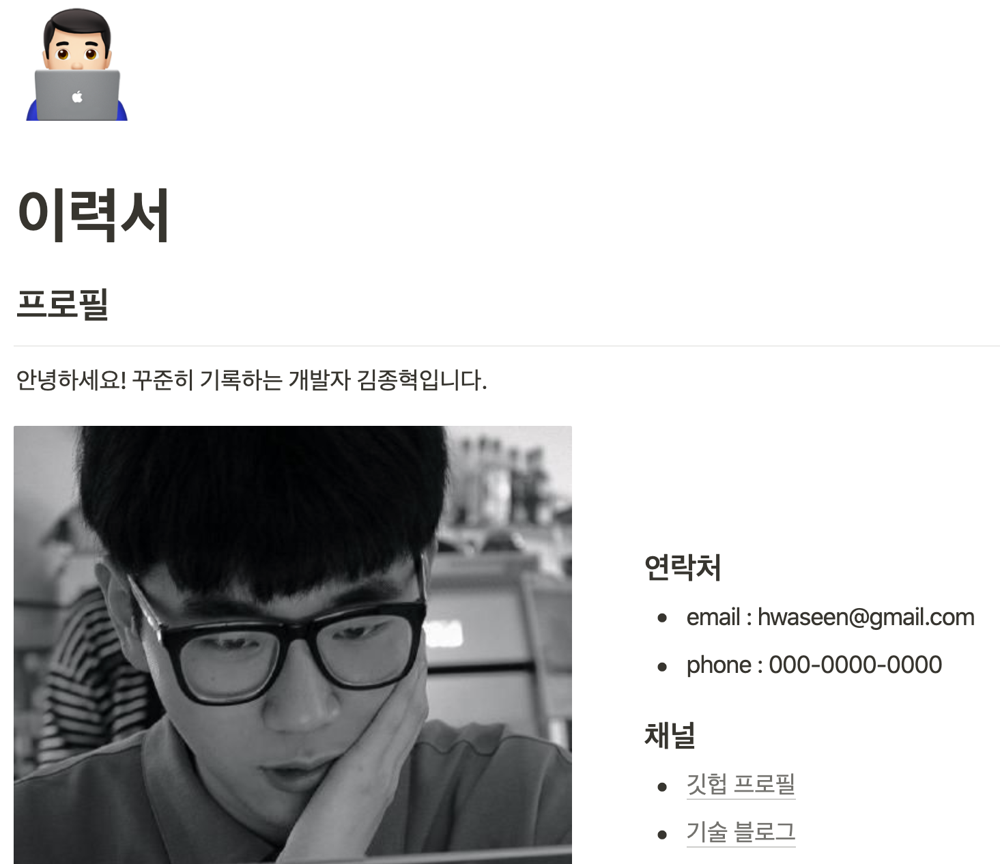

지난 6월 말, 대학교에서 3학년 2학기를 마치고 웹 프론트엔드 개발자로 구직을 진행한 결과를 회고합니다. 결과부터 이야기하자면 4개 회사에 원서를 내고 3개 회사에서 면접을 진행했으며 면접을 본 3개 회사에서 모두 오퍼를 받았습니다.

이력서를 낸 모든 회사에서 감사하게도 면접에 응할 수 있는 기회를 얻었고, 회사 한 곳은 그 전에 채용이 결정되어 면접에 응하지 못했어요. 지원한 회사들은 모두 스타트업이었고, 인턴과 정규직에 모두 지원했고요, 로켓펀치와 지인 추천을 통해 회사에 지원했습니다. 꽤 유명한 앱을 서비스하는 규모있는 스타트업부터, 학교에서 창업 공간을 지원받은 초기 스타트업 등 지원한 회사의 규모는 다양했습니다.

회사 한 곳 한 곳과 면접 경험을 기술하고 평가하기 보다는, 첫 구직을 하며 제가 준비했던 것들과 막상 해보니 부족했던 것이 무엇인지, 결국 어떻게 회사를 선택했는지를 위주로 포스팅해보려 합니다.

> 아, 그리고 스타트업 프론트엔드 개발자 구직에 초점을 맞춘 글이 될 것 같습니다. 대기업이나 SI업체 구직에 해당되는 이야기가 아닐 수 있다는 점 미리 말씀드립니다.

## 🤷🏻 왜 지금 구직?

- 개발 공부 시작한지 일년 반쯤 되었는데, 지금까지 잘 공부해왔는지 궁금했습니다.
- 개발을 전공자들보단 늦게 시작한 셈이니 곧바로 4학년을 치르고 졸업할 자신이 없었습니다. 지금 실력으로 입사해서 졸업 전에 더 개발을 배워보고 싶었습니다.
- 졸업을 하면 회사의 규모와 조건을 많이 따질 것 같았습니다. 그래서 조금이라도 순수(?)할 때 스타트업의 빠른 성장이나 의사 결정, 창업을 경험하고 싶었습니다.

## 📝 이력서 준비

저는 개발자 이력서의 핵심은 스토리나 테마보다 **증명**이라고 생각합니다. 자신의 역량이나 경험을 객관적인 문서나 링크로 증명하는 것에 중점을 두어야 합니다. **개인적으로, 내용에 링크를 많이 걸 수 있는 이력서가 좋은 이력서일 확률이 높다고 생각합니다.**

증명을 다 한 이후에 이력서가 자신을 잘 설명하고 어필하고 있는지 타진하면 좋을 것 같습니다. 몇 가지 항목을 정리한 요령을 정리해보겠습니다.

제 깃헙 프로필에 [공개 이력서](https://github.com/MaxKim-J/RESUME)가 있으니 참고해보셔도 좋을 것 같고요. 작성하는데 주로 정원희 님의 [개발자 이력서 작성하기(feat.이력서 공개)](https://brunch.co.kr/@hee072794/132) 포스팅과 이동욱 님의 [주니어 개발자의 이력서 쓰기](https://speakerdeck.com/weirdx/99con-junieo-gaebaljayi-iryeogseo-sseugi-idongug) 포스팅이 도움이 많이 되었습니다.

### 신상 정보

- 그렇게 많은게 필요하지 않은 것 같습니다.
- 개인적으로는 이름, 학력, 현재 거주지, 연락처, 개인 블로그나 깃헙 프로필 주소 정도면 괜찮을 것 같습니다.

### 기술 스택

- 현재 확실히 사용할 수 있는 것만 적었습니다.
- 공부를 살짝 해봤거나 사용한지 오래된 스택 자체는 이력서에 그렇게 득이 되지 못하는 것 같습니다. 면접 때 이와 관련해서 질문이 들어왔을 때 그건 너무 써본지 오래되었다거나 깊게 공부해보지 않아서 모른다는 말 자체는 좋은 인상을 주기 힘듭니다.
- 현재 공부하고 있는 스택을 적는 것 역시도 크게 도움이 되지 못하는 것 같습니다. 지원자가 정확히 무엇을 제대로 할 수 있을지 검증해야 하는 회사를 혼란스럽게 한다고 생각했습니다. 회사 입장에서 검증할 필요가 있는 업무와 관련된 스택 위주로 기술하시면 좋지 않을까 생각합니다.

### 프로젝트 이력

- 핵심만 간결하게 적으려 노력했습니다.
- 꼭 포함되어야 한다고 생각한 부분은 **1) 어떤 기술을 어떻게 사용했다 몇 줄** + **2) 프로젝트를 증명할 레포지토리나 서비스되고 있는 링크** + **3) 필요하면 사진 한 장 정도**인 것 같습니다.
- 리드미를 잘 정리해놓은 프로젝트 레포지토리가 존재하고, 프로젝트가 배포되었다면 사진은 굳이 필요 없다고 생각했습니다.
- 협업 프로젝트를 진행했다면 자신은 어떤 부분을 맡았는지 기술해야 합니다.
- 개인적으로 프로젝트가 배포되어있는 서비스 링크를 첨부할 수 없다면(기획이 미뤄진 외주 프로젝트 같은 경우) 그 이유를 면접에서 타당하게 설명할 수 있어야 한다고 생각합니다.

### 이력서 사진

- 이건 진짜 회사 차이가 클 것 같긴 한데... 이번 구직에서는 크게 뭐 어때야 한다고 생각하지 않아도 될 것 같았습니다.
- 어떤 개발자분들은 증명사진보다 자신이 좀 더 잘 드러나는 사진을 선호하신다고 하네요.
- 저는 제 깃헙 프로필 사진을 사용했습니다.

### 그 외

- 저는 공부한 내용과 튜토리얼을 계속 기록하고 있는 기록용 레포지토리 두 개와 튜토리얼 레포지토리를 올리고 있는 개인 organization 링크를 제출했습니다.
- 개발 관련 동아리 활동을 기술하면서 동아리에서 제가 발표자로 진행했던 세션의 발표 자료 링크를 첨부했습니다. 코랩(colab)과 노션으로 작성되어 있었습니다.
- 개발자 구직에 한해서는 개발 이외의 활동을 굳이 이력서에 쓸 필요는 없을 것 같습니다.
- 이렇게 쓰고보니 이력서가 너무 건조해서; 맨 앞에 자기소개를 좀 적었습니다. 자기소개는 지금까지 작성한 내용을 기반해서 회사가 저에 대해 좀 더 알았으면 좋을 것 같은 내용을 보충하는 느낌으로 적었습니다.

### 제출

- 노션으로 작성해서, 지원시마다 PDF와 링크를 같이 첨부했습니다.
- PDF나 노션 링크는 모든 컴퓨터에서 열람할 수 있기 때문에 이력서 제출에 적합합니다. 워드나 한글 파일로만 첨부하지 않는다면 괜찮을 것 같습니다.

## 🙋🏻 면접(기술, 인성)

### 준비

- [면접용 스크립트](https://www.notion.so/projectmaxkim/2cf3578802074089b5a3be5e26062bca)를 카테고리별로 써갔습니다. 기술면접 뿐만 아니라 인성면접 스크립트도 작성했습니다.
- 프론트엔드 관련 지식과 더불어 프로젝트 경험에 대한 설명과 예상 질문들도 정리했습니다.
- 이미지 트레이닝을 거듭했습니다. 스크립트를 숙지했다고 생각하면 소리내서 말해보는 연습을 했던 것 같아요. 스크립트대로 말할 수는 없더라도 주제에 대해 설명할 때 꼭 들어가야 하는 내용들의 흐름을 익히려고 노력했습니다.
- 이 스크립트 정리하는게 구직에서 제일 힘들었습니다... 정리해서 공부하는걸 편안해하는 스타일이라... 기말고사 기간에 죽기살기로 정리했었던 기억이 나네요.

### 실전

- **질문에 대한 답을 충분히 하고 나서 부연설명 해도 늦지 않습니다.**
- 저는 뭔가 항상 하고싶은 말이 많아서(폭풍 TMI러인것 같습니다;) 질문 듣고 대답할때 가끔 부연을 먼저 하는 경우가 많았었는데 이미지 트레이닝 하면서 고치려고 노력했습니다. ex) 그렇다 아니다로 답할 수 있는 질문은 먼저 결론/답을 말하고 설명을 한다거나 하는 식으로요
- **모르는걸 모른다고 말하는게 꽤 중요하다고 느꼈습니다.** 모르는걸 아는 것처럼 이야기하면 너무 뻔히 들통납니다.(물론 기본 소양에 해당하는 크리티컬한 걸 모르면 망합니다...)
- 저는 모르는 것이 나왔을 때 대답하는 프로토콜을 정했습니다. 모른다고 말하되 아는 것 까지를 단순하게 설명하는 방식입니다. 다만 간결하게 답해야합니다. 모른다는 사실을 그렇게 길게 말할 필요는 없기 때문에...

> A는 잘 모르겠습니다(결론부터) + 하지만 A와 연관된 B는 이거저거 같습니다/하지만 A를 이해하기 위해 필요한 C에 대해서는 ~라고 이해하고 있습니다.(간략히) + 질문주신 A에 대해 더 공부해봐야 될 것 같습니다.

- 모르는 것과 아는 것을 확실히 구분하는 것도 능력이라고 생각합니다

## 🧐 부족했던 것

### 즉석 (손)코딩

면접에서 만났던 코딩 문제로는 `배열 요소 빈도순으로 정렬하기`, `배열 요소 완전 랜덤으로 섞기`, `콘솔 로그 순서 문제` 정도였습니다. 손으로 직접 수도코드를 적어서 설명을 요구하는 곳도 있었고, 컴퓨터를 제공하고 직접 코딩을 요구하는 면접도 있었습니다. 저는 즉석 코딩에 약합니다. 뭔가 빨리빨리 못 풀겠습니다. 좀 더 완벽하게 풀려고 생각을 많이 해서 결과물을 빨리 못 내놓겠더군요.

한 번에 모든 문제를 잘 풀 수는 없으니 어느정도 맞는 답을 빨리 내놓고, 설명할 내용의 흐름도 정리가 좀 된 후에 면접관분들에게 버그가 있으면 수정하면서, 최적화를 진행하면서 설명을 진행하겠다 미리 말하면서 설명을 진행하면 좋을 것 같습니다. 물론 애초에 코딩을 빨리 정확히 잘하면 될 것 같긴 합니다. 연습.. 연습......

### 백엔드

프론트엔드 개발자 면접 후기인데 백엔드 관련 지식이 부족했다고 쓰는 이유는 면접에서 질문을 받았기 때문입니다.

당락을 가르는 크리티컬한 질문은 아닌 것으로 보여졌지만, REST API 설계와 데이터베이스 모델 설계, 인프라에 대한 질문도 받았는데요. 주로 엔지니어가 많지 않은 아닌 초기 스타트업에서 다양한 역량을 평가하기 위한 의도였던 것 같습니다. 시간이 남는다면 백엔드와 데이터베이스도 조금 더 관심을 가지고 공부해봐도 나쁠 것 없지 않나 싶습니다.

### 기술면접이 아닌 면접

기술 면접은 그래도 프론트엔드와 관련된 웬만한 질문이면 잘 대답할 수 있을 정도로 준비를 해갔습니다. 그런데 생각보다 어려웠던게 이외의 질문들이었습니다. 그 중에서도 엔지니어링에 대한 생각을 묻는 질문들이 까다로웠습니다.

어떤 엔지니어가 좋은 엔지니어인지, 어떻게 일해야 생산성을 높일 수 있을 것인지에 대한 질문이었습니다. 제 생각을 차근차근 말했지만 당시에는 좀 당황했던 것 같아요. 이런 질문에 대해서도 모두 대비하고 스크립트를 준비할 수는 없겠지만, 평소에 개발과 엔지니어링, 협업, 성장에 대해 어떻게 생각하고 있는지 좀 생각해봐도 좋을 것 같다는 생각이 들었습니다.

## 🤝 회사 선택

가장 크게 고민했던 점은 **시니어가 있는지**였던 것 같습니다. 외주든 프로젝트든 그동안 혼자서만 개발을 해 와서, "이렇게 하는게 정말 맞는 걸까", "더 좋은 구조는 없을까" 고민했었지만 답을 찾을 수 없었던 순간이 많았습니다. 저와 비슷한 수준의 주니어만 있는 곳으로 간다면, 결국 그 고민에서 뚜렷한 돌파구를 찾을 수 없을 것으로 생각했습니다. 그래서 확실히 보고 배울 수 있을 시니어 개발자가 있는 회사의 인턴을 선택했습니다.

다른 회사에 입사했다면 정규직으로 입사할 수도 있었고, 제가 조금 더 도전하고 싶은 기술 스택을 쓸 수 있었을 것 같았습니다만... 조금 다른 방식으로 성장하고 싶어서 다음 기회로 미뤘습니다. 회사를 고민했던 기준을 크게 보면 다음과 같습니다.

- **내가 지원한 포지션에서 보고 배울 수 있는 시니어 개발자가 있는가**
- **투자를 받았는가** : 초기 수준의 스타트업에 지원할 때 가장 크게 생각했던 지점입니다. 개인적으로는 투자를 유치한 스타트업과 그렇지 못한 스타트업은 꽤 큰 차이가 난다고 생각합니다.
- **코드리뷰를 진행하는가**
- **엔지니어 친화적인 회사인가**

## 🎯 깨달은 사실 몇가지

### 개발자를 구인하는 회사는 많고 지원자의 수준도 천차만별이다

달리 말하면 여기저기 도전해봐도 될 것 같다는 말입니다. 졸업을 하지 않아도 실력+근무를 위한 시간적 계획만 있으면 구직에는 상관 없다는 것을 많이 느꼈습니다. 스스로가 열심히 공부를 해 왔다면 언제든 스스로를 시험해볼 수 있는 좋은 수단이 바로 구직이라고 생각합니다. 면접이나 즉석 코딩을 통해 직관적으로 모르는 부분을 직시할 수 있고 많이 배워볼 수 있으니까요.

### 개인 깃헙 계정 관리는 정말정말 중요하다

제가 이 글에서 계속 **증명**의 중요함을 계속 강조했는데요. 증명할 수 있는 컨텐츠를 만들어내는 과정에서 깃헙 계정 관리는 빠질 수가 없습니다. 프로젝트의 레포지토리, 자신이 날마다 공부한 것을 정리하는 TIL 레포지토리 등이 지원자가 얼마나 공부해왔는지, 무엇을 해봤는지에 대한 좋은 레퍼런스가 됩니다.

일일 일커밋을 하라는 이야기가 아닙니다. 깃헙 프로필 관리는 양보다는 질인 것 같아요. 자신의 성실성과 실력을 보여줄 수 있는 지표를 깃헙을 통해 만들어놓는게 중요합니다. 면접관분들은 꽤 유심히 살펴 보시기도 합니다. 프로젝트 리드미뿐만 아니라 내부 코드까지 보신 분, TIL에 정리해놓은 자잘한 내용들을 보신 분도 계셨습니다. 개발 블로그에 정리한 내용을 토대로 더 심화된 내용을 면접에서 물어보시기도 했어요.

개인적으로 개발 블로그나 TIL 레포지토리 둘 중에 하나 정도는 하시면 무척 좋을 것 같습니다.
