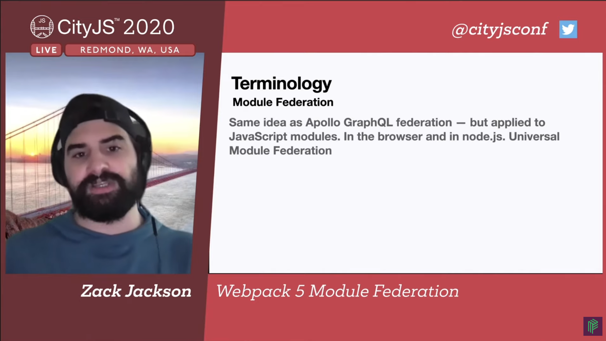
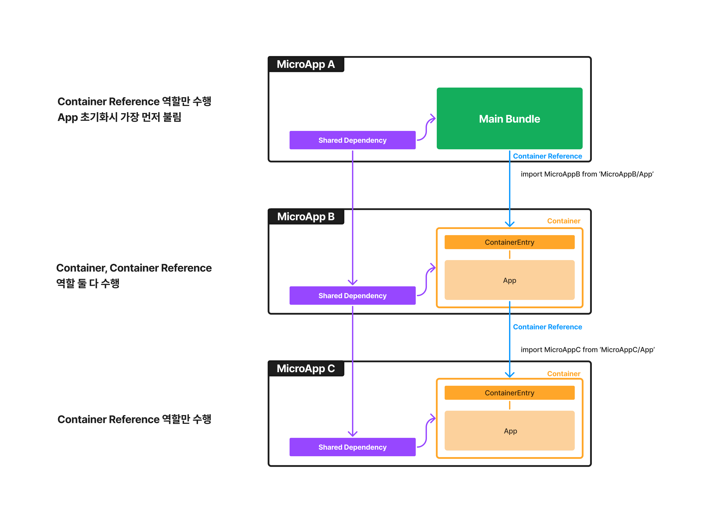
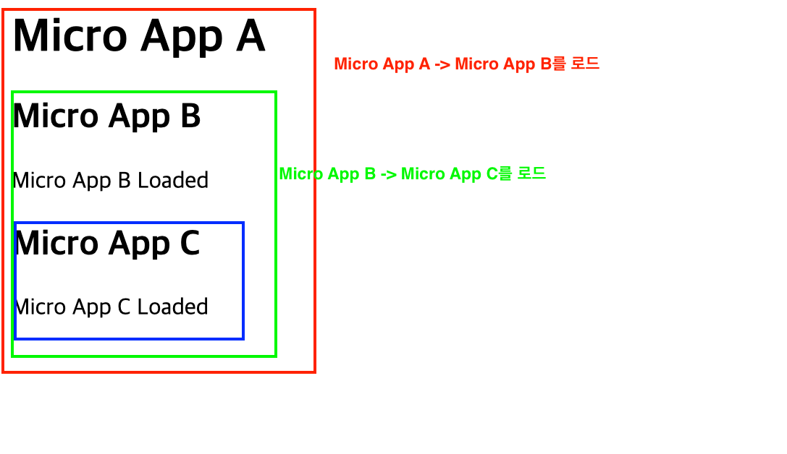
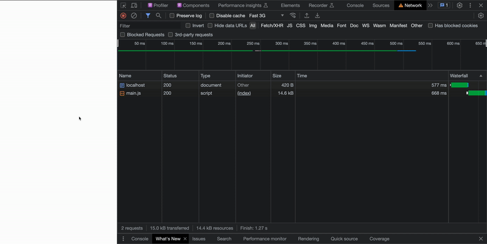
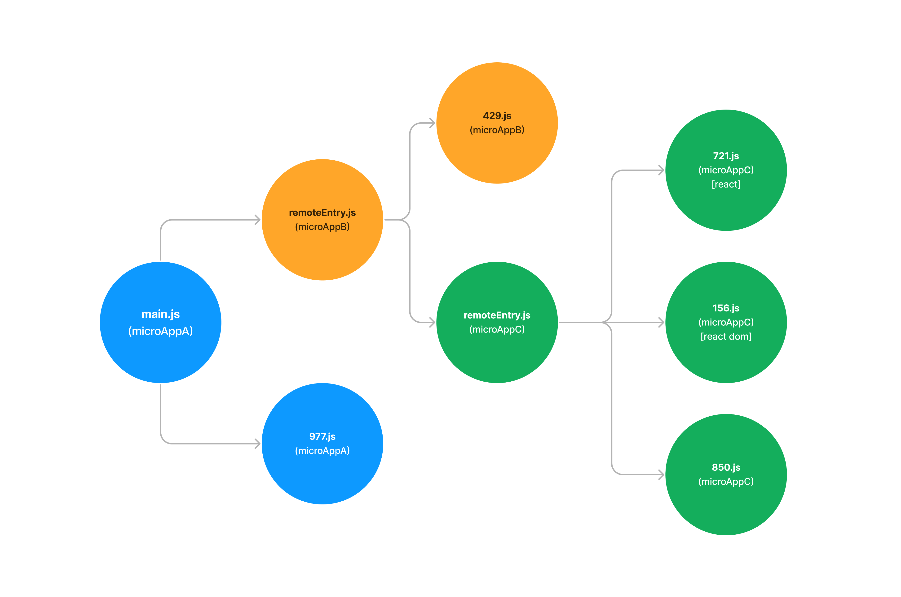
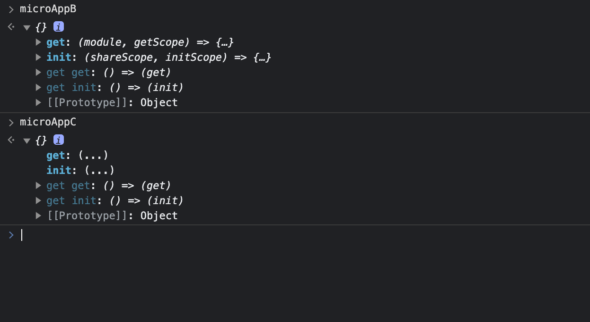

Module Federation과 관련된 글 몇개를 정리해서 엮어보려 합니다. 그동안 공부하며 어떻게 동작하는지 감은 잡았지만, 내용을 정리해둘 필요도 있다는 것을 느꼈습니다. 국내 레퍼런스도 늘리고 싶었고요.

이 포스팅은 첫번째로, Module Federation의 기본 컨셉과 특징을 이해해보려고 하는 글입니다.

# Module Federation

## Module Federation이란?


> [Micro at buildtime, Monolith at runtime](https://youtu.be/XpeD4FtlMg4?t=2) - Zack Jackson

하나의 앱을 독립적인 배포가 가능한 모듈 단위([Webpack에서의 청크](https://webpack.kr/guides/code-splitting/))로 나누어 브라우저 런타임에 합체시키는 개념입니다.

Micro Frontends와 상응하는 개념은 아니지만 구현의 하나로 볼 수 있습니다. 하나의 앱을 특정 단위로 찢어서 배포할 수 있는 방법을 제공하기 때문입니다.

[Zack Jackson](https://twitter.com/ScriptedAlchemy)님이 이 개념의 창시자라고 할 수 있습니다. [Apollo graphQL Federation의 개념을 JS 모듈에 적용한 것이라고 합니다.](https://youtu.be/-ei6RqZilYI?t=655)



[Webpack 5 Module Federation - Zack Jackson - CityJS Conf 2020 영상](https://www.youtube.com/watch?v=-ei6RqZilYI)에서는 Module Federation의 창시자가 직접 해당 컨셉의 개괄을 설명합니다.

Zack이 Module Federation으로 해결하고자 하는 것은 [다음과 같습니다.](https://youtu.be/-ei6RqZilYI?t=444) 주로 기존의 분절된 앱의 부분들을 하나의 앱에 통합시키는 시도에서 보였던 단점들입니다.

- **Sharing code is hard**: 빌드타임 통합은 느리고 비효율적이며 확장 가능하지 않다
- **Nothing Feels Smooth**: 자주 쓰이던 런타임 통합 방식(iframe)은 결국 하나의 앱처럼 합쳐지지 않는다.
- Native ESM은 아직 브라우저에서 느리고, Monolith는 확장하면 할수록 커지고 느려지고, webpack external을 사용해 특정 모듈을 따로 번들링하는 것은 굉장히 수고롭다

Module Federation은 webpack에 국한된 구현체가 아닙니다. [구현 컨셉, 인터페이스에 가깝습니다.](https://youtu.be/-ei6RqZilYI?t=1062) 빌드 툴(vite, rollup)에 따라 각각 다른 구현체가 존재하기도 합니다.

- [vite-plugin-federation](https://github.com/originjs/vite-plugin-federation)
- [rollup-federation](https://github.com/originjs/vite-plugin-federation)

하지만 개념적 구현에 그치지 않고, 꾸준히 유지보수가 되고 있는 [Webpack Plugin](https://webpack.kr/plugins/module-federation-plugin/)을 이용한 구현 방법이 지금은 가장 접근성이 좋은 구현 방식이라고 생각됩니다.

## Webpack 5 Module Federation Plugin

Module Federation 개념의 Webpack 버전 구현체이며, [2020년에 릴리즈된 Webpack 5](https://webpack.js.org/blog/2020-10-10-webpack-5-release/#module-federation)에 추가되었습니다.

이 Plugin은 Module Federation의 개념에 맞게 청크로 잘게 나눠놓은 JS 모듈들의 런타임 로드가 제대로 동작할 수 있도록 합니다.

플러그인은 빌드 시 코드를 직접 수정하고 추가하거나, 청크를 나누거나, 청크 간의 의존관계를 바꾸는 등의 처리를 통해 청크 결과물을 처리합니다.

이 포스팅에서는 요 플러그인이 제공하는 기능을 가지고 주된 설명을 진행할 예정입니다. [module-federation-example](https://github.com/module-federation/module-federation-examples) 레포지토리에서 여러가지 exmaple을 볼 수 있습니다. React, Vue, Angular 등을 포함한 다양한 기술 스택들이 플러그인을 통해 처리되는 예시들을 확인하실 수 있어요.

## Module Federation Plugin 작동 원리 이해하기



보여드릴 예제는 하나의 모놀리식 웹앱의 분절인 3개의 “Micro App”이 주르륵 의존하고 있는 형식입니다. 각 앱들은 모두 React를 이용해 만든 간단한 SPA로 구현되어 있습니다. 이 예제를 이용해 다음과 같은 것들을 보여드리려 합니다.

- 핵심 개념
- 청크 로드 순서와 양상
- 진입점 청크(main, remoteEntry)들이 하는 일
- 플러그인의 동작방식

코드는 미리 작성해놓았어요. README의 설명을 통해 한번 구동해보시고, 코드를 한 번 쭉 살펴보시고 나서 이어질 포스트의 내용을 읽어보시는 것을 권장드립니다.

> [Module Federation 코드 예제 레포지토리](https://github.com/MaxKim-J/module-federation-example)

## Module Federation Plugin 핵심 개념 3가지

일단 Module Federation을 설명하는데 있어 가장 중요한 세 가지 개념을 설명하고 가겠습니다.


### Container

다른 마이크로 앱에서 로드 가능한 단위입니다. A앱을 B, C와 같은 다른 마이크로 앱에서 불러와 쓸 수 있다면 “A앱은 Container를 포함하고 있다” 고 말할 수 있습니다.

- 1개 이상의 Exposed Module을 가지고 있는 Module Federation Plugin의 단위입니다.
- Remote Container라고도 하고 Remote App이라고 말할 수도 있습니다.
- Module Federation Plugin에서 다음과 같은 설정값을 가지면 해당 마이크로 앱은 Container를 가지게 됩니다.

```javascript
new ModuleFederationPlugin({
    name: 'microApp',
    filename: 'remoteEntry.js',
    // exposes 설정을 가지고 있다면 conatiner를 포함한다.
    exposes: {
      './AppA': './src/AppA.tsx',
      './AppB': './src/AppB.tsx',
    },
  }),
```

```javascript
// 아래 설명할 conatiner reference를 가진 다른 micro app에서는
// 다음과 같은 방식으로 microApp을 불러옵니다.

import 구현체 from '{container 이름}/{exposes설정값의 key}';

// 정적 import
import MicroAppA from 'microApp/AppA';

// 동적 import
const MicroAppB = React.lazy(() => import('microApp/AppB'));
```

### Container References

특정 앱에서 다른 마이크로 앱을 Import할때 만들어지는 참조 관계입니다. A 앱에서 B 앱을 import해서 쓰고 있다면 “A앱은 B앱에 대한 Container Refrences가 존재한다.”고 말할 수 있습니다.

- 1개 이상의 Container를 import하고 있는 Module Federation Plugin의 단위입니다.
- Remote App을 import한다는 관점에서 Host App이라고 부를 수도 있습니다.
- Module Federation Plugin에서 다음과 같은 설정값을 가지면 해당 마이크로 앱은 Container References를 가지게 됩니다.

```javascript
new ModuleFederationPlugin({
    name: 'microAppA',
    // remotes 설정을 가지고 있다면 conatiner reference를 포함한다.
    remotes: {
       microAppB: 'microAppB@http://localhost:3002/remoteEntry.js',
    },
  }),
```

### Share Scope

공유되는 의존성이 유효한 하나의 scope입니다. 마이크로 앱간 의존성 공유를 할 때 공유 의존성에 대한 설정, 버전을 체크하고 이를 설정한 바에 맞게 각 Micro App에서 로드해서 쓰는 방식을 결정하게 하는 역할을 합니다.

- `shared` 설정으로 특정 의존성과 버전을 넘기면 마이크로 앱간 의존성을 런타임에서 공유할 수 있습니다. 예컨데 다음 코드와 같은 설정을 모든 마이크로 앱에 붙여주면, React 인스턴스를 모든 마이크로앱에서 하나만 공유할 수 있는 것이죠.
- `shareScope` 설정까지 넘겨주면 같은 scope를 가지고 있는 container, container reference 사이에서만 의존성 공유를 할 수 있습니다. 통상적으로 기본값은 `default`로 처리됩니다.

```javascript
new ModuleFederationPlugin({
    shared: {
      // react를 default shared scope 범위에서 공유 모듈로 추가합니다.
      react: {
        requiredVersion: deps.react,
        singleton: true,
        shareScope: 'default'
      },
    },
  }),
```

[의존성 공유 기능에 대해서는 다른 포스팅에서 더 자세히 살펴보겠습니다.](/posts/module-federation-shared) 이것도 꽤 복잡하거든요. 여기서는 의존성 공유가 가능하더라-정도만 알고 계시면 됩니다.

## Module Federation Plugin으로 만드는 웹앱 구조

핵심 개념을 살펴보았으니, 이제 예제의 도식을 다시 한 번 보겠습니다.


여기서 눈여겨볼 것은, 중간의 앱 B는 Container인 동시에 Container Refrence를 가진 상태라는 것입니다.

Module Federation Plugin의 설정값의 `remotes`와 `exposes` 속성은 배타적이지 않아서, 하나의 마이크로 앱은 Container가 될 수 있고, Container Reference를 가질 수도 있습니다. 앱 B는 다음과 같은 설정값을 가지게 됩니다.

```javascript
new ModuleFederationPlugin({
  name: 'microAppB',
  filename: 'remoteEntry.js',
  remotes: {
    microAppC: 'microAppC@http://localhost:3002/remoteEntry.js',
  },
  exposes: {
    './App': './src/App.tsx',
  },
  shared: {
    react: {
      singleton: true,
      version: '18.2.0',
    },
    'react-dom': {
      singleton: true,
      version: '18.2.0',
    },
  },
}),
```

이것이 Module Federation Plugin의 중요한 특성 중 하나인 [**전방향적 성격(Omnidirectional)**](https://medium.com/swlh/webpack-5-module-federation-a-game-changer-to-javascript-architecture-bcdd30e02669) 입니다.

브라우저에서는 이렇게 표시됩니다. MicroApp A가 최초 로드 후, Micro App B를 부르고, Micro App B가 Micro App C를 부르는 것을 눈으로 확인할 수 있습니다





## 앱 초기화와 청크 로드 순서

이제 개발자 도구를 열고 청크가 로드되는 순서를 자세히 살펴보겠습니다. 각 청크가 로드된 지점(intiator)을 보면 어떤 청크가 다른 어떤 청크를 불렀는지 알 수 있습니다.



여기서 JS 리소스들의 종류는 크게 3가지로 볼 수 있습니다. `main.js`, `remoteEntry.js` 청크의 런타임 처리로 적절한 chunk들이 불러와 런타임에서 앱을 완성시키고 있음을 알 수 있습니다.

- **main.js**: 최초에 앱을 초기화하는 역할을 합니다. 가장 상위의 Micro App A의 HTML에서 가장 먼저 불러와지는 청크가기도 합니다. Micro App A의 Container Reference를 가진 청크로, 해당 처리를 해줍니다. 이 외에도 createRoot등, 브라우저에서도 앱을 최초로 초기화하는데 필요한 코드들을 가지고 있습니다.
- **remoteEntry.js**: Container을 가진 Micro App을 초기화하는 청크입니다. 특정 마이크로 앱에서 다른 Micro App을 import할 때 가장 먼저 불리는 청크가기도 합니다. Micro App B, C의 Container를 가진 청크로, 해당 처리를 해줍니다.
- **XXX.js** : 이외 청크입니다. 공유 의존성 청크과 Micro App 본문에 대한 청크입니다. `main.js`, `remoteEntry.js`내부의 런타임 처리를 통해 로드가 제어됩니다.

청크들 중 공유 의존성에 해당하는 청크는 shared 옵션과 의존성 이름에 따라 단일한 청크 이름을 갖기 때문에, 의존성을 공유하는 여러 개의 Micro App사이에서 한번만 불러와질 수 있습니다.

## Container Reference, Container 런타임 처리

아까 각각 `main.js`와 `remoteEntry.js` 청크가 Container, Container Refrence에 대한 런타임 처리 코드를 가지고 있다고 말씀드렸는데요, 각각의 청크는 다음과 같은 것들을 가지고 있습니다.

요것들은 진입점 청크이기 때문입니다.

- **localhost:3000/main.js**: Micro App A에 대한 Container Reference
- **localhost:3001/remoteEntry.js** : Micro App B에 대한 Container, Container Reference
- **localhost:3002/remoteEntry.js** : Micro App C에 대한 Container

청크가 각각 따로지만 특정 청크가 Container Reference를 가지고 있는지, Container를 가지고 있는지, 공유 의존성을 가지고 있는지에 따라 하는 일이 살짝 달라집니다.

여기서는 각 청크에 포함된 webpack의 런타임 청크 코드를 직접 까서 살펴보고, 각각이 하는 일에 대해서 대략적으로 설명해보겠습니다. 코드는 필요한 부분만 인용할건데, 주석을 붙인 부분만 중점적으로 보시면 됩니다.
예제에서 개발자도구를 열고, 코드 조각을 청크에서 같이 찾아가며 읽어주셔도 좋을 것 같아요!!

### Container Reference, Container 청크 공통

일단 Container Reference, Container 모두 필요한 또다른 청크를 불러오는 동작이 있습니다.

`remoteEntry.js` 청크는 가져오는 Micro App에 필요한 청크를 불러오고, `main.js` 청크 역시 다른 `remoteEntry.js` 청크, 앱 진입점의 코드가 필요한 청크를 불러오거나 하는 식으로 각 앱의 진입점 청크는 필요한 청크를 계속 불러옵니다. 이렇게 외부 청크를 불러와 필요한 동작을 수행하는 것은 통상적인 code splitting의 동작과 상당히 유사합니다.

또한 불러올 청크를 적절하게 처리할 런타임 함수들을 가지고 있습니다. module federation plugin을 사용하면 웹팩 런타임에서 특정 모듈을 찾는데 도움을 주는 `__webpack_require__.f`을 확장시켜서, module federation plugin으로 처리된 원격 모듈을 찾고, 접근할 수 있게 해줍니다.

```js
/* webpack/runtime/ensure chunk */
(() => {
  __webpack_require__.f = {};
  // webpack_require.f는 객체이고, 여기에 청크를 로드했을 때 후처리를 하는 식의 코드를 붙일 수 있다.
  // webpack_require.e는 f에 붙은 모듈 로드 방식을 reduce를 통해 호출하고, 결과물에 대한 프로미스 배열을 리턴한다.
  __webpack_require__.e = (chunkId) => {
    return Promise.all(
      Object.keys(__webpack_require__.f).reduce((promises, key) => {
        __webpack_require__.f[key](chunkId, promises);
        return promises;
      }, [])
    );
  };
})();
```

shared 옵션을 가지고 있는 경우, `webpack_require.f.consumes` 함수를 통해, 공유되는 의존성 청크가 필요한 경우, 속성값에 따라 적당한 밸리데이션을 통해 어떤 청크를 가져올지 정하고 실제로 불러옵니다.

```js
// 공유 의존성 청크에 대한 버전 확인 및 청크 번호 명시
// load~ 어쩌구 함수들은 module federation plugin이 제공하는 공유 의존성에 대한 버전 밸리데이션 + fallback 제공 + 로드 역할을 수행
var moduleToHandlerMapping = {
  966: () =>
    loadSingletonVersionCheckFallback('default', 'react', [1, 18, 2, 0], () =>
      __webpack_require__.e(721).then(() => () => __webpack_require__(721))
    ),
  239: () =>
    loadSingletonFallback('default', 'react', () =>
      __webpack_require__.e(721).then(() => () => __webpack_require__(721))
    ),
};

// 특정 청크를 로드할때 필요한 chunkId 명시
var chunkMapping = {
  239: [239],
  966: [966],
};

__webpack_require__.f.consumes = (chunkId, promises) => {
  if (__webpack_require__.o(chunkMapping, chunkId)) {
    chunkMapping[chunkId].forEach((id) => {

      // 이미 로드된 청크라면 인자로 같이 들어온 Promise 배열에 Push
      if (__webpack_require__.o(installedModules, id)) return promises.push(installedModules[id]);

      var onFactory = (factory) => {
        // 청크 로드를 기록하고 인자로 받은 팩토리 함수를 호출
        ...
      };
      var onError = (error) => {
        // 공유 의존성 청크 로드에 대한 에러 처리
        ...
      };
      try {
        // 청크 로드 시도하고 promise로 처리, 청크를 로드할 수 있으면 인자로 같이 들어온 Promise 배열에 Push
        var promise = moduleToHandlerMapping[id]();
        if (promise.then) {
          promises.push((installedModules[id] = promise.then(onFactory)['catch'](onError)));
        } else onFactory(promise);
      } catch (e) {
        onError(e);
      }
    });
  }
};
```

위 코드에서 `moduleToHandlerMapping` 객체는 shared 청크에 대한 정보와, 불러올때 필요한 chunkId에 대한 정보를 미리 가지고 있습니다. 이러한 맵핑 객체를 통해 특정 청크를 로드했을 때, 이게 공유 의존성에 해당하는 청크인지, 다른 Micro App의 일부인 청크인지 구분이 가능합니다.

### Container Reference를 가진 청크가 하는 일

해당 앱의 본문을 렌더링하는데 필요한 청크를 로딩합니다. 이때 이 청크가 shared 청크나 다른 청크를 필요로 할때, 앞에서 설명했던 런타임 청크를 통해 적절한 처리를 해줍니다. 참조가 살아있는 Micro App들에 대한 진입점 청크, 즉 `remoteEntry.js`를 로딩합니다. 어떤 URL에서 이 청크를 가져와야할지는 앞에서 본 `ModuleFederationPlugin` 설정값에 명시한 것처럼 미리 알고 있습니다.

```js
module.exports = new Promise((resolve, reject) => {
  // 이미 스크립트를 로드해서 전역 객체에 등록했다면 아무것도 안함
  if(typeof microAppC !== "undefined") return resolve();

  // 어디서 remoteEntry.js 파일을 불러올지 미리 명시하고 `__wepback_reuire__.l` 호출
  __webpack_require__.l("http://localhost:3002/remoteEntry.js", (event) => {
    if(typeof microAppC !== "undefined") return resolve();
    ...
  }, "microAppC");

}).then(() => (microAppC));
```

`__webpack_require__.l` 함수를 이용해 직접 스크립트 태그를 만들고 HTML에 붙여 로드합니다.

```js
/* webpack/runtime/load script */
(() => {
  var inProgress = {};
  var dataWebpackPrefix = '@module-federation-example/micro-app-b:';
  // loadScript function to load a script via script tag
  __webpack_require__.l = (url, done, key, chunkId) => {
    ...
    if (key !== undefined) {
      // 이미 로드 중인 경우 또 로드하지 않는다.
      var scripts = document.getElementsByTagName('script');
      for (var i = 0; i < scripts.length; i++) {
        var s = scripts[i];
        if (
          s.getAttribute('src') == url ||
          s.getAttribute('data-webpack') == dataWebpackPrefix + key
        ) {
          script = s;
          break;
        }
      }
    }

    if (!script) {
      needAttach = true;
      // 스크립트 태그를 직접 만들어 붙여서 브라우저에 로드한다.
      script = document.createElement('script');
      script.charset = 'utf-8';
      script.timeout = 120;
      ...
      script.src = url;
    }

    inProgress[url] = [done];

    // 스크립트 로드 이후 호출되는 콜백
    var onScriptComplete = (prev, event) => {
      ...
      clearTimeout(timeout);
      ...

      // 로드가 완료된 뒤에는 해당 스크립트 태그를 삭제한다.
      script.parentNode && script.parentNode.removeChild(script);
      doneFns && doneFns.forEach((fn) => fn(event));
      if (prev) return prev(event);
    };

    // 120초가 지나도 로드가 안되면 onScriptComplete 함수를 그냥 호출해서 에러처리한다.
    var timeout = setTimeout(
      onScriptComplete.bind(null, undefined, { type: 'timeout', target: script }),
      120000
    );
    ...
    needAttach && document.head.appendChild(script);
  };
})();
```

`__webpack_require__.f.remotes` 함수 호출을 통해, remote 청크를 불러왔을 때 get을 호출해서 container 진입점 청크에서 init한 코드를 가져와 브라우저에 로드합니다. `idToExternalAndNameMapping`이라는 객체에서 청크 번호, scope, expose된 식별자를 미리 가지고 있습니다.
`get`, `init` 함수는 바로 아래서 설명할게요!

```js
/* webpack/runtime/remotes loading */
(() => {
  var chunkMapping = {
    706: [706],
  };
  // container에 대한 정보에 관한 맵핑 객체
  var idToExternalAndNameMapping = {
    706: ['default', './App', 296],
  };

  // container를 불러오는 역할
  __webpack_require__.f.remotes = (chunkId, promises) => {
    if (__webpack_require__.o(chunkMapping, chunkId)) {
      // Micro App을 불러올때 필요한 모든 청크를 로드 시도
      chunkMapping[chunkId].forEach((id) => {
        var getScope = __webpack_require__.R;
        if (!getScope) getScope = [];
        // 로드할 청크에 대한 데이터
        var data = idToExternalAndNameMapping[id];
        if (getScope.indexOf(data) >= 0) return;
        getScope.push(data);
        // 로드할 청크에 대한 사전 처리가 되어있다면 인자로 받은 프로미스 배열에 push해서 리턴
        if (data.p) return promises.push(data.p);
        var onError = (error) => {
         // 로드 실패시 에러 콜백
         ...
        };
        var handleFunction = (fn, arg1, arg2, d, next, first) => {
          // conatiner 청크 로드를 처리하는 함수. 첫번째 인자로 받은 함수를 실행하여 맵핑 객체의 청크에 대한 처리를 함(get 함수 호출 등)
          try {
            var promise = fn(arg1, arg2);
            if (promise && promise.then) {
              var p = promise.then((result) => next(result, d), onError);
              // 처리 후 리턴
              if (first) promises.push((data.p = p));
              else return p;
            } else {
              return next(promise, d, first);
            }
          } catch (error) {
            onError(error);
          }
        };
        var onExternal = (external, _, first) =>
          external
            ? handleFunction(__webpack_require__.I, data[0], 0, external, onInitialized, first)
            : onError();
        var onInitialized = (_, external, first) =>
          handleFunction(external.get, data[1], getScope, 0, onFactory, first); // get호출
        var onFactory = (factory) => {
          data.p = 1;
          __webpack_require__.m[id] = (module) => {
            module.exports = factory();
          };
        };

        // 콜백으로 삽입함 onExternal 함수에서 handleFunction을 재귀적으로 호출하여, container에 해당하는 모든 청크에 대해 처리할 수 있도록 함
        handleFunction(__webpack_require__, data[2], 0, 0, onExternal, 1);
      });
    }
  };
})();
```

### Container을 가진 청크가 하는 일

container에서 expose된 특정 모듈을 로드할 때 어떤 청크를 같이 로드해야하는지에 대한 정보를 가지고 있습니다.

```javascript
var moduleMap = {
  './App': () => {
    return Promise.all([
      __webpack_require__.e(966),
      __webpack_require__.e(239),
      __webpack_require__.e(429),
    ]).then(() => () => __webpack_require__(429));
  },
};
```

해당 컨테이너 식별자에 해당하는 전역변수를 선언합니다. 그리고 거기다가 `get`과 `init`함수를 선언합니다. 각각 container을 초기화하고, 내부의 코드를 얻는데 필요한 함수입니다.

```js
// 전역변수 선언
var microAppB;
...
var get = (module, getScope) => {
  __webpack_require__.R = getScope;
  getScope = __webpack_require__.o(moduleMap, module)
    ? moduleMap[module]()
    : Promise.resolve().then(() => {
        throw new Error('Module "' + module + '" does not exist in container.');
      });
  __webpack_require__.R = undefined;
  return getScope;
};
var init = (shareScope, initScope) => {
  if (!__webpack_require__.S) return;
  var name = 'default';
  var oldScope = __webpack_require__.S[name];
  if (oldScope && oldScope !== shareScope)
    throw new Error(
      'Container initialization failed as it has already been initialized with a different share scope'
    );
  __webpack_require__.S[name] = shareScope;
  // __webpack_require__.I에서 shared 의존성 청크를 확인하고 불러오는 동작, 전역 변수에 get과 init함수를 등록하는 동작이 이루어짐
  return __webpack_require__.I(name, initScope);
};

// 전역 객체에 등록되는 코드
__webpack_require__.d(exports, {
  get: () => get,
  init: () => init,
});
```

- **init()**: 컨테이너를 브라우저 위에서 초기화하는 동작을 합니다. 해당 앱이 로드되기 위해 필요한 shared 의존성 청크를 불러오는 동작, 스코프를 확인하는 동작을 합니다.
- **get()**: 해당 컨테이너의 scope 정보를 바탕으로, moduleMap에서 해당 module 이름의 청크 로드를 찾아 리턴합니다. 쉽게 말하면 리모트 컨테이너가 expose하는 코드에 직접 접근할 수 있는 코드입니다. init이 먼저 이루어져야 합니다.

remoteEntry 청크가 불러올때 `init`이 같이 호출되며, 해당 remote 앱에서 필요한 의존성 청크들도 같이 부릅니다. get은 위에서 말했듯 container reference를 가진 청크에서 호출합니다. 초기화를 하고 나면 전역 객체에 선언한 전역 변수를 바탕으로 해당 Micro App의 코드를 확인할 수 있게 됩니다. 콘솔 탭에서도 확인할 수 있어요.



Module Federation도 웹팩에 이미 존재하는 런타임 청크들을 기반으로 필요한 동작을 취합니다.

`self`, `__wepback_require__.l` , `__wepback_require__.e` , `__wepback_require__.f` 등의 웹팩 런타임 청크 API들은 dynamic import를 통한 일반적인 코드 스플리팅에도 사용합니다.

dynamic import만을 이용한 청크 스플리팅은 앱 내 코드만 분할하지만, module federation 환경에서는 공유 의존성에 대한 청크, 다른 container에 해당하는 청크까지 splitting된 청크로 분할하고 처리하는 것입니다.

Zack은 [Webpack 5 Module Federation - A look at the source code and how it works 영상](https://youtu.be/HDRIvks0yyk?t=2448)에서 간단한 멘탈 모델로 이를 설명하기도 합니다.

```javascript
// 원격에서 chunk를 받아오고, 공유 의존성을 override해서 앱을 런타임에서 완성한다.
require(remoteApp).override({ ...sharedDependency });
```

## Module Federation Plugin의 내부 동작 이해

그렇다면 플러그인에서는 어떤 처리를 해주고 있는 것일까요? 코드를 직접 들여다보기엔 살짝 복잡하지만, 필요한 부분만 이해할 수 있도록 정리해보겠습니다.

기본적으로 Module Federation Plugin은 웹팩의 여러가지 [tappable plugin api](https://webpack.js.org/api/plugins/)를 사용하여, 일반적인 번들을 만드는 과정에서 코드 생성, 혹은 기존의 의존성을 바꾸는 과정을 사용해 런타임에 integration이 가능하고 의존성 공유까지 가능한 상태로 번들을 만들어냅니다.

webpack plugin의 기능을 사용하는 부분은 대강 이런 식으로 간단히 이해해볼 수 있습니다.

- [Module Factory](https://webpack.js.org/api/normalmodulefactory-hooks/)를 사용해 코드의 dependency 구조를 바꿉니다. shared로 공유된 의존성의 경우, 기존 패키지 매니저가 마련한 디렉토리(node_modules 등)에서 의존성을 찾는 것이 아니라 번들링된 다른 청크를 보게 하는 것이죠.
- [Module의 source 프로퍼티를 직접 수정](https://webpack.js.org/api/normalmodulefactory-hooks/#generator)해서 Module Federation 앱 초기화에 필요한 코드를 직접 생성해서 넣어줍니다.
- [external plugin](https://webpack.kr/configuration/externals/)을 이용해 특정 Micro App에서 다른 Micro App의 번들이 포함되는 것을 막고, import 코드도 직접 코드를 import해오는 것이 아니라 청크를 import 하도록 변경합니다.

Module Federation Plugin은 `ContainerPlugin`, `ContainerReferencePlugin`, `SharePlugin`이라 불리는 하위 플러그인 3개로 구성되어 있습니다.

```js
compiler.hooks.afterPlugins.tap('ModuleFederationPlugin', () => {
  if (
    options.exposes &&
    (Array.isArray(options.exposes)
      ? options.exposes.length > 0
      : Object.keys(options.exposes).length > 0)
  ) {
    // 1. ContainerPlugin: ModuleFederationPlugin 설정 객체에 expose 설정이 존재하면 호출
    new ContainerPlugin({
      name: options.name,
      library,
      filename: options.filename,
      runtime: options.runtime,
      shareScope: options.shareScope,
      exposes: options.exposes,
    }).apply(compiler);
  }

  if (
    options.remotes &&
    (Array.isArray(options.remotes)
      ? options.remotes.length > 0
      : Object.keys(options.remotes).length > 0)
  ) {
    // 2. ContainerReferencePlugin: ModuleFederationPlugin 설정 객체에 remotes 설정이 존재하면 호출
    new ContainerReferencePlugin({
      remoteType,
      shareScope: options.shareScope,
      remotes: options.remotes,
    }).apply(compiler);
  }

  if (options.shared) {
    // 3. SharePlugin: ModuleFederationPlugin 설정 객체에 shared 설정이 존재하면 호출
    new SharePlugin({
      shared: options.shared,
      shareScope: options.shareScope,
    }).apply(compiler);
  }
});
```

하나의 Micro App은 Container, Container Reference를 동시에 포함할 수 있고, shared 의존성을 필요로할 수도 있으므로 설정값에 따라 플러그인이 모두 관여할 수도 있고, 몇 개만 관여할 수도 있습니다.

### ContainerPlugin

Container 동작에 관여해서 특정 Micro App에서 Consume할 수 있는 Container을 만드는 플러그인입니다. `exposes` 옵션을 파싱합니다.

- Module Federation Plugin에서 정의해놓은 `exposes` 설정 값인 파일 경로를 webpack 번들링시의 새로운 파일 엔트리로 추가합니다. 즉, `exposes`로 설정한 path개수 만큼 청크를 생성합니다.
- 각 Container가 있는 앱에 하나씩 존재하는 module entry chunk도(`remoteEntry.js`) 생성합니다.
- `exposes` 설정의 path를 엔트리로 삼아 만든 청크에 대해, 해당 청크를 불러오려면 어떤 또다른 청크들의 로드가 필요한지 map의 형태로 가지고 있게 합니다. (`moduleMap`)
- Shared chunk로 받은 의존성이 이미 Container Reference를 가진 앱에서 로드되었으면 또 로드하지 않고, 로드되지 못했다면 해당 Container와 같이 번들링된 청크에서 로드하여 꺼내씁니다.

### ContainerReferencePlugin

Container Reference 동작에 관여해서 Consumable한 Container를 초기화하고 불러와서 사용할 수 있게 만드는 플러그인입니다. `remotes` 옵션을 파싱합니다.

- external plugin을 이용하여 Container을 직접 import하고 있는 구문에서 리졸브 되는 의존성을 번들에서 제외합니다.
- Container를 Container Reference에서 Import해올때 아래 같은 방식으로 import문을 작성하는데요,
  ```jsx
  import App from '${container이름}/${exposePath이름}';
  ```
  요 요상한 Import문을 번들링 과정에서 처리합니다. 해당 import문이 런타임에서는 분리된 청크를 바라볼 수 있도록 처리하면서, 어떤 청크를 가져와야 할지 `idToExternalAndNameMapping`이라는 맵으로 remoteEntry 번들에 제공합니다.

### SharePlugin

설정한 shared 의존성을 각각 독립된 청크로 번들링해서 각 Micro App들이 필요한 공유 의존성들을 참조할 수 있게 하는 플러그인입니다. `shared` 옵션을 파싱합니다.

- shared 청크로 제공되는 의존성을 Container Reference, 혹은 Container에서 꺼내쓰지 못했을 때의 fallback을 정의해놓습니다.
- Container Reference가 가지고 있는 shared 청크들을 가져온 Container에 오버라이드하는 런타임 코드를 생성합니다. override한 후 의존성이 충족된 Container Chunk는 브라우저에 로드됩니다.
- 청크를 만들 때 shared로 등록된 의존성을 번들에 포함되지 않게 하고, 일반적인 의존성 path(node_modules)로 리졸브하는 것이 아니라 따로 번들링된 shared 청크를 바라보게끔 처리합니다.
- runtime chunk에서 shared의 버전 관련 밸리데이션을 위한 API들을 제공하고, 위에서 설명했던`__webpack_require__.f.consumes` 함수도 제공합니다.

저도 코드를 다 이해한 것은 아니고, 플러그인에서 생성한 코드 조각들을 따라가며 특정 역할을 하고 있다고 보여지는 부분을 위주로 이해했습니다. 그래서 조금 애매하거나 정확하지 않게 이해하고 있는 부분이 있을 수도 있습니다.

참고 자료로, [Webpack 5 Module Federation - A look at the source code and how it works 영상](https://www.youtube.com/watch?v=HDRIvks0yyk&t=1s)에서는 Zack이 Module Federation Plugin의 흐름을 잘 설명해주고 있는데요. 3년전 영상이라 코드는 이전의 것이지만 전체적인 로직의 흐름을 이해하는데 도움이 됩니다.

# 맺는 말

글을 쓰는 입장에서는 생소한 용어를 일관성있게 정리하는게 조금 힘들었습니다. 뭔가… 저 스스로도 여러가지 용어들을 섞어서 쓰고 있었던 부분이 많음을 깨달았습니다.

어느정도 보시기에 이해가 쉬웠으면 좋겠는데 글로만 효과적으로 설명하기에는 양이 많고 복잡하다는 생각이 드네요. 글이 길기도 하고요... 코드 예제와 같이 보시는게 효과적이니 꼭 참고하시길 바라겠습니다.

혹시 이해가 어려운 부분이 있으시다면 댓글이나 이메일로 말씀해주시면 답변해 드릴게요! 틀린 정보가 있을 수 있으니 지적도 환영합니다. 저는 요 글을 바탕으로 사내 세션도 한번 조지고 다음 포스팅으로 Module Federation의 의존성 공유에 대한 포스팅으로 다시 찾아뵙겠습니다.

(끝)
