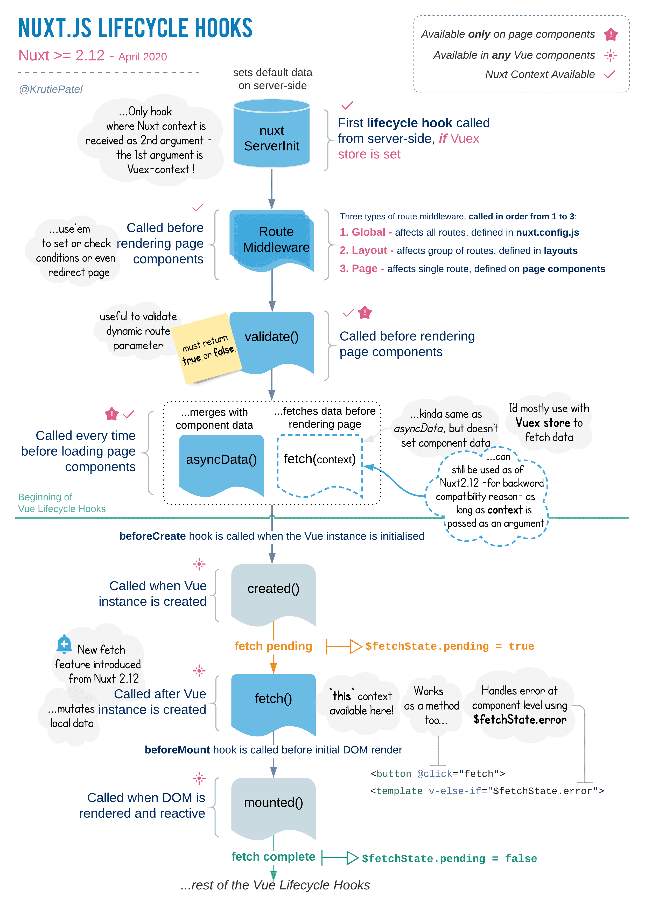

Next나 Nuxt같은 SSR 라이브러리들이 이제는 널리 사용되는 것 같은데, 동작 원리를 비롯해서 프리랜더링이나 하이드레이션같은 용어를 다룬 한국어 포스팅은 잘 찾지 못했습니다. 그래서 회사에서 주로 사용하는 스택인 Nuxt를 통해 어떻게 SSR 라이브러리들이 SPA를 서버사이드 렌더링 시키는지에 대해 그 탐구의 결과를 포스팅으로 정리해보려 합니다.


## CSR(클라이언트사이드 렌더링) vs SSR(서버사이드 렌더링)

CSR은 초기 렌더링시 내용이 없는 HTML을 받고 그 이후에는 모두 자바스크립트로 웹 페이지를 모두 작동시킵니다. 흔히 React, Vue로 만드는 SPA(Single Page Application)이 이렇게 동작하죠.

SSR은 초기 렌더링시에 내용이 존재하는, 미리 서버에서 랜더링된 HTML을 받습니다. 그 다음 자바스크립트로 웹 페이지를 완전하게 작동시킵니다. 이 포스팅에서 살펴볼 Nuxt나 React 기반의 Next등 서버사이드 렌더링을 지원하는 라이브러리로 앱을 만들면 이처럼 동작합니다.

SSR이 필요한 가장 큰 이유는 검색 엔진 최적화입니다. 검색엔진들의 크롤링 봇들은 HTML 내용 자체를 긁어오기 때문에 처음에 내용이 빈 HTML을 받는 CSR 앱들은 검색 엔진 노출에 불리합니다.


URL을 어딘가에 포스팅했을때 이미지나 설명이 뜨는 링크 박스가 나타나는 거 가끔 보셨죠? 그것도 크롤링 봇이 해당 링크 HTML의 메타 태그 정보를 가져오는 건데요. CSR앱들의 메타 태그 초기 상태는 모두 똑같아서 한 웹페이지에서 메타 태그를 각각 다른 하위 페이지에 따라 다르게 만드는것도 어렵습니다. react helmet같은 라이브러리를 써도 크롤링 봇이 못 긁어오는 경우도 허다하죠.

SSR을 적용하면 초기 렌더링시에 내용이 있는 HTML에다가 메타태그까지 해당 페이지에 맞는 내용으로 커스텀할 수 있어 사이트 노출에 이점이 생깁니다.

## 프리랜더링과 하이드레이션

```markdown
브라우저 주소창으로 페이지 요청 =>
서버에서 요청에 맞는 프리랜더링 HTML 보냄 =>
브라우저에서 html받고 딸려온 자바스크립트로 하이드레이션 =>
그 다음은 SPA처럼 동작 => SSR 끗!
```

**프리랜더링(pre-rendering)**이란 React나 Vue로 만든 기존 SPA 위에서 서버에서 브라우저로 전송할 수 있도록 어느정도 완성된 HTML 파일을 만드는 동작을 의미합니다.

원래 SPA는 라우팅 역시 자바스크립트로만 이루어지는데요. SSR 라이브러리를 사용한 앱은 자바스크립트로만 라우팅하지 않고, 빌드 결과물에 작은 서버를 달아서 브라우저의 주소창으로 들어온 요청에 맞는 페이지 컴포넌트를 프리랜더링해 브라우저에 제공하는 방식으로 라우팅을 합니다.

**하이드레이션(hydration)**이란 프리랜더링 과정을 마치고 브라우저로 전달된 HTML파일 위에 남은 자바스크립트 코드들을 실행하는 동작입니다. 하이드레이션으로 인해 SSR앱은 기존의 SPA와 동일한 동작과 반응성을 보장할 수 있게 됩니다. 용어 그대로 불완전한 HTML 파일이라는 '마른 땅'에 자바스크립트라는 '물'을 뿌리는 일입니다.

이 두 개념은 단언코 서버사이드 렌더링의 핵심입니다. 요약하면 프리랜더링은 페이지에 내용을 채워 크롤링 봇이 읽을 수 있게 해주고, 하이드레이션은 그 이후에 앱이 SPA와 똑같이 동작할 수 있도록 합니다.

여기서 **SSR앱이 서버를 끼고 빌드된다는 개념**은 SSR앱과 SPA의 배포 방식의 차이를 야기시킵니다. SPA의 빌드 결과물은 HTML하나랑 자바스크립트 파일 뭉치들입니다. AWS S3같은 스토리지에 빌드 결과물을 저장하고 도메인을 연결시키면 브라우저가 알아서 HTML과 JS파일들을 실행하겠죠

하지만 SSR앱은 서버를 끼고 있으니, 스토리지에 올려놓는다고 해서 브라우저가 접근해서 실행시킬 수 있는 자원이 아닙니다. 백엔드처럼 서버를 계속해서 구동할 수 있는 컴퓨팅이 필요합니다.

## Nuxt로 살펴보는 SSR

이제 Nuxt가 어떤 방식으로 SSR을 구현하는지 살펴보겠습니다.

### 3가지의 빌드 방법

`nuxt.config.js`의 build 옵션, 혹은 `package.json`에 정의된 npm 명령어를 통해 빌드 방식을 달리할 수 있습니다.

```javascript
// nuxt.config.js

export default {
mode:'spa',
build: {
ssr:true 혹은 false,
}
}
```

- `SSR : true` : 위에서 설명했던 방식대로 SSR앱을 빌드합니다.
- `SSR: false 혹은 mode:'spa'` : SPA처럼 빌드합니다. mode를 spa로 설정하면 그냥 Vue를 사용해서 만든 SPA처럼 루트 디렉토리에 dist로 빌드된 폴더가 생성됩니다. ([mode:'spa'는 deprecate 되었습니다](https://ko.nuxtjs.org/guides/configuration-glossary/configuration-mode/))
- `yarn generate`: 정적 사이트 빌드를 실행하는 스크립트 명령어입니다. pages 디렉토리의 페이지들의 그 경로 그대로 모든 html이 완성되어서 빌드됩니다.

### SSR:true로 빌드했을 때 동작 방식

여기서 우리의 관심사는 SSR 방식의 빌드입니다. 앞에서 언급했던 방식의 서버사이드렌더링을 구현하기 위해서는 두 개의 자원이 필요합니다.


하나는 Vue 인스턴스로 프리랜더링된 HTML을 만들어 브라우저로 쏴주는 **서버 코드**, 다른 하나는 클라이언트 사이드에서 기존 SPA처럼 동작할 수 있게 하는 자바스크립트 뭉치, 즉 **클라이언트 코드**입니다. 빌드 폴더 내부의 `dist` 폴더를 보시면 이렇게 두 폴더로 나누어져 빌드되고 있다는 것을 알 수 있는데요.


`SSR:true`로 빌드한 앱을 `yarn start` 명령어를 통해 브라우저에서 실행해보았습니다. 프리랜더링된 HTML에 웹팩으로 빌드된 자바스크립트 코드가 script태그로 삽입되었음을 알 수 있습니다. 프리랜더링된 html에 SPA처럼 작동할 수 있도록 자바스크립트 코드 전부를 끼워서 같이 보내는 것이죠.

### vue-server-renderer

Nuxt는 `vue-server-renderer`라는 라이브러리를 통해 뷰 인스턴스를 [서버사이드 렌더링에 적합한 구조로 만듭니다.](https://ko.nuxtjs.org/guide#%EC%84%9C%EB%B2%84-%EB%A0%8C%EB%8D%94%EB%A7%81-%EB%B2%94%EC%9A%A9-ssr) [공식 문서](https://ssr.vuejs.org/#what-is-server-side-rendering-ssr)의 내용을 요약해보고자 합니다.

크게 이 라이브러리는 두 가지 역할을 하는데요. 첫째는 `renderer` 클래스와 내부의 `renderToString`, `renderToStream` 메소드를 통해 Vue 인스턴스를 인자로 받아서 HTML 문자열로 바꿔 렌더링할 수 있도록 돕습니다. 편리하게도 이때 Vue 인스턴스와 관련있는 css같은 asset들 역시 html에 같이 주입됩니다.

```javascript
// el 프로퍼티를 정의하지 않고 Vue 인스턴스만 생성한다는게 특징입니다
// mount는 클라이언트 사이드에서 수동으로 이루어지니깐요
const app = new Vue({
  template: `<div>Hello World</div>`,
});

// 렌더러를 불러옵니다.
const renderer = require('vue-server-renderer').createRenderer();

// Vue 인스턴스를 HTML로 바꿉니다.
renderer.renderToString(app, (err, html) => {
  if (err) throw err;
  console.log(html);
  // => <div data-server-rendered="true">Hello World</div>
});
```

둘째는 이 라이브러리와 함께 웹팩을 이용하면 프리랜더링을 하는 서버 코드와, 하이드레이션에 필요한 클라이언트 코드를 쉽게 각각 빌드할 수 있습니다. 게다가 서버, 클라이언트 두 개의 진입점을 사용해 서버와 클라이언트에서 모두 작동하는 동작(universal code)과 각자에서의 동작을 정의할 수 있습니다. Nuxt같은 서버사이드렌더링 앱을 만들 수 있는 것이죠. 관련해서 웹팩 플러그인도 있습니다.

`vue-server-renderer` docs에 있는 SSR Vue앱 예제가 있는데요, 그걸 한 번 살펴보겠습니다. Nuxt의 동작방식을 간접적으로 이해할 수 있는 예제입니다.

### vue-server-renderer 예제

먼저 구조에 대해 말씀드리면 빌드 진입점은 `server-entry.js`, `client-entry.js` 두 개로 이루어져 있고, 이 두 모듈에서는 `app.js`의 `createApp` 함수를 참조합니다.

```javascript
// server-entry.js

import { createApp } from './app';

export default (context) => {
  // HTML으로 바꿀 Vue 인스턴스를 내보냅니다.
  const { app } = createApp();

  // 내보내기 전에 서버단에서만 사용하는 로직을 정의할 수 있습니다.

  return app;
};
```

```javascript
// client-entry.js

import { createApp } from './app';

// 마운트하기 전에 클라이언트단에서만 사용하는 로직을 정의할 수 있습니다.

const { app } = createApp();

// 클라이언트단의 js 코드는 Vue 인스턴스를 마운트시킵니다.
app.$mount('#app');
```

```javascript
// app.js

import Vue from 'vue';
import App from './App.vue';
import { createRouter } from './router';
import { createStore } from './store';
import { sync } from 'vuex-router-sync';

export function createApp() {
  // new Router()로 라우터를 정의합니다.
  // Nuxt는 pages 디렉토리를 읽어 스스로 라우터를 만듭니다.
  const router = createRouter();

  // new Vuex.Store()을 통해 저장소를 정의합니다.
  const store = createStore();

  // 라우트 정보를 store에 동기화합니다.
  sync(store, router);

  // app Vue 인스턴스에 router와 store을 주입해서 반환합니다.
  const app = new Vue({
    router,
    store,
    render: (h) => h(App),
  });

  return { app, router, store };
}
```

그리고 `server.js`에서 직접 서버를 구현합니다. 배포할때는 이 파일을 진입점으로 활용하면 되겠죠.

```javascript
// server.js
const createApp = require('./app');

server.get('*', (req, res) => {
  const context = { url: req.url };
  const app = createApp(context);

  renderer.renderToString(app, (err, html) => {
    // handle error...
    res.end(html);
  });
});
```

서버에서는 요청을 받아주는데 이때 요청한 url을 먼저 가로채서 `server-entry`에서 `app`에 맵핑된 `router`를 이용해 해당 URL로 이동하게끔 만들어줄 수 있습니다. 이때 `router.onready`이벤트 훅을 이용하면 `renderToString`이 호출되기 전에 서버에서 실행할 로직을 정의할 수 있습니다. Nuxt에서 서버에서만 작동하는 `asyncData`훅처럼요.

```javascript
// server-entry.js

import { createApp } from './app';

export default (context) => {
  return new Promise((resolve, reject) => {
    const { app, router } = createApp();

    // 요청 들어온 URL로 라우팅합니다
    router.push(context.url);

    // 라우터 훅을 이용해 서버단에서만 실행할 로직을 작성합니다.
    router.onReady(() => {
      const matchedComponents = router.getMatchedComponents();
      if (!matchedComponents.length) {
        return reject({ code: 404 });
      }

      // 이상이 없으면 라우팅된 상태의, 요청URL에 맞는 Vue 인스턴스 프로미스를 반환합니다.
      resolve(app);
    }, reject);
  });
};
```

이 예제에서는 그래서 최초로 렌더링이 이루어질 때 요청한 url에 맞는 페이지를 찾아주고, 프리렌더링 이후에 그 다음 라우팅은 모두 클라이언트 사이드에서 자바스크립트를 통해 이루어지는 것입니다. Nuxt도 그렇게 작동합니다.

라우터뿐만 아니라 Vuex 스토어 역시 서버에서부터 제어할 수 있습니다. `createApp`에서 store를 생성한 후 `server-entry.js`에서 store을 불러 `disaptch`같은 동작을 수행할 수 있습니다. 서버에서 같이 초기화된 store은 프리랜더링 과정에서 `JSON.stringify`를 사용해 `window.__INITIAL_STATE__`라는 프로퍼티에 담기게 되고 클라이언트에서는 이 정보를 그대로 받아 Vuex store을 초기에 업데이트합니다. 자세한 구현 방식은 [여기](https://ssr.vuejs.org/guide/data.html)를 참조하시면 되겠습니다.

마지막으로 서버 코드는 router을 통해 이동한 vue 인스턴스를 `renderToString` 을 이용해 프리렌더링한 후 응답으로 전송합니다.

### Nuxt 생명주기



위의 예제에서 SSR앱이 서버와 클라이언트 사이드에서 다른 과정을 거쳐 렌더링을 수행한다는 것을 알 수 있을 것입니다. Nuxt도 마찬가지인데요.

Nuxt는 렌더링 과정에서 Vue 인스턴스를 계속 다루고, 각 렌더링 과정에서만 동작하는 로직들 역시 정의되어 있습니다. 따라서 Nuxt의 렌더링 과정에서는 일반적인 Vue 인스턴스의 생명주기 훅과 Nuxt에서만 찾아볼 수 있는 독특한 생명주기 훅이 섞여서 호출됩니다. 활용도가 높고 중요한 몇가지 훅들을 동작 순서대로 살펴보겠습니다.

- **middleware(클라이언트, 서버)** : 클라이언트와 서버 모두 훅들이 본격적으로 호출되기 전에, 앱을 만드는 과정에서 미리 정의해놓은 미들웨어들이 먼저 동작합니다. 만약 `serverMiddlware`을 정의했다면 서버 사이드에서만 렌더링 과정에서 일반 미들웨어가 동작하기 전에 먼저 동작합니다.
- **asyncData(서버 or 클라이언트)**: 서버 혹은 클라이언트 사이드에서 생명주기 통틀어 한번씩만 호출되는 훅입니다. Vue 인스턴스의 생명주기 이전에 먼저 데이터를 가져와서 렌더링을 하고싶은 경우에 사용합니다. 컴포넌트를 로드하기 전에 항상 호출되며, 페이지 컴포넌트의 경우에만 사용할 수 있습니다. `asyncData` 의 리턴값은 Vue 인스턴스의 `data()`와 병합됩니다.
- **beforeCreated, created(클라이언트, 서버)**: 서버에서 새로운 vue인스턴스를 생성한 뒤 이를 프리랜더링 하기 때문 Vue 인스턴스가 서버에서 만들어지는 시점에 `created`와 `beforeCreated`훅이 호출됩니다. 또한 클라이언트에서도 인스턴스를 만들고 `$mount` 메소드가 호출될 때도 따라 호출됩니다. 즉 서버와 클라이언트 사이드 양쪽에서 호출되는 훅입니다.
- **beforeMount 이후의 훅(클라이언트)**: 클라이언트 사이드에서만, 하이드레이션 이후에 `$mount` 메소드가 호출될 때 나머지 Vue 생명주기 훅들이 실행됩니다.

전체적인 Nuxt의 생명주기는 [여기](https://ko.nuxtjs.org/guides/concepts/nuxt-lifecycle)를 참고하시면 될 것 같습니다.

## 마무리

동작 하나를 모두 규명하고 설명하고 싶은 욕심 때문에 긴 글이 되었지 않나 싶습니다. 사실 Nuxt의 내부를 뜯어보면서 프리랜더링 서버는 어떻게 생겼는지, `vue-server-renderer`는 어떻게 사용하고 있는지 살펴보고 싶었지만 너무 크고 복잡해서 일단 포기했습니다. 시간이 날 때 한 번 살펴보고 싶네요. 아무쪼록 SSR 라이브러리들이 동작하는 과정을 대략적으로 이해하시는데 좋은 레퍼런스가 되었으면 좋겠습니다!

## Reference

- [Nuxt Docs](https://ko.nuxtjs.org/)
- [Vue SSR Guide](https://ssr.vuejs.org/)
- [Lukas Bombach - The case of partial hydration](https://medium.com/@luke_schmuke/how-we-achieved-the-best-web-performance-with-partial-hydration-20fab9c808d5)
- [Evan Moon - Vue Server Side Rendering](https://evan-moon.github.io/2018/09/25/vue-ssr/)

```

```
