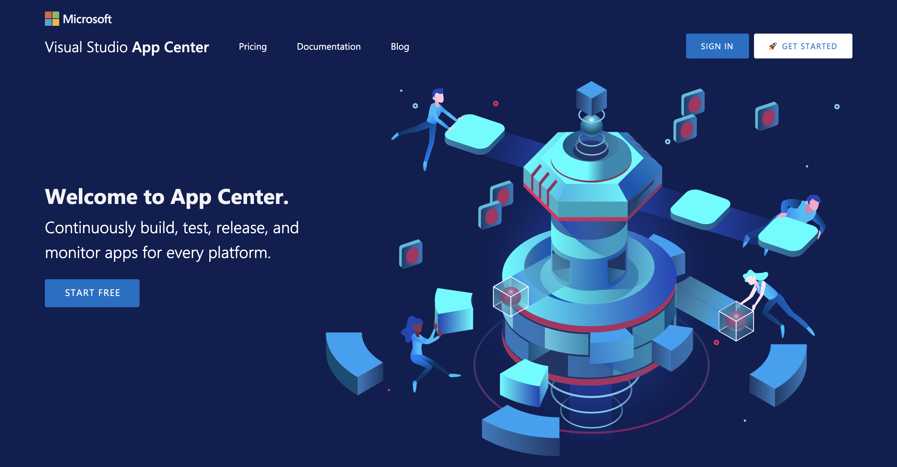
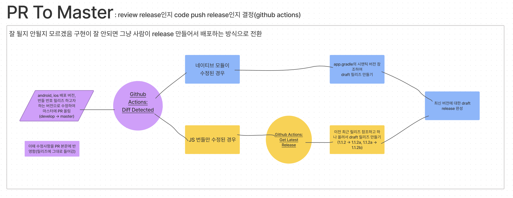
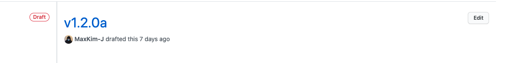
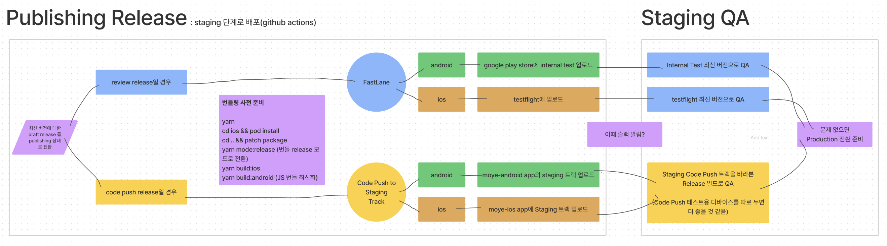
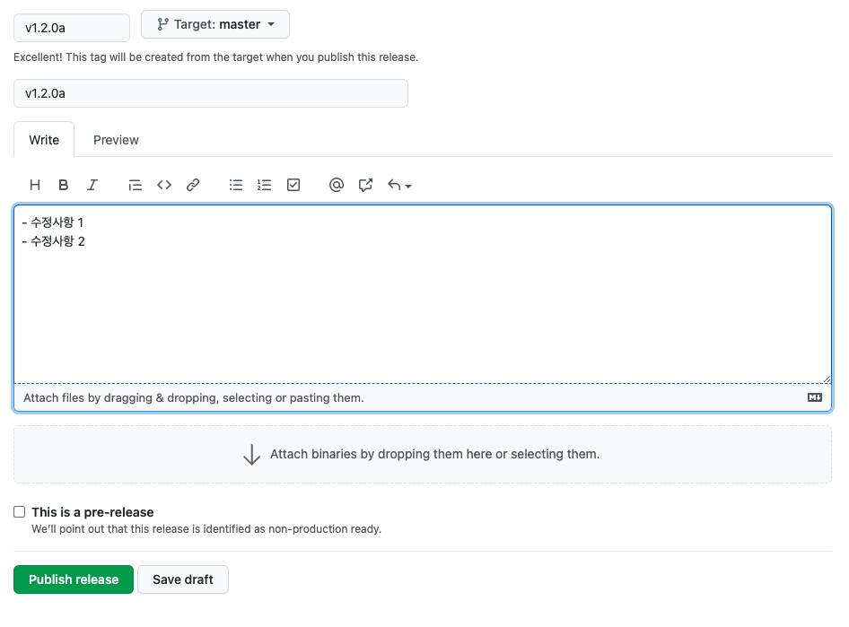
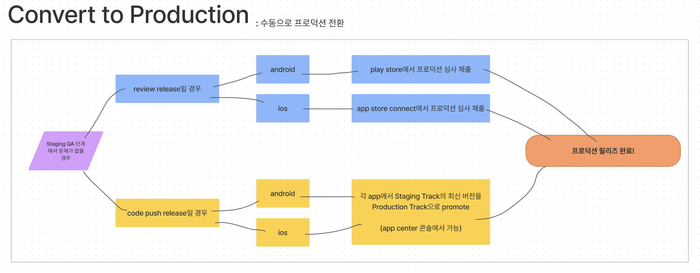
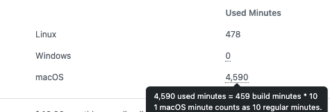

이번에 회사에서 React Native를 사용해 만든 [모바일 앱](https://apps.apple.com/kr/app/moye-%EC%83%88%EB%A1%9C%EC%9A%B4-%ED%8C%A8%EC%85%98%EC%9D%84-%EA%B0%80%EC%9E%A5-%EB%A8%BC%EC%A0%80/id1561711601)의 CI/CD 파이프라인을 구축해 보았습니다. 고도의 통합이나 테스트 자동화같은건 없고 거의 그냥 배포 자동화 정도만 구현한 상태라서 CI/CD라고 하기엔 좀 거창한 감이 있습니다..ㅎㅎ

CI/CD 파이프라인의 설계, 구현 과정을 이 포스팅에 정리해보고자 합니다! 사용한 기술들(github actions, fastlane, React Native)의 상세한 면면보다는 회사가 제공하는 서비스의 **어떤 문제를 해결하려 했고, 해결했고, 어떤 문제가 남았는지** 과정의 흐름과 결과 위주로 정리하는 글이 될 것 같습니다.

# CI/CD 도입 목적

CI/CD를 도입한 목적은 크게 3가지였습니다. 후술할 모예 모바일 앱의 문제점을 해결하기 위해서였습니다.

1. **복잡하고 시간도 오래 걸리는 모바일 앱 빌드 과정**을 **사람이 수행할 때** 발생하는 휴먼에러와 리소스를 최소한으로 줄인다.
2. Code Push 사용으로 인해 발생하는 **추가적인 리소스**를 줄인다. (Code Push를 사용할 수 있는지 판단 + 꼬이는 버저닝)
3. 인력이 부족해 효과적으로 수행하지 못했던 **QA를 원할하게 수행할 수 있는** 파이프라인을 구축한다.

# 모예 모바일 앱의 문제점

## 1. 사람이 하면 실수하기 쉬운 복잡한 빌드과정

우선, 모예 앱의 프로덕션 빌드가 유난히 복잡한 이유에 대한 설명이 필요합니다.

### 웹과 앱의 불완전한 모듈 공유

모예 모바일 앱은 웹과의 기능 차이가 크지 않고 React를 기반으로 작성되어 있습니다. 따라서 웹 프로젝트에서 TypeScript로 작성된 몇개의 모듈(Custom Hooks나 API 요청 함수, 각종 헬퍼 함수 등등)들을 그대로 옮겨와 모바일 프로젝트에서도 사용하고 있는데요.

yarn workspace와 lerna, 혹은 npm을 통한 모듈 분리를 사용하는 것은 아닙니다. 정말 간단하지만 저렴한 방법을 쓰고 있습니다. 약간 소개하기는 부끄럽습니다만... 모바일 프로젝트에서 `git submodule` 기능을 이용하여 웹 프로젝트를 그대로 받아 사용하는 것인데요.

package.json의 dependencies 프로퍼티에 모바일 프로젝트에서 사용할 서브모듈의 파일을 링크시켜주면, yarn install을 할 경우 파일이 node_modules안에 그대로 설치됩니다.

```json
"dependencies" :{
  "@moye-kr/hooks": "file:moye-web/src/hooks",
  "@moye-kr/utils": "file:moye-web/src/utils",
  ...
}
```

이렇게 하면 앱 프로젝트 안에서는 이렇게 쓸 수 있습니다.

```typescript
import someHooks from '@moye-kr/hooks/someHooks';
```

이 방식은 아주 간단하고 빠르게 프로젝트간 모듈 공유를 실현시킬 수 있다는 장점이 있지만, **앱 프로젝트가 사실상 웹에 의존하는 꼴이 되버려** 좋지 않습니다. 앱 작업을 하기 위해서 웹 프로젝트를 먼저 만져야 하는 경우가 생기니 개발자간 워크플로우가 꼬이고, submodule로 들어간 웹 프로젝트의 커밋 HEAD가 어디에 와있는지까지 관리해야 하니 프로젝트가 자체도 복잡해집니다.

프론트엔드 팀에서는 이런 문제를 인지하고 있고요.. 추후에 웹과 앱에서 공용으로 쓰이는 로직을 Core Module로 분리해 사내 NPM 모듈로 배포해서 관리할 예정입니다.

### 웹과 앱의 환경변수 공유 문제

웹 프로젝트에서는 `.env` 파일을 이용해 환경변수를 관리하고, `process.env`로 참조하고 있습니다. 앱에서 웹 모듈을 공유할 때, `process.env`를 참조한 부분도 같이 딸려옵니다. 따로 처리를 해주지 않으면 undefined로 참조가 되겠죠.

모바일 앱 개발 환경에서는 공유 모듈의 `process.env`참조를 [`babel-plugin-transform-inline-environment-variables`](https://github.com/babel/minify/tree/master/packages/babel-plugin-transform-inline-environment-variables)을 사용해 개발 서버를 띄울 때 주입된 환경변수 값으로 바꾸고 있습니다.

```json
"scripts": {
  ...
  "start:dev": "export $(cat env/.env.dev | xargs) && react-native start",
  "start:prod": "export $(cat env/.env.prod | xargs) && react-native start",
},

```

문제는 개발이 아니라 앱 Production build를 할 때인데, Android, Ios앱을 빌드가 진행되는 과정 중 JS Bundle이 만들어질 때 환경변수가 적용되어야 합니다만 build를 할 때 환경변수를 주입하는 좋은 방식을 아직 찾지 못했습니다..ㅜㅜ 더 많은 리서치가 필요한 부분입니다.

따라서 빌드, 배포를 하기 전에 `process.env`로 참조한 부분을 직접적으로 수정합니다. 공유 모듈의 `process.env`를 미리 정의된 문자열 값으로 바꾸는 스크립트를 실행하면 됩니다. 스크립트는 얼추 다음과 같이 생겼습니다.

```typescript
// releaseModeScript.js
fs.readFile(
  'node_modules/@moye-kr/api/index.ts',
  'utf8',
  (err, data) => {
    if (err) {
    return;
  }

  const result = data
    .replace(
      /process.env\['BASE_URL_PATH'\]/g,
      '"https://api.base.url"', // 프로덕션의 API Base Url
    )
...
  }
)
```

```json
"scripts": {
  "mode:release": "node ./scripts/releaseMode.js",
},

```

### 빌드 단계가 많음

IOS, Android 프로젝트를 모두 포함하고 있는 React Native 프로젝트의 특성상 빌드시 해줘야 하는 게 원래 많은데, 웹과 앱이 로직을 공유하는 구조 때문에 더욱 복잡해졌습니다. CI/CD 환경에서 빌드-배포를 시도할 경우 다음과 같은 과정들을 모두 거쳐야 합니다.

```shell

1. Android, IOS에 배포할 버전 번호, 앱 번들 번호 수정
2. fastlane 설치, App center cli 설치 # 로컬에서는 이미 설치되있음
3. git submodule update # 앱이 바라보는 웹 서브모듈의 최신을 바라보게 설정
4. yarn # 의존성 최신 업데이트, 이때 웹의 공유 모듈이 node_modules에 주입됨
5. npx patch-package # pacth-package로 수정한 node_modules의 변화 반영
6. yarn mode:release # 환경변수를 참조하게 했던 process.env들을 문자열로 바꿈
7. cd ios && pod install # pod 부분의 의존성을 리졸브함
8. fastlane 또는 codepush로 배포

```

상당히 빌드 스탭이 많죠. 로컬에서 프로덕션 빌드를 시도할 때 이 단계들을 하나씩 빼먹는 경우가 생기기 쉬운 상황이라 자동화가 절실했습니다.

## 2. Code Push 사용시의 문제점



Code Push는 스토어를 거치치 않고 앱을 업데이트할 수 있는 클라우드 서비스입니다. 약간 뜬금없게(?)도 마소가 서비스합니다.

프로덕션 앱에 Code Push 세팅을 해 놓으면 앱이 구동될때 미리 수정된 JS 번들을 올려놓은 App Center로 Http 리퀘스트를 보내 현재 네이티브 앱 버전에 맞는 JS 번들을 가져와 기존의 JS 번들과 바꿔치기 하는 방식으로 업데이트를 진행합니다. 이미 최신 버전의 번들을 가져왔다면 더 이상 업데이트 하지 않습니다. 자세한 설명은 [Docs](https://docs.microsoft.com/ko-kr/appcenter/distribution/codepush/)를 참조하시면 좋을 것 같아요!

### Code Push 릴리즈를 할 수 있는지 개발자가 판단해야 함

Code Push 릴리즈는 프로덕션 앱의 JS 번들만을 바꾸기 때문에, 앱의 네이티브 코드가 바뀌었을 경우에는 Code Push를 이용한 릴리즈를 하지 못합니다. 주로 RN 앱의 네이티브 코드가 바뀌는 경우는 새로운 써드파티 라이브러리를 설치하거나, 네이티브 앱 쪽의 정보(앱 버전, 메타데이터 등등)를 수정할 필요가 있을 때입니다.

Code Push 릴리즈를 할 수 있을지 타진하려면 저번 릴리즈에서부터 작업을 진행한 모든 개발자들이 네이티브 쪽 코드를 수정했는지 파악해야 합니다. 물론 github에서 PR의 diff를 파악하여 눈으로 확인할 수 있겠지만, 매번 사람이 확인해야 하는게 매우 번거롭게 느껴졌습니다. 자동화를 적용하면 편리할 부분으로 여겨졌습니다.

### 꼬이는 버저닝

App Store, Play Store을 이용한 릴리즈는 버저닝이 확실합니다. 앱의 네이티브 부분에 앱 번들의 고유 번호와 버전을 입력하게 되어있어서 Store에서는 이러한 값들이 배포 가능한지 파악하고 그렇지 않다면 새로운 버전을 심사 요청하지 못하게 합니다.

Code Push로 업데이트 했을 경우에도 업데이트는 업데이트니까 버전을 수정해서 릴리즈를 기록해야 하는데, 문제는 **네이티브 쪽의 버전명을 수정하지 못해 릴리즈를 기록하기 애매합니다.** 네이티브 앱에 기록된 버전만으로 버저닝을 하기가 어려워지는 것이죠.

Code Push를 통해 App Center에 JS 번들을 업로드하면 현재 네이티브 쪽 코드에 기록된 버전을 바탕으로 타겟팅을 하기 때문인데요. 가령 Code Push 릴리즈를 할 때의 로컬 프로젝트의 네이티브 버전이 1.1.1이라면, 프로덕션이 1.1.1일 경우에만 App Center에서 새로운 버전을 가져옵니다.

이런 상황이라 저는 스토어를 통해 릴리즈되었을 경우 네이티브 코드에 기록된 숫자 3자리 버전(v1.1.1)을, Code Push로 릴리즈했을 경우 기존 버전 뒤에 알파벳을 붙인 4자리 버전(v1.1.1a)를 사용하여 레포지토리의 release 기능을 사용해 버전을 관리하면 어떨까 팀에 제안했습니다. 이러한 버전 tag와 릴리즈 생성을 자동으로 CI/CD 파이프라인에서 해줄 수 있으면 어떨까도 생각했습니다.

## 3. 명시적인 QA 단계 부재

초기 스타트업에서 개발자들이 가장 아쉬워하는 부분 중 하나가 QA가 원할하지 않다는 것입니다. 전문으로 QA를 하시는 분도 안 계시고, 추가된 기능의 요구사항을 아시는 다른 분에게 부탁하기도 애매한 상황이 많습니다.

저희 회사 같은 경우에도 기능을 수정한 후 앱의 내부 테스트 기능을 사용해 대강의 QA를 진행했었는데, 일이 바쁘거나 배포가 빠르게 진행되어야 하는 경우에는 QA 과정이 무시되기 십상이었습니다. 따라서 파이프라인을 구축할때 **명시적으로 QA가 가능한 시점이 필요하다**는 생각을 하게 되었습니다.

이를 위해 수정된 앱을 배포 전에 내부 인원이 테스트할 수 있는 환경을 만들고, **QA에서 문제가 발생하지 않을때만 수동으로 프로덕션 전환하는 흐름**을 생각해봤습니다.

물론 fastlane을 사용하면 앱 심사 제출과 릴리즈 노트 작성까지 자동화할 수 있습니다. 하지만 QA를 할 수 있는 명시적인 단계를 만들기 위해, 또한 QA에서 문제가 있을 때 쉽게 이전 단계로 돌아오기 위해 수동으로 프로덕션 전환을 진행하는게 안전하다고 생각했습니다.

# CI/CD 구현

실질적인 파이프라인 구현을 설명해보겠습니다! github 환경을 기준으로 구현되었기 때문에, `Release`나 `Tag`는 모두 github과 git의 그것입니다.

## 1. PR을 master에 올릴 때

> **Code Push로 배포할지 Store를 통해 배포할지 판단하고 Draft Release를 만듭니다.**



프론트엔드 팀은 git flow를 사용해 개발을 진행하고 있어, feature 브랜치 위에서 작업한 기능들을 develop 브랜치에 한데 모아 master로 옮깁니다. 매번의 릴리즈에 반영되는 수정들은 develop에서 master로 보내는 PR의 변경점과 같습니다.

develop 브랜치에서 master로 PR을 올리면 Action이 실행되면서 **develop브랜치와 master 브랜치의 diff를 비교해 android, 혹은 ios 프로젝트 디렉토리의 코드가 수정되었는지** 파악합니다. `git diff` 명령어의 반환값을 shell script 배열로 받아 순회하면서 값을 평가합니다. github actions에서 사용한 shell script 코드는 다음과 같습니다.

```shell

# 리모트 master 브랜치 fetch

git fetch origin master

# develop과 master의 diff 비교

DIFF=$(git diff --name-only HEAD origin/master)
IS_REVIEW_RELEASE=false

# diff를 순회하면서 android, ios 디렉토리가 바뀌었는지 확인

for diff in $DIFF
  do
  echo $diff
    if [[$diff == _android_]] || [[$diff == *ios*]]
    then
    IS_REVIEW_RELEASE=true
    break
  fi
done

# 전역변수 대입

echo "ENV_IS_REVIEW_RELEASE=$IS_REVIEW_RELEASE" >> $GITHUB_ENV

```

이 스크립트 실행의 결과로 `ENV_IS_REVIEW_RELEASE`가 true일 경우 네이티브 코드(정확하게는 /android/app/build.gradle)의 버전을 태그로 삼아 Store을 경유한 릴리즈를 준비합니다. false일 경우 이전 릴리즈에서 알파벳 하나를 올린 버전을 태그로 삼아 Code Push를 이용한 릴리즈를 준비하게 됩니다.

draft release 까지만 만듭니다. draft release를 만들면 입력한 태그나 릴리즈가 아직 publish되지는 않은 채로 릴리즈가 만들어지게 됩니다.



## 2. Release를 Publish할 때

> **버전 이름을 평가하여 적합한 방식으로 Staging 환경으로 배포합니다.**



다음과 같이 draft 상태인 릴리즈에 내용을 작성하여 publish하게 되면 또 다른 Action이 실행됩니다.



이 Action에서는 publish로 전환된 최신 릴리즈의 태그를 평가하여 맨 뒤에 알파벳이 붙어있을 경우 Staging Track으로의 Code Push 배포를, 그렇지 않을 경우 내부 테스트로의(internal test, testflight) 배포를 준비합니다. 배포가 완료되었을 때 사내 Slack 채널로 메시지를 전송합니다.


여기까지 QA를 할 수 있는 Staging 환경으로의 배포가 완료되었습니다. 이 단계의 Action에서 fastlane 관련 로직을 작성할 때 ios의 코드 사이닝과 인증이 정확한 단계를 거치도록 작성해야 testflight으로의 배포가 잘 진행될 수 있었습니다. 삽질을 많이 했었는데요. [이 포스팅](https://dev-yakuza.posstree.com/ko/react-native/github-actions-fastlane/)이 도움이 많이 되었습니다.

## 3. QA와 그 이후

> **Staging Release한 프로덕트를 바탕으로 QA진행 후 수동으로 Production 전환합니다.**



거의 다 왔습니다. Staging QA 진행 후 별다른 문제가 없을 경우 수동으로 프로덕션 릴리즈로 전환합니다.

Store을 통한 릴리즈의 경우 각 스토어에서 제공하는 내부 테스트 기능(internal test, testflight)을 이용해 QA를 진행하고 이를 수동으로 각 store의 콘솔에서 리뷰를 넘깁니다.

Code Push 릴리즈의 경우 먼저 Staging Track으로 배포한 후 이전 버전 앱이 설치되어있는 QA 디바이스에서 번들이 잘 바뀌는지, 기능은 잘 작동하는지 테스트해본 후 해당 번들을 Production Track으로 프로모션합니다.

# 남은 문제점

이것으로 RN 모바일 앱의 CI/CD 파이프라인을 구축하기 위한 모든 과정을 설명했습니다. 앱 프로젝트의 여러 문제를 해결할 수 있었지만 여전히 해결되어야 하는 문제들은 남아있습니다.

## 웹과의 환경변수 공유 문제

빌드가 왜 이렇게 복잡해졌는지에 대해 설명하면서 말씀드렸던 문제입니다. 프로덕션 빌드 상황에서도 JS 번들에 환경변수를 주입할 수 있는 방법을 찾아 빌드 단계를 하나 줄일 수 있으면 좋을 것 같습니다.

## 비싸고 느린 github actions macos 이미지



github actions의 macos이미지는 기존 linux 이미지보다 **10배가 비쌉니다.** 리눅스 이미지를 사용할때 10분을 사용했다면 github actions 사용 가능 시간(기본 매달 2000분)에서 10분이 그대로 가감되지만, 맥 이미지는 100분이 가감됩니다(...)

회사에서 카드를 등록해줘서 2000분을 넘겼을 경우 유료 결제로 전환될 수 있도록 했습니다. 이번 달에는 아무래도 파이프라인 구현 중이었기 때문에 디버깅을 하기 위해 시간을 거의 다 썼었습니다. 아마 다음 달에는 문제 없지 않을까 생각합니다.

그리고 로컬보다 빌드-배포까지 걸리는 시간이 느립니다. 로컬에서는 20분정도면 android와 ios 모두 배포가 가능했는데 github actions에서는 거의 50분이 걸립니다. 물론 돌려놓고 로컬에서는 다른 걸 할 수 있으니 리소스는 절약이 되지만 여전히 시간이 오래 소요된다는 점이 심히 걸립니다..

빌드 시간을 줄일 수 있는 방법을 좀 찾아봐야 할 것 같습니다. 또는 Circle CI에도 macos 이미지를 결제하면 쓸 수 있다고 들었는데, Circle CI에서 돌려보면서 시간을 비교해봐도 좋을 것 같습니다.

## Code Push를 쓸 수 있는 경우와 아닌 경우를 제대로 판단할 수 있을까?

파이프라인의 첫번째 스탭에서 `ios`와 `android` 폴더가 수정되었다면 Store를 통한 릴리즈를, 수정되지 않았다면 Code Push 릴리즈를 준비하는데요. 말이 되어 보이지만 이게 모든 상황에 정확한 방법인지는 아직 증명된 바가 없습니다.

가령 써드파티 라이브러리를 설치할 때, ios쪽에서는 cocoapod을 통해 의존성 관리가 되기 때문에 ios 디렉토리의 코드가 바뀌지만, android쪽에서는 gradle이 의존성을 해결해서 빌드를 하기 때문에 명시적으로 의존성의 변화가 코드에 반영되지 않을 수도 있습니다.

물론 아직 RN 써드파티 라이브러리를 사용하면서 안드로이드 쪽에만 적용되는 라이브러리를 아직 써보지는 않았습니다. 써야 하는 경우에는 store을 통해 릴리즈를 할 수 있도록 해야할 것 같습니다.

# 맺는말

사실 너무 부족해서 부끄럽습니다. React Native와 모바일 앱의 개발 환경을 잘 모르는 상황에서 앱 프로젝트를 빠른 시간 안에 진행하며 놓친 부분이 많은 것 같습니다.

CI/CD 파이프라인을 구현하면서 프로젝트의 구조, 웹과 어떻게 모듈을 공유하고 있는지, 그리고 일하는 방식에 대해 곰곰히 생각해야 했습니다. 회사에 가장 도움이 되는 방식으로 파이프라인을 구현하려면 무엇이 필요한지 생각해봤고 저 나름의 결론이 바로 이 파이프라인입니다.

더욱 정석적인 방법이 존재할 수도 있겠지만 결국 저희 회사와 개발팀이 처한 상황에서는 생각했던 방향이 최선이라 믿고(아마도...), 앞으로도 고도화와 개선을 거듭하려고 합니다. 상황에 대한 저의 접근과 설계 방식에서 조금의 인사이트라도 얻어가실 수 있다면 기쁠 것 같습니다 😃
