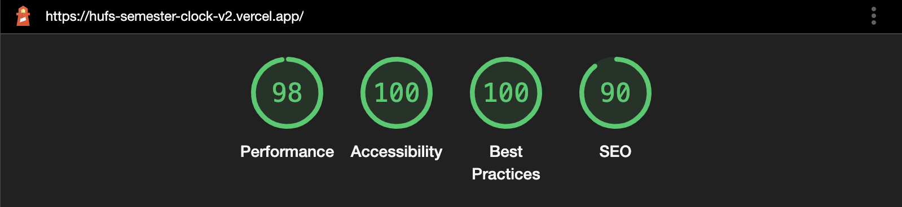
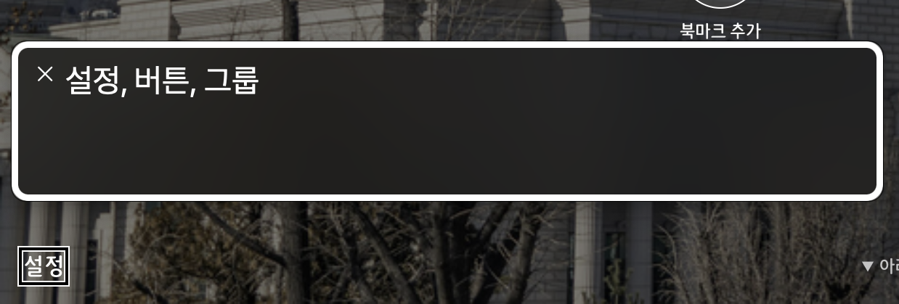
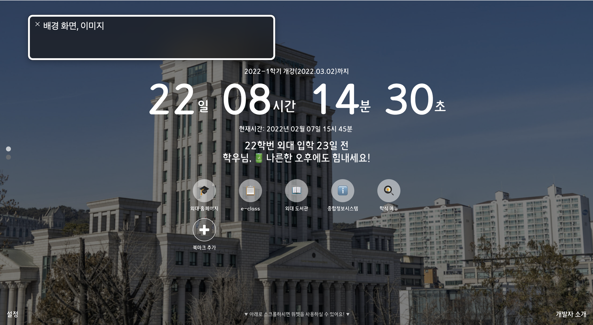
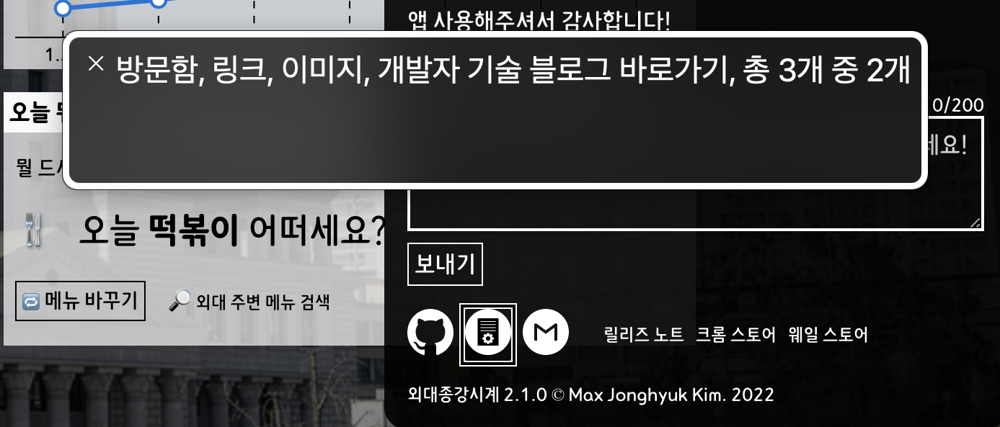
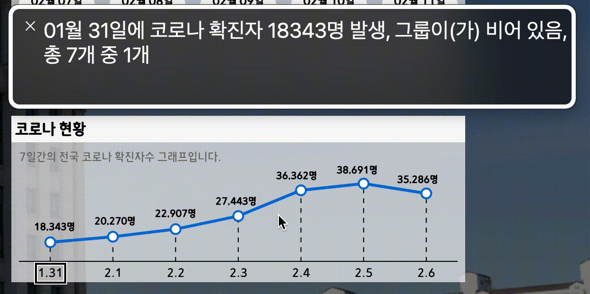
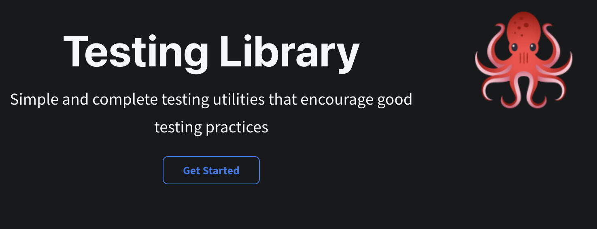
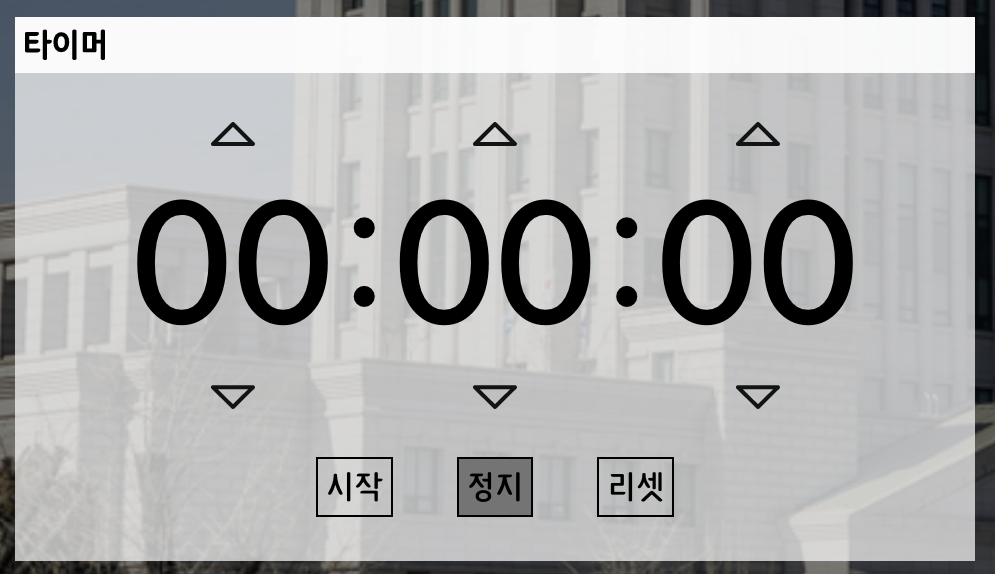

이번 [외대 종강시계 2.0 버전](https://github.com/MaxKim-J/hufs-semester-clock-v2)을 만들면서, 신경썼던 것 중 하나가 시맨틱 태그의 사용과 웹 접근성 준수였습니다.
처음 써보는 여러 태그들과 role 속성, WAI-ARIA등을 학습하고, 스크린 리더 디버깅을 병행하면서 프로젝트를 진행했는데요.

그 결과 스크린 리더로 사용 가능한 웹앱을 만들 수 있었고, Lighthouse 기준 접근성 100점을 달성하기도 했습니다. 물론 웹에 쉽게 접근할 수 있는 현재의 제가 보았을 때고, 점수는 점수일 뿐이니 아직도 많이 부족하다고 생각합니다.



이렇게 웹 접근성을 준수하는 마크업을 만들어보면서 **제가 그동안 웹 접근성에 대해 오해**를 하고 있었다는 생각을 하게 되었고, 예상하지 못했지만 **웹 접근성을 준수하면서 개발하면 따라오는 장점**들에 대해 알게 되었습니다.

이번 포스팅에서는 웹 접근성의 정확한 정의와 함께, 웹 접근성을 준수하면 취할 수 있는 여러 장점들을 **유저 관점**, **개발자 관점**, **서비스 관점**에서 살펴봅니다.

# 웹 접근성의 본질

> Web accessibility means that websites, tools, and technologies are designed and developed so that **people with disabilities can use them.** - W3C

웹 표준 기구 W3C가 말하는 웹 접근성은 제약을 가진 유저들도 접근하고 사용할 수 있게끔 하는 웹사이트, 도구, 기술입니다. 전 세계에 사는 모든 다양한 유저가, 그들이 가진 불편함과 관계 없이 웹을 사용할 수 있게 하는 것이 웹 접근성의 목표입니다.

웹 접근성의 본질은 **유저**를 향해 있습니다.

웹 접근성과 관련된 기술 중에 시맨틱 마크업 정도밖에 몰랐었던 저로서는, 그동안 시맨틱 태그를 사용하면 취할 수 있는 장점으로 SEO 최적화와 의미론적인 마크업 작성을 통한 협업 효율 상승을 꼽았었습니다.

그런데 시맨틱 태그를 사용해보고 스크린 리더 디버깅을 해보니, 이제 저정도의 설명은 웹 접근성을 너무 과소평가하는 것이 아닌가 하는 생각이 듭니다. 웹 접근성은 **모든 유저가 웹에 접근 가능하게 한다는 큰 비전**을 가지고 있습니다.

`div` 태그와 같이 시맨틱하지 않은 태그들은 스크린리더를 사용하는 전맹, 약시 유저가 아예 웹의 여러 기능들을 사용하지 못하게 할 수도 있습니다. 아래 사진들은 애플의 보이스오버를 이용해 외대 종강시계 앱의 요소들을 읽게 한 것인데요.



`button` 요소는 버튼이라는 설명을 붙여 읽지만, `div`요소는 그렇지 않아 스크린리더 사용자 입장에서는 누를 수 있는 요소임을 인식하지 못합니다.





```html

```

`img`요소는 이미지라는 설명을 붙이면서 `alt` 요소에 명시된 이미지에 대한 설명을 같이 읽는데요. `alt` 속성이 없으면 이미지의 `src` 속성을 읽어 스크린리더 사용성을 해칩니다.

이렇게 웹 접근성의 본질과, 웹 접근성이 어떠한 방식으로 유저에게 영향을 미치는지 간단하게 살펴봤습니다. 다음 섹션에서는 웹 접근성이 가져오는 이점들에 대해 살펴보겠습니다.

# 웹 접근성 준수의 이점들

## 1. 유저 관점 : 모두를 위한 UX

물론 스크린리더가 웹 접근성 준수의 전부는 아닙니다.

웹 접근성의 목표는 "모든 유저"입니다. 웹 접근성은 전맹, 약시 유저 말고도 일시적인 장애로 웹 접근이 불편한 유저, 색약, 광과민성 발작을 일으킬 수 있는 유저, 또는 제한된 하드웨어만으로 웹에 접근해야 하는 환경에서의 웹 접근도 고려합니다.

웹 접근성은 모든 유저의 UX를 고려하기 때문에, 비교적 쉽게 웹에 접근할 수 있는 유저들도 웹 접근성을 준수한 마크업의 혜택을 볼 수 있습니다.

접근성을 고려해 모든 사용자의 경험을 개선한 실생활의 예시를 들어보자면, 현재 많은 지하철역에 설치되어있는 엘리베이터가 있습니다. 2000년대부터 여러 지하철 역사에 설치되기 시작한 엘리베이터는 [장애인 인권운동과 꾸준한 요구의 결과입니다.](https://www.hani.co.kr/arti/society/rights/1023822.html)

하지만 이 엘리베이터는 장애인만 이용할 수 있는 것이 아니라, 거동이 편치 못하신 어르신이나 계단을 올라가기 힘든 상황인 비장애인들도 이용할 수 있는, 모두를 위한 시설이 되었습니다. 접근성에 대한 고려는 이렇게 모든 사람들의 편의를 증진시킵니다.

웹 접근성에서는 가장 대표적인 예시가 **키보드 사용성**입니다. `button`, `a`, `input` 등의 focusable한 요소들은 키보드의 탭 키로 빠르게 접근이 가능합니다.

키보드 사용성 증진은 스크린리더 사용자에게 웹과 상호작용 할 수 있는 요소들을 쉽게 찾을 수 있도록 합니다. 또한 백오피스와 같은 앱에서 빠른 작업이 필요한 유저에게도 충분히 도움이 됩니다. 아래 이미지는 외대 종강시계에서 tab키만을 사용해 focusable한 요소들을 탐색하는 예시입니다.


스크린리더를 켜놓고 접근하면, 다음과 같이 텍스트들을 읽습니다.


이때 여러 focusable 요소들 중 focus가 잡히는 순서, 혹은 focus여부 자체도 [tabindex](https://developer.mozilla.org/ko/docs/Web/HTML/Global_attributes/tabindex)라는 속성을 통해 적절히 수정할 수 있습니다.

focus 요소의 순서는 개발시 일반적으로 고려되는 UX는 아니며, UX의 종류에는 이런 것도 있다는 깨달음을 줍니다. **웹 접근성은 일반적으로 생각되는 UX의 범위를 넓히고**, 일반적인 웹 사용자들의 UX뿐 아니라 특수한 웹 사용자들의 UX까지 고려합니다.

그러한 예로 또 들 수 있는 것은 **UX 라이팅**입니다. 스크린리더는 화면의 텍스트를 읽기 때문에 화면의 텍스트가 해당 요소를 충분히 설명하고 있다면 스크린리더 사용자가 요소의 설명을 들을 수 있고, 어떤 요소인지 파악할 수 있을 것입니다. 하지만 반대의 경우는 그렇지 못합니다. 단순한 예시를 보여드리겠습니다. 유저 정보를 수정하는 form의 submit 버튼입니다.

```html
<!-- 버튼 요소에 대한 설명을 텍스트가 충분히 제공하지 않습니다. -->

<button type="submit" onClick="{onClickHandler}">수정</button>

<!-- 버튼 요소에 대한 설명을 텍스트가 충분히 제공합니다. -->

<button type="submit" onClick="{onClickHandler}">유저 정보 수정하기</button>
```

하지만 기획이나 디자인 측면에서 해당 UX 라이팅을 요소를 잘 설명하도록 수정할 수 없다면, 웹 접근성 측면에서는 요소에 대한 추가적인 설명을 제공할 수 있는 WAI-ARIA 표준을 사용해 요소에 추가적인 설명, accesible name을 넣어줄 수 있고, 스크린리더가 이를 읽게 할 수 있습니다. (`aria-label`, `aria-labelledby`, `aria-describedby`)

```html
<!-- aria-label 속성으로 요소에 추가적인 정보를 제공할 수 있습니다. -->

<button type="submit" onClick="{onClickHandler}" aria-label="유저 정보 수정하기">수정</button>
```

WAI-ARIA에서 정의한 설명 요소를 사용할 수 있지만, 제일 좋은 것은 텍스트의 내용과 시맨틱 태그 만으로 요소를 충분히 설명할 수 있는 요소입니다.

이런 지점에서 웹 접근성은 UX 라이팅의 범위를 확장하고, 화면 요소의 텍스트가 요소를 잘 설명하고 있는지, 추가적인 설명이 필요하지는 않는지 돌아보게 합니다.

### +) 차트의 웹 접근성

스크린 리더 사용자에 있어, 요소의 텍스트가 요소를 잘 설명하고 있어야 한다고 말씀드렸습니다.

그런데 차트(그래프)와 같은, 아예 시각적인 표현이 주가 되는 요소들은 어떻게 해야 할까요? 이런 상황에서 WAI-ARIA 표준을 적절히 사용할 수 있습니다.

외대 종강시계에도 코로나 확진자 꺾은선 차트가 있어서, 이 요소의 스크린 리더 UX에 대해 고려할 필요가 있었습니다.

우선 스크린 리더가 접근할 수 있게 SVG로 차트를 그렸습니다. 또한 요소의 라벨과 차트를 분리하고, 스크린 리더가 요소의 라벨을 읽을때 라벨과 수치를 같이 읽을 수 있도록 만들었습니다. 이때 추가적인 설명을 제공하기 위해 `aria-label`을 사용했습니다.



`aria-label`은 텍스트보다 우선순위가 높아서, `aria-label`을 설정하면 요소 안의 텍스트 대신에 `aria-label`로 설정한 설명을 읽습니다.

## 2. 개발자 관점 : 편해지는 협업과 테스트(feat.React-Testing-Library)

이번엔 개발 측면에서의 웹 접근성 준수의 이점입니다. 시맨틱 마크업을 사용하면 `div`만 쓰는 것보다 마크업만 보고 어떤 구조인지 파악이 용이해집니다.

`footer`, `header`, `main`, `nav` 등의 [layout 요소](https://www.w3schools.com/html/html_layout.asp)들로 페이지의 레이아웃을 파악할 수 있고 `p`, `button` 등의 요소들로 어떤 종류의 요소가 존재하는지 파악할 수 있습니다. `div`나 `span`과 같은 태그는 의미가 없는, 스타일링을 위한 요소에만 쓰여야 합니다.

부가적으로 스크린리더 대응을 생각할때, 간결하고 읽기 쉬운 요소가 되어야 하므로 태그의 구조가 깊어지는 것에 대해 경각심이 생기기도 했습니다.

웹 접근성을 준수하면 프론트엔드 테스트에 이점이 생기기도 합니다. 이번에 프로젝트를 진행하며 처음 써본 [React-Testing-Library(RTL)](https://testing-library.com/docs/react-testing-library/intro) 이야기를 할까 하는데요. 사용 경험이 좋았습니다.



> The more your tests resemble the way your software is used, the more confidence they can give you.- [Testing Library Guiding Principles](https://testing-library.com/docs/guiding-principles)

RTL은 사용자의 입장에서 테스트케이스를 작성하기를 권합니다. 이러한 맥락에서 RTL이 테스트하는 요소를 찾는데 제공하는 여러 쿼리들 중 [가장 높은 우선순위로 권하는 것](https://testing-library.com/docs/queries/about#priority)이 요소의 `role` 속성과 `accessible name`을 통해 요소를 쿼리하는 `~ByRole(getByRole, findByRole, queryByRole)`입니다.

`role`은 시맨틱 요소들의 역할을 표현하는 속성입니다. 요소들은 암시적으로 `role`을 가지고 있을 수 있고, 개발자가 가능한 `role`을 직접 명시해줄 수도 있습니다. 더 자세히는 [MDN의 Using ARIA 문서](https://developer.mozilla.org/en-US/docs/Web/Accessibility/ARIA/ARIA_Techniques)와 [레진 WAI-ARIA 가이드라인](https://tech.lezhin.com/2018/04/20/wai-aria)을 참고하시면 좋을 것 같습니다!

RTL이 웹 접근성에서 중요한 역할을 하는 `role`을 통해 쿼리를 하는 것을 권장하는 이유는 **role**을 통해 요소를 찾는 것이 사용자의 행위와 닮아있기 때문이라고 생각합니다.

사용자는 웹과의 인터랙션을 위해 "버튼의 **역할**을 하는 요소", "버튼같아보이는 요소" 를 찾지 버튼의 텍스트를 먼저 찾지 않습니다. `input` 요소를 찾을 때도 사용자는 `label`이나 `placeholder`를 보고 무엇에 대한 인풋 요소인지 생각하기 때문에 `getByLabel`이나 `getByPlaceholder`같은 쿼리도 `getByRole`에 이어서 높은 우선순위를 가집니다.

또한 `role`을 통해 쿼리하는 것은 테스트가 쉽게 깨지지 않게 합니다. 특정 기능을 RTL로 테스트할때 `getByText`와 같은 쿼리를 사용했다면, 기능에 문제가 없어도 텍스트가 바뀔 때 RTL은 요소를 찾지 못하고 테스트는 깨지게 될 것입니다.

하지만 특정 기능을 구현한 컴포넌트에서, 지금 존재하는 요소들의 역할은 비교적 잘 변하지 않습니다. 쉽게 외대 종강시계의 타이머를 예로 들어 설명해 보겠습니다.



추후에 제가 업데이트를 진행한다면, 타이머의 디자인은 변할 수 있습니다. 하지만 타이머라는 기능이 계속 유지된다면 타이머를 제어하는 시작이나 정지 버튼, 혹은 타이머의 숫자를 올리거나 내리는 버튼 요소 역시 계속 **존재**할 가능성이 높습니다.

이런 버튼들을 `accessible name`과 `role`로 쿼리할 수 있다면, 테스트는 빈번히 바뀌지 않는 **"버튼 역할을 하는 요소의 존재"**에 의존하게 되는 셈이 됩니다.

따라서 타이머에 대한 테스트들은 버튼이 없어지기 전까지, 테스트 범위 밖의 다른 요소 때문에 테스트가 깨지는 상황에서 비교적 자유롭습니다.

RTL의 쿼리 우선순위 때문에 **웹 접근성을 준수하면 자연스럽게 RTL 사용도 편해집니다.** 왠만한 요소들은 `role`을 통해 쿼리할 수 있게 되니, 쿼리를 작성할때의 고민도 줄어들고 테스트도 덜 깨집니다.

테스트 작성에 그치지 않고 좋은 권장사항으로 웹 접근성 준수와 더 좋은 practice를 따르도록 유도한다는 점에서, RTL은 꽤나 큰 그림을 가지고 만들어진 라이브러리가 아닐까 하는 생각이 들었습니다 😎

## 3. 서비스 관점 : SEO, 유저를 포기하지 않는 서비스

마지막으로, 서비스 측면입니다.

웹 접근성을 준수한 마크업은 SEO에 유리합니다. [시맨틱한 마크업은 검색 크롤러가 컨텐츠를 이해하는데 도움을 주기 때문입니다.](https://onextrapixel.com/html5-semantics-better-seo/) 검색 크롤러는 텍스트를 읽을 수는 있지만 시맨틱 마크업이 없다면 각 요소의 중요도와 의미까지는 읽어내지 못합니다.

검색 엔진의 크롤러는 웹사이트 요소간의 관계와 중요도를 파악하여 `heading`과 같은 태그로 감싸진 중요한 키워드를 검색 인덱스에 넣어 검색 결과를 최적화하려고 노력합니다. 사이트에서 가장 중요한 키워드로 검색엔진에 노출될 수 있는 가능성을 더 높여줍니다.

그리고 웹 접근성을 준수함으로써 서비스는 그 어떤 유저도 포기하지 않는 서비스가 됩니다.

저는 서비스를 제공하는 팀이 다양하고 많은 사람들에게 사랑받는 서비스를 만들기 위해 노력해야 한다고 생각합니다.

그러기 위해서는 특정 유저들이 자신이 가진 제약으로 인해 서비스를 사용해보고, 효용을 느끼고, 나아가 서비스를 좋아하게 될 수 있는 기회를 잃어서는 안 된다고 생각합니다.

물론 현재 서비스의 목표들 중에서 웹 접근성 준수는 그렇게 우선순위가 높지 않을 수도 있습니다. 저도 회사에서 모든 일 다 제쳐두고 "지금 당장 웹 접근성을 준수해야한다!!!" 고 외칠 수는 없습니다. 하지만 어떤 시점에서는 필히 고려되어야 한다고 생각합니다.

# 맺는말

> The power of the Web is in its universality.
> Access by everyone **regardless of disability** is an essential aspect. - Tim Berners-Lee

웹의 창시자 팀 버너스리의 말에서 알 수 있듯, 웹은 모든 유저가 그들이 가진 불편함과 관계 없이 접근하고 사용할 수 있게 디자인되었습니다.

외대 종강시계의 웹 접근성에 신경썼던 이유는, 모든 유저가 사용할 수 있는 웹앱이 되기를 원해서였습니다. 학교 공동체 내부의 모든 사용자들이 불편 없이 앱을 사용할 수 있으면 좋겠습니다. 더불어 앞으로도 모든 유저가 사용할 수 있는 앱을 만드는 개발자가 되기 위해 노력하고 싶습니다.

제 경험이 웹 접근성에 대한 좋은 인사이트가 되었으면 하는 바람이고, 더 멋진 웹 생태계를 만드는데 도움이 되었으면 좋겠습니다.

마지막으로 웹 접근성에 대해 공부하면서 도움이 되었던 자료들을 소개드리면서 글 마치겠습니다. 읽어주셔서 감사합니다!

- [UCSF - Screen Reader Demo for Digital Accessibility](https://www.youtube.com/watch?v=dEbl5jvLKGQ&t=171s)
- [Google Developers - Making Accessible Web Apps Using HTML5 and ChromeVox](https://www.youtube.com/watch?v=x18vEEfpK3g)
- [toss feed - 핀테크는 장애인의 금융 생활도 편하게 바꿨을까?](https://blog.toss.im/article/tinyquestions-disability-1)
- [FEConf - 모두를 위한 모바일웹: 접근성을 준수해서 스크린리더 UX 개선하기(김도환)](https://www.youtube.com/watch?v=tKj3xsXy9KM&t=1086s)
- [레진 웹 접근성 가이드라인](https://github.com/lezhin/accessibility)
- [Google Web Fundamentals - 접근성](https://developers.google.com/web/fundamentals/accessibility?hl=ko)
- [W3C - ACCESSIBILITY](https://www.w3.org/standards/webdesign/accessibility)

# 레퍼런스

- [Testing-Library Docs](https://testing-library.com/)
- [A Guide to HTML5 Semantics for Better SEO](https://onextrapixel.com/html5-semantics-better-seo/)
- [한겨례 - 지하철 승강기, 장애인 목숨이 설치해준 겁니다](https://www.hani.co.kr/arti/society/rights/1023822.html)
- [MDN Web Docs](https://developer.mozilla.org/ko/)
